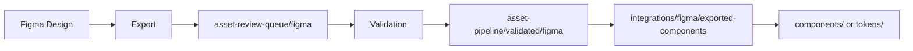

# Design System Architecture Optimization Plan

**Version:** 1.0
**Date:** 2025-11-18
**Status:** READY FOR IMPLEMENTATION

---

## 🎯 Current State Analysis

### Identified Issues

1. **Duplicate Token Directories:**
   - `/tokens/` (currently has content)
   - `/design-tokens/` (does NOT exist yet)
   - **Decision needed:** Consolidate to ONE location

2. **Unorganized Subcategories:**
   - `/tokens/brand/` - Has 25+ files, mixed types (TS, CSS, SCSS, TSX)
   - `/tokens/core/` - Has 5 files with TypeScript definitions
   - `/tokens/themes/` - Has 3 theme files
   - **Issue:** No clear organization by format or purpose

3. **Compiled Files Cluttering Source:**
   - `.d.ts` files (TypeScript definitions)
   - `.d.ts.map` files (Source maps)
   - `.js.map` files (JavaScript source maps)
   - **Issue:** Build artifacts mixed with source files

4. **Asset Pipeline Integration Missing:**
   - Figma → moved to `/asset-pipeline/asset-review-queue/`
   - Framer → moved to `/asset-pipeline/asset-review-queue/`
   - **Need:** Clear path from review queue → validated → design-system

5. **M4 Acceleration Tokens Scattered:**
   - Some tokens in `/m4-acceleration/`
   - Needs review and consolidation

---

## ✅ Recommended Architecture

### Directory Naming Decision

**Use `/tokens/` (NOT `/design-tokens/`)**

**Reasoning:**
- Already has content and structure
- Shorter, cleaner path
- Consistent with existing `design_system_directory.sh`
- Follows industry standard (Design System Repo naming)

---

## 📁 Optimal Directory Structure

```
design-system/
├── tokens/                          # ✅ SINGLE SOURCE OF TRUTH
│   ├── source/                      # Human-authored source files
│   │   ├── brand/                   # Brand-specific tokens
│   │   │   ├── colors.ts            # Foundation colors (SOURCE OF TRUTH)
│   │   │   ├── gradients.ts         # Gradient systems
│   │   │   ├── effects.ts           # Shadows, glows, filters
│   │   │   ├── animations.ts        # Animation timing/easing
│   │   │   └── index.ts             # Brand exports
│   │   ├── core/                    # Platform-agnostic core tokens
│   │   │   ├── foundations.ts       # Primitive values (8px grid, etc.)
│   │   │   ├── apple-hig.ts         # Apple HIG compliance tokens
│   │   │   ├── accessibility.ts     # WCAG compliance tokens
│   │   │   ├── responsive.ts        # Breakpoints, containers
│   │   │   └── index.ts             # Core exports
│   │   └── themes/                  # Theme compositions
│   │       ├── petersen-gaming.ts   # Gaming theme
│   │       ├── ecommerce.ts         # E-commerce theme
│   │       ├── enterprise.ts        # Enterprise/SaaS theme
│   │       └── index.ts             # Theme exports
│   │
│   ├── exports/                     # Generated/compiled tokens
│   │   ├── css/                     # CSS Custom Properties
│   │   │   ├── variables.css        # All tokens as CSS vars
│   │   │   ├── brand.css            # Brand tokens only
│   │   │   ├── core.css             # Core tokens only
│   │   │   └── themes/              # Per-theme CSS
│   │   │       ├── gaming.css
│   │   │       ├── ecommerce.css
│   │   │       └── enterprise.css
│   │   ├── scss/                    # SCSS variables
│   │   │   ├── _variables.scss
│   │   │   ├── _brand.scss
│   │   │   └── _core.scss
│   │   ├── json/                    # Style Dictionary format
│   │   │   ├── tokens.json          # All tokens
│   │   │   ├── brand.json
│   │   │   ├── core.json
│   │   │   └── themes/
│   │   ├── js/                      # JavaScript modules
│   │   │   ├── tokens.js
│   │   │   ├── tokens.esm.js
│   │   │   └── tokens.cjs.js
│   │   ├── ts/                      # TypeScript declarations
│   │   │   └── tokens.d.ts
│   │   ├── swift/                   # iOS/macOS tokens
│   │   │   └── DesignTokens.swift
│   │   ├── figma/                   # Figma plugin format
│   │   │   └── tokens.json
│   │   └── android/                 # Android XML (future)
│   │       └── colors.xml
│   │
│   └── docs/                        # Token documentation
│       ├── color-palette.md
│       ├── typography-scale.md
│       ├── spacing-system.md
│       └── usage-guidelines.md
│
├── asset-pipeline/                  # Asset workflow management
│   ├── asset-review-queue/          # Assets awaiting validation
│   │   ├── figma/                   # From Figma exports
│   │   │   ├── components/
│   │   │   ├── icons/
│   │   │   └── illustrations/
│   │   ├── framer/                  # From Framer projects
│   │   │   ├── components/
│   │   │   └── prototypes/
│   │   └── design-tokens/           # Token candidates
│   │       ├── color-swatches/
│   │       └── style-exports/
│   │
│   ├── validated/                   # Approved, ready for integration
│   │   ├── figma/
│   │   ├── framer/
│   │   └── tokens/
│   │
│   └── integration/                 # Integration staging
│       ├── figma-to-tokens/         # Scripts to extract tokens
│       ├── framer-to-components/    # Scripts to extract components
│       └── validation-reports/      # QA reports
│
├── integrations/                    # Platform integrations
│   ├── figma/                       # Figma integration
│   │   ├── plugins/                 # Figma plugins
│   │   │   └── turbo-variables/    # Your color unification plugin
│   │   ├── exported-components/     # Validated Figma components
│   │   │   ├── buttons/
│   │   │   ├── cards/
│   │   │   └── layouts/
│   │   ├── styles/                  # Figma style exports
│   │   │   ├── color-styles.json
│   │   │   ├── text-styles.json
│   │   │   └── effect-styles.json
│   │   └── sync/                    # Sync scripts
│   │       ├── import-from-figma.js
│   │       └── export-to-figma.js
│   │
│   └── framer/                      # Framer integration
│       ├── components/              # Validated Framer components
│       │   ├── quantum-buttons/
│       │   ├── quantum-cards/
│       │   └── quantum-layouts/
│       ├── code-overrides/          # Framer code overrides
│       │   └── quantum-spatial/
│       ├── packages/                # Framer packages
│       │   └── quantum-spatial-system/
│       └── sync/                    # Sync scripts
│           ├── import-from-framer.js
│           └── export-to-framer.js
│
├── m4-acceleration/                 # M4 Neural Engine optimizations
│   ├── foundation/                  # Core M4 features
│   │   ├── quantum-pixels/          # Pixel generators
│   │   └── grid-systems/            # Grid systems
│   ├── tokens/                      # M4-specific tokens (TO REVIEW)
│   │   └── performance-tokens.ts    # Will merge to /tokens/
│   └── optimizations/               # M4 optimization guides
│       └── rendering-strategies.md
│
├── components/                      # React/TS components
├── styles/                          # Global styles
├── docs/                            # Documentation
├── tests/                           # Tests
├── tools/                           # Build tools
├── dist/                            # Built/compiled output
└── examples/                        # Usage examples
```

---

## 🔄 Migration Strategy

### Phase 1: Token Consolidation

**Goal:** One clear token structure

#### Step 1.1: Organize `/tokens/source/`

```bash
# Create source structure
mkdir -p tokens/source/brand
mkdir -p tokens/source/core
mkdir -p tokens/source/themes

# Move TypeScript source files
mv tokens/brand/*.ts tokens/source/brand/
mv tokens/core/*.ts tokens/source/core/
mv tokens/themes/*.ts tokens/source/themes/

# Move CSS/SCSS files to source/brand
mv tokens/brand/*.css tokens/source/brand/
mv tokens/brand/*.scss tokens/source/brand/
```

#### Step 1.2: Create `/tokens/exports/` Structure

```bash
# Create export directories by format
mkdir -p tokens/exports/css
mkdir -p tokens/exports/scss
mkdir -p tokens/exports/json
mkdir -p tokens/exports/js
mkdir -p tokens/exports/ts
mkdir -p tokens/exports/figma
mkdir -p tokens/exports/swift
```

#### Step 1.3: Move Compiled Files

```bash
# Move .d.ts files to exports/ts/
mv tokens/**/*.d.ts tokens/exports/ts/

# Move .map files to appropriate locations
# (or delete if not needed)
```

#### Step 1.4: Handle TSX Files

**Decision needed:** TSX files in `/tokens/brand/` are actually components, not tokens.

**Recommendation:**
```bash
# Move TSX component files out of tokens
mv tokens/brand/*.tsx components/token-preview-components/
# OR
mv tokens/brand/*.tsx integrations/framer/components/
```

---

### Phase 2: Asset Pipeline Integration

**Goal:** Clear workflow from Figma/Framer → Validated → Design System

#### Step 2.1: Create Asset Pipeline Structure

```bash
mkdir -p asset-pipeline/asset-review-queue/figma
mkdir -p asset-pipeline/asset-review-queue/framer
mkdir -p asset-pipeline/asset-review-queue/design-tokens
mkdir -p asset-pipeline/validated/figma
mkdir -p asset-pipeline/validated/framer
mkdir -p asset-pipeline/validated/tokens
mkdir -p asset-pipeline/integration
```

#### Step 2.2: Create Integration Skeletons

**Figma Integration:**
```bash
mkdir -p integrations/figma/plugins/turbo-variables
mkdir -p integrations/figma/exported-components
mkdir -p integrations/figma/styles
mkdir -p integrations/figma/sync
```

**Framer Integration:**
```bash
mkdir -p integrations/framer/components
mkdir -p integrations/framer/code-overrides
mkdir -p integrations/framer/packages
mkdir -p integrations/framer/sync
```

---

### Phase 3: M4 Token Review & Merge

**Goal:** Consolidate M4 tokens into main token system

#### Step 3.1: Review M4 Tokens

```bash
# Identify M4-specific tokens
ls m4-acceleration/tokens/

# Evaluate each token file:
# - Is it truly M4-specific?
# - Or is it a general token?
```

#### Step 3.2: Merge Strategy

**M4-Specific Tokens** (performance-related):
```typescript
// Keep in m4-acceleration/tokens/
// Example: rendering quality levels, particle counts, etc.
```

**General Tokens** (colors, spacing, etc.):
```bash
# Merge into tokens/source/brand/ or tokens/source/core/
```

---

## 🗑️ Files to Remove

### Compiled Files (Can be regenerated)

```bash
# Delete all .d.ts.map files
find tokens/ -name "*.d.ts.map" -delete

# Delete all .js.map files
find tokens/ -name "*.js.map" -delete

# OPTIONAL: Delete .d.ts files (if using build process)
# find tokens/ -name "*.d.ts" -delete
```

**Note:** `.d.ts` files are useful for TypeScript autocomplete. Keep them IF they're auto-generated by your build process. Delete them IF they're manual/outdated.

---

## 📋 Token Organization Best Practices

### File Naming Convention

```
tokens/source/
├── brand/
│   ├── colors.ts                    # ✅ Plural, lowercase
│   ├── gradients.ts                 # ✅ Descriptive
│   ├── effects.ts                   # ✅ Category name
│   └── animations.ts                # ✅ Consistent
│
├── core/
│   ├── foundations.ts               # ✅ Core primitives
│   ├── apple-hig.ts                 # ✅ Kebab-case for multi-word
│   └── accessibility.ts             # ✅ Clear purpose
│
└── themes/
    ├── petersen-gaming.ts           # ✅ Project-specific
    ├── ecommerce.ts                 # ✅ Use-case specific
    └── enterprise.ts                # ✅ Industry-specific
```

### File Content Structure

**Example: `tokens/source/brand/colors.ts`**
```typescript
/**
 * Quantum Spatial Color System
 * SOURCE OF TRUTH - v2.0
 *
 * All colors must be defined here.
 * DO NOT duplicate colors in other files.
 */

export const colors = {
  // Foundation Colors
  foundation: {
    voidBlack: '#000000',
    deepSpaceIndigo: '#0A0A0F',
    ultraIndigo: '#15151D',
    dimensionalEggplant: '#331F4A',
  },

  // Interactive Colors
  interactive: {
    appleBlue: '#007AFF',
    subtleCyan: '#5AC8FA',
    roseEnergy: '#BF4080',
  },

  // Text Hierarchy
  text: {
    primary: '#FCFDF2',
    secondary: 'rgba(252, 253, 242, 0.85)',
    tertiary: 'rgba(252, 253, 242, 0.70)',
  },
} as const;

export type ColorTokens = typeof colors;
```

---

## 🎨 Figma Integration Skeleton

### Directory Structure

```
integrations/figma/
├── plugins/
│   └── turbo-variables/             # Your color unification plugin
│       ├── manifest.json
│       ├── code.ts                  # Plugin code
│       ├── ui.html                  # Plugin UI
│       └── README.md
│
├── exported-components/             # Validated Figma exports
│   ├── buttons/
│   │   ├── primary-button.svg
│   │   ├── secondary-button.svg
│   │   └── metadata.json
│   ├── cards/
│   ├── icons/
│   └── layouts/
│
├── styles/                          # Figma style exports
│   ├── color-styles.json            # All color styles
│   ├── text-styles.json             # Typography styles
│   ├── effect-styles.json           # Shadow/blur effects
│   └── grid-styles.json             # Layout grids
│
├── sync/                            # Sync automation
│   ├── import-from-figma.js         # Import script
│   ├── export-to-figma.js           # Export script
│   └── sync-config.json             # Sync configuration
│
└── README.md                        # Figma integration docs
```

### Workflow



---

## 🎭 Framer Integration Skeleton

### Directory Structure

```
integrations/framer/
├── components/                      # Validated Framer components
│   ├── quantum-buttons/
│   │   ├── QuantumButton.tsx
│   │   ├── variants.ts
│   │   └── README.md
│   ├── quantum-cards/
│   ├── quantum-layouts/
│   └── quantum-navigation/
│
├── code-overrides/                  # Framer code overrides
│   └── quantum-spatial/
│       ├── colorOverrides.ts
│       ├── animationOverrides.ts
│       └── responsiveOverrides.ts
│
├── packages/                        # NPM packages for Framer
│   └── quantum-spatial-system/
│       ├── package.json
│       ├── src/
│       └── README.md
│
├── sync/                            # Sync automation
│   ├── import-from-framer.js
│   ├── export-to-framer.js
│   └── sync-config.json
│
└── README.md                        # Framer integration docs
```

### Safety Notes

```markdown
# Framer Integration - SAFETY PROTOCOL

⚠️ **READ-ONLY SOURCE:**
- Original Framer files remain in asset-pipeline/asset-review-queue/framer/
- DO NOT modify original Framer project files
- Extract validated components here ONLY

✅ **SAFE WORKFLOW:**
1. Review Framer component in asset-review-queue
2. Extract component logic
3. Create NEW file in integrations/framer/components/
4. Apply source of truth colors
5. Test independently
6. Move to components/ when validated
```

---

## 🛠️ Implementation Scripts

### Script 1: Token Reorganization

**File:** `tools/scripts/reorganize-tokens.sh`

```bash
#!/bin/bash

# Quantum Spatial Token Reorganization Script
# Safely reorganizes token directory structure

echo "🚀 Starting token reorganization..."

# Create new structure
mkdir -p tokens/source/brand
mkdir -p tokens/source/core
mkdir -p tokens/source/themes
mkdir -p tokens/exports/{css,scss,json,js,ts,figma,swift}
mkdir -p tokens/docs

# Move source files (TypeScript)
echo "📦 Moving source TypeScript files..."
find tokens/brand -name "*.ts" -not -name "*.d.ts" -exec mv {} tokens/source/brand/ \;
find tokens/core -name "*.ts" -not -name "*.d.ts" -exec mv {} tokens/source/core/ \;
find tokens/themes -name "*.ts" -not -name "*.d.ts" -exec mv {} tokens/source/themes/ \;

# Move CSS/SCSS files
echo "🎨 Moving CSS/SCSS files..."
find tokens/brand -name "*.css" -exec mv {} tokens/source/brand/ \;
find tokens/brand -name "*.scss" -exec mv {} tokens/source/brand/ \;

# Move compiled files to exports
echo "📤 Moving compiled files..."
find tokens -name "*.d.ts" -exec mv {} tokens/exports/ts/ \;

# Clean up empty directories
echo "🧹 Cleaning up..."
find tokens -type d -empty -delete

echo "✅ Token reorganization complete!"
echo ""
echo "Next steps:"
echo "1. Review tokens/source/ structure"
echo "2. Build export formats: npm run build:tokens"
echo "3. Update import paths in components"
```

### Script 2: Asset Pipeline Setup

**File:** `tools/scripts/setup-asset-pipeline.sh`

```bash
#!/bin/bash

# Asset Pipeline Setup Script

echo "🎨 Setting up asset pipeline..."

# Create asset pipeline structure
mkdir -p asset-pipeline/asset-review-queue/{figma,framer,design-tokens}
mkdir -p asset-pipeline/validated/{figma,framer,tokens}
mkdir -p asset-pipeline/integration

# Create integration structures
mkdir -p integrations/figma/{plugins,exported-components,styles,sync}
mkdir -p integrations/framer/{components,code-overrides,packages,sync}

# Create README files
cat > asset-pipeline/README.md << 'EOF'
# Asset Pipeline

Workflow for validating and integrating design assets.

## Workflow

1. **Review Queue:** Assets land here first
2. **Validation:** Review for quality, HIG compliance, color accuracy
3. **Validated:** Approved assets ready for integration
4. **Integration:** Scripts to integrate into design system
EOF

echo "✅ Asset pipeline setup complete!"
```

---

## 📖 Updated README Structure

### Main README.md Sections

```markdown
# Quantum Spatial Design System

## Table of Contents

1. [Overview](#overview)
2. [Architecture](#architecture)
3. [Design Tokens](#design-tokens)
4. [Asset Pipeline](#asset-pipeline)
5. [Integrations](#integrations)
   - [Figma](#figma-integration)
   - [Framer](#framer-integration)
6. [M4 Acceleration](#m4-acceleration)
7. [Components](#components)
8. [Development](#development)
9. [Contributing](#contributing)

## Architecture

### Directory Structure

\`\`\`
design-system/
├── tokens/                  # Design tokens (SOURCE OF TRUTH)
│   ├── source/              # Human-authored tokens
│   └── exports/             # Generated token formats
├── asset-pipeline/          # Asset workflow management
│   ├── asset-review-queue/  # Assets awaiting validation
│   ├── validated/           # Approved assets
│   └── integration/         # Integration scripts
├── integrations/            # Platform integrations
│   ├── figma/               # Figma sync & exports
│   └── framer/              # Framer components
├── m4-acceleration/         # M4 Neural Engine features
├── components/              # React components
├── styles/                  # Global styles
└── docs/                    # Documentation
\`\`\`

### Token Organization

Tokens are organized in `/tokens/source/` by category:
- **brand/**: Brand-specific tokens (colors, gradients, effects)
- **core/**: Platform-agnostic primitives (spacing, typography)
- **themes/**: Theme compositions (gaming, ecommerce, enterprise)

Generated tokens are exported to `/tokens/exports/` in multiple formats:
- CSS Custom Properties
- SCSS variables
- JSON (Style Dictionary)
- TypeScript
- Swift (iOS/macOS)
- Figma plugin format

### Asset Pipeline Workflow

1. **Review Queue**: New assets from Figma/Framer land in `asset-review-queue/`
2. **Validation**: Review for HIG compliance, color accuracy, accessibility
3. **Validated**: Approved assets move to `validated/`
4. **Integration**: Scripts extract and integrate into design system

## Figma Integration

Location: `integrations/figma/`

### Turbo Variables Plugin

Color unification plugin that:
- Scans Figma files for all colors
- Matches colors to source of truth tokens
- Batch replaces similar colors
- Unifies gradient variations

### Sync Workflow

\`\`\`bash
# Import from Figma
npm run figma:import

# Export to Figma
npm run figma:export
\`\`\`

## Framer Integration

Location: `integrations/framer/`

### Components

Validated Framer components with source of truth colors:
- Quantum Buttons
- Quantum Cards
- Quantum Layouts

### Code Overrides

Framer code overrides for:
- Color system
- Animation timing
- Responsive behavior

## M4 Acceleration

M4 Neural Engine optimizations for:
- Quantum pixel generators
- Volumetric rendering
- Dimensional grids
- Particle systems

See: `m4-acceleration/README.md`
\`\`\`

---

## ✅ Action Items

### Immediate (Do Now)

- [ ] **Run reorganization script** (after review)
- [ ] **Create asset-pipeline structure**
- [ ] **Move Figma plugin** to integrations/figma/plugins/
- [ ] **Update README.md** with new architecture

### Short-term (This Week)

- [ ] **Review M4 tokens** and merge into main token system
- [ ] **Create Figma sync scripts**
- [ ] **Create Framer extraction scripts**
- [ ] **Validate token exports** (CSS, JSON, etc.)

### Long-term (This Month)

- [ ] **Build token transformation pipeline** (Style Dictionary)
- [ ] **Create automated tests** for token integrity
- [ ] **Set up CI/CD** for token exports
- [ ] **Document integration workflows**

---

## 🎯 Summary

### Key Decisions

1. ✅ **Use `/tokens/` (not `/design-tokens/`)**
2. ✅ **Separate source and exports** (`/tokens/source/` vs `/tokens/exports/`)
3. ✅ **Remove compiled files** from source directories (`.d.ts.map`, `.js.map`)
4. ✅ **Create asset-pipeline** for Figma/Framer workflow
5. ✅ **Create integrations/** for platform-specific code
6. ✅ **Review M4 tokens** before merging

### File Count Reduction

**Before optimization:**
- ~80+ files in `/tokens/`
- Compiled files mixed with source
- No clear organization

**After optimization:**
- ~30 source files in `/tokens/source/`
- Generated files in `/tokens/exports/`
- Clear separation of concerns

---

© 2025 9Bit Studios
**Status:** READY FOR IMPLEMENTATION
