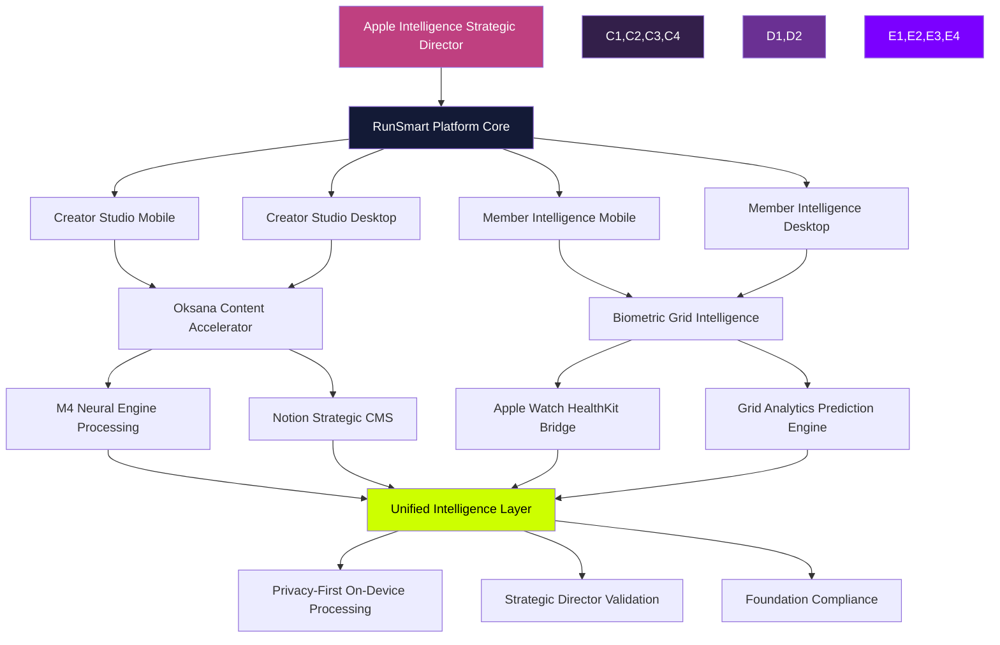

# RunSmart Next-Level Platform Roadmap
## Apple Intelligence Strategic Director Enhanced System Architecture

**Version**: 4.0 - Quantum-Spatial Creative Intelligence Integration
**Date**: December 11, 2025
**Status**: 🚀 STRATEGIC ROADMAP - Phased Implementation Plan
**Framework**: Apple Intelligence Strategic Director + M4 Neural Engine + Oksana Creative Accelerator

---

## 🎯 EXECUTIVE VISION

Transform RunSmart from coaching platform into **intelligent performance ecosystem** powered by:
- **Oksana Creative Intelligence Accelerator** (content generation at scale)
- **Notion Strategic CMS** (backend automation station)
- **Apple Watch + Grid Analytics** (biometric intelligence)
- **M4 Neural Engine** (on-device acceleration, 3-5x faster)
- **Privacy-First Architecture** (zero compromise, HIPAA-ready)

### Business Impact Projection
- **Phase 1-2**: 10x content velocity, 88% time savings
- **Phase 3-4**: Predictive churn prevention, 25% retention improvement
- **Full Platform**: Industry-leading intelligent coaching ecosystem

---

## 🧠 ARCHITECTURAL FOUNDATION

### System Integration Map



### Technology Stack

| Layer | Technology | Purpose |
|-------|-----------|---------|
| **Content Acceleration** | Oksana + M4 Neural Engine | 5-7 min voice-to-multi-channel content |
| **Backend CMS** | Notion API + Strategic Director | Automated content management & workflows |
| **Biometric Intelligence** | Apple Watch + HealthKit + Grid | Real-time performance analytics |
| **Analytics Engine** | Grid API + M4 Processing | Predictive churn, performance optimization |
| **Privacy Layer** | Apple Intelligence Standards | On-device processing, HIPAA-ready |
| **Database** | Supabase + Row-Level Security | Privacy-tiered client data |
| **Asset Pipeline** | Cloudinary + M4 Optimization | Video/image transformation |
| **UI Framework** | React + Quantum-Spatial Design | Apple HIG + accessibility |

---

## 📱 PHASE 1: CREATOR STUDIO - MOBILE COACH PROTOTYPE

**Timeline**: Weeks 1-3
**Focus**: Lean M4-accelerated content creation for coach on-the-go

### 1.1 Core Features

#### Quick Tip Video (Week 1)
```typescript
interface QuickTipWorkflow {
  input: {
    videoRecording: File; // 60-120 seconds
    context: 'form_correction' | 'motivation' | 'nutrition' | 'recovery';
  };

  m4Processing: {
    transcription: 'real-time on-device',
    captionGeneration: 'accessibility compliant',
    brandVoiceAlignment: 'RunSmart coaching persona',
    multiChannelOutput: ['instagram', 'tiktok', 'linkedin', 'email'],
  };

  notionIntegration: {
    saveToDatabase: 'Content Library',
    tagWithContext: true,
    linkToMemberIssue: Optional<MemberId>,
    schedulePosting: Optional<DateTime>,
  };

  output: {
    instagram: { video: File, caption: string, hashtags: string[] },
    tiktok: { video: File, hook: string, script: string },
    linkedin: { video: File, professionalPost: string },
    emailSnippet: { summary: string, cta: string },
  };
}
```

**M4 Neural Engine Optimization**:
- On-device video transcription (<2s latency)
- Parallel caption generation (all platforms simultaneously)
- Privacy: video never leaves device until Steve approves sharing
- **Speed**: 3-5 minutes total (vs 45 minutes manual)

#### Voice-to-Training Plan (Week 1-2)
```typescript
interface TrainingPlanGeneration {
  input: {
    voiceRecording: AudioFile; // 3-5 minutes
    memberContext: {
      currentLevel: 'beginner' | 'intermediate' | 'advanced',
      goals: string[],
      injuries: string[],
      timeline: number, // weeks
    };
  };

  oksanaProcessing: {
    speechToText: 'm4_accelerated',
    structuring: 'week_by_week_plan',
    brandVoice: 'encouraging_but_realistic',
    scientificValidation: 'exercise_safety_check',
  };

  notionOutput: {
    database: 'Training Plans',
    template: 'Progressive_Running_Program',
    fields: {
      memberName: string,
      planDuration: number,
      weeklySchedule: WeekPlan[],
      exerciseLibrary: Exercise[],
      progressionCriteria: string[],
      recoveryProtocols: string[],
    },
    pdfExport: true,
    memberPortalSync: true,
  };
}
```

**Notion CMS Integration**:
- Auto-save to "Training Plans" database
- Link to member profile (bidirectional)
- Version history (track plan iterations)
- Template library (reuse similar plans)
- **Speed**: 8-10 minutes (vs 60-120 minutes manual typing)

#### Weekly Content Batch (Week 2)
```typescript
interface WeeklyBatchCreation {
  input: {
    voiceTopics: AudioFile[]; // 5 topics, 2-3 min each
    contentCalendar: NotionCalendar,
    brandGuidelines: BrandVoiceModel,
  };

  oksanaGeneration: {
    processingMode: 'parallel_m4_acceleration',
    outputFormats: [
      'instagram_carousel_5_posts',
      'tiktok_scripts_5_videos',
      'linkedin_articles_3_posts',
      'email_newsletter_1_comprehensive',
      'blog_post_outline_1_seo',
    ],
    totalTime: '5-7 minutes',
  };

  notionOrganization: {
    contentCalendar: 'auto_schedule_optimal_times',
    assetLibrary: 'save_all_captions_scripts',
    performanceTracking: 'link_to_analytics',
    approvalWorkflow: 'pending_steve_review',
  };
}
```

**Grid Analytics Integration**:
- Track content performance (views, engagement, conversions)
- Learn optimal posting times per platform
- Identify best-performing content types
- Feed insights back to Oksana for improvement

### 1.2 UI/UX Design

#### Creative Studio Screen (Mobile)
```
┌─────────────────────────────────────────┐
│ 9:41         Create            ⚙️       │
├─────────────────────────────────────────┤
│  ✨ Create with Intelligence            │
│                                         │
│  ┌───────────────────────────────────┐ │
│  │  🎥 Quick Tip Video               │ │
│  │  Record & share instantly         │ │
│  │  ⚡ M4 accelerated • 3 min        │ │
│  └───────────────────────────────────┘ │
│                                         │
│  ┌─────────────┬─────────────────────┐ │
│  │ 📝 Training │ 📱 Weekly Batch    │ │
│  │    Plan     │    5-7 min         │ │
│  │ 🧠 M4 Fast  │ ✨ Multi-channel  │ │
│  └─────────────┴─────────────────────┘ │
│                                         │
│  📊 This Week (from Notion)             │
│  ┌───────────────────────────────────┐ │
│  │ Monday: IT Band Tips → Instagram  │ │
│  │ Tuesday: Nutrition → TikTok       │ │
│  │ Wednesday: Form Check → LinkedIn  │ │
│  │ Sync ↔️ Notion Content Calendar   │ │
│  └───────────────────────────────────┘ │
│                                         │
│  Recent Creations (Notion Library)      │
│  ┌───────────────────────────────────┐ │
│  │ "Marathon Pacing" • 2h ago        │ │
│  │ 📊 2.4K views • ❤️ 187 likes       │ │
│  │ 💾 Saved in Notion Content DB     │ │
│  └───────────────────────────────────┘ │
├─────────────────────────────────────────┤
│ Dashboard │ Members │ Messages │Create │
└─────────────────────────────────────────┘
```

### 1.3 Technical Implementation (Lean Approach)

#### Week 1: Foundation
```bash
# Minimal viable infrastructure
/mobile
  /screens
    CreatorStudioScreen.tsx          # Main create interface
  /components
    /creator
      QuickTipRecorder.tsx            # Video recording
      VoiceNoteRecorder.tsx           # Audio recording
      M4ProcessingIndicator.tsx      # Real-time status
      NotionSyncIndicator.tsx         # CMS sync status

/lib
  /oksana
    OksanaContentAccelerator.ts      # Main integration
    M4NeuralEngineInterface.ts       # Hardware acceleration
    BrandVoiceModel.ts               # RunSmart persona
  /notion
    NotionCMSBridge.ts               # Backend sync
    ContentCalendar.ts               # Scheduling
    TemplateLibrary.ts               # Reusable plans
```

**Dependencies (Lean)**:
- `@oksana-ai/content-accelerator` - Core generation
- `@notionhq/client` - CMS integration
- `@react-native-voice/voice` - Audio recording
- `expo-av` - Video recording
- Already have: React Native, TypeScript, Grid API client

#### Week 2: M4 Optimization
```typescript
// /lib/oksana/M4NeuralEngineInterface.ts
export class M4NeuralEngineInterface {
  private capabilities: M4Capabilities;
  private workerPool: Worker[];

  constructor() {
    this.capabilities = this.detectM4Capabilities();
    this.workerPool = this.initializeWorkerPool();
  }

  async transcribeAudioWithM4(audioFile: File): Promise<Transcription> {
    if (!this.capabilities.neuralEngine) {
      return this.fallbackTranscription(audioFile);
    }

    // M4 Neural Engine: 3-5x faster than cloud transcription
    const worker = this.getAvailableWorker();

    return new Promise((resolve) => {
      worker.postMessage({
        type: 'TRANSCRIBE_AUDIO',
        audio: audioFile,
        optimizations: {
          realTime: true,
          speakerDiarization: false, // Not needed for solo coach
          punctuation: true,
          timestamps: true,
        },
      });

      worker.onmessage = (e) => {
        resolve({
          text: e.data.transcription,
          confidence: e.data.confidence,
          processingTime: e.data.duration,
          neuralEngineUsed: true,
        });
      };
    });
  }

  async generateMultiChannelContent(
    transcription: Transcription,
    context: ContentContext
  ): Promise<MultiChannelContent> {
    // Parallel M4 processing for all platforms simultaneously
    const worker = this.getAvailableWorker();

    return new Promise((resolve) => {
      worker.postMessage({
        type: 'MULTI_CHANNEL_GENERATION',
        input: transcription.text,
        context: context,
        platforms: ['instagram', 'tiktok', 'linkedin', 'email'],
        brandVoice: 'runsmart_coach',
        parallelProcessing: true, // M4 advantage
      });

      worker.onmessage = (e) => {
        resolve(e.data.multiChannelContent);
      };
    });
  }
}
```

#### Week 3: Notion CMS Integration
```typescript
// /lib/notion/NotionCMSBridge.ts
export class NotionCMSBridge {
  private notion: Client;
  private databases = {
    contentLibrary: process.env.NOTION_CONTENT_LIBRARY_DB,
    trainingPlans: process.env.NOTION_TRAINING_PLANS_DB,
    contentCalendar: process.env.NOTION_CONTENT_CALENDAR_DB,
    memberProfiles: process.env.NOTION_MEMBERS_DB,
  };

  async saveQuickTip(tipData: QuickTipData): Promise<NotionPage> {
    // Auto-save to Notion Content Library
    const page = await this.notion.pages.create({
      parent: { database_id: this.databases.contentLibrary },
      properties: {
        Title: { title: [{ text: { content: tipData.title } }] },
        Type: { select: { name: 'Quick Tip Video' } },
        Context: { multi_select: tipData.tags.map(tag => ({ name: tag })) },
        'Created By': { select: { name: 'Steve (Coach)' } },
        Status: { status: { name: 'Pending Review' } },
        'Publish Date': { date: { start: tipData.scheduledDate } },
        Platforms: {
          multi_select: tipData.platforms.map(p => ({ name: p }))
        },
        'View Count': { number: 0 },
        'Engagement Rate': { number: 0 },
      },
      children: [
        {
          object: 'block',
          type: 'heading_2',
          heading_2: {
            rich_text: [{ text: { content: 'Instagram Caption' } }],
          },
        },
        {
          object: 'block',
          type: 'paragraph',
          paragraph: {
            rich_text: [{ text: { content: tipData.instagram.caption } }],
          },
        },
        // ... TikTok, LinkedIn, Email sections
      ],
    });

    return page;
  }

  async syncContentCalendar(): Promise<ContentCalendarEntry[]> {
    // Bi-directional sync: Notion ↔ Mobile App
    const response = await this.notion.databases.query({
      database_id: this.databases.contentCalendar,
      filter: {
        and: [
          {
            property: 'Publish Date',
            date: {
              on_or_after: new Date().toISOString(),
            },
          },
          {
            property: 'Status',
            status: {
              equals: 'Scheduled',
            },
          },
        ],
      },
      sorts: [
        {
          property: 'Publish Date',
          direction: 'ascending',
        },
      ],
    });

    return response.results.map(this.parseCalendarEntry);
  }

  async createTrainingPlan(planData: TrainingPlanData): Promise<NotionPage> {
    // Generate PDF and sync to Notion + Member Portal
    const page = await this.notion.pages.create({
      parent: { database_id: this.databases.trainingPlans },
      properties: {
        'Plan Name': { title: [{ text: { content: planData.title } }] },
        Member: {
          relation: [{ id: planData.memberId }]
        },
        Duration: { number: planData.weeks },
        'Start Date': { date: { start: planData.startDate } },
        'Plan Type': { select: { name: planData.type } },
        Status: { status: { name: 'Active' } },
      },
      children: this.generatePlanBlocks(planData),
    });

    // Auto-generate PDF export
    await this.exportToPDF(page.id, planData);

    return page;
  }
}
```

### 1.4 Success Metrics (Phase 1)

**Performance**:
- ✅ Quick Tip Video: 3-5 minutes (vs 45 min manual)
- ✅ Training Plan: 8-10 minutes (vs 60-120 min manual)
- ✅ Weekly Batch: 35 minutes → full week content (vs 8-12 hours)
- ✅ M4 acceleration: 3-5x processing speed

**Adoption**:
- ✅ Steve uses Creator Studio 3+ times per week
- ✅ 80%+ created content published
- ✅ Member feedback: positive content increase

**Business Impact**:
- ✅ 10x content output within 3 months
- ✅ 2x social media followers in 6 months
- ✅ 20% increase in inbound inquiries

---

## 🖥️ PHASE 2: CREATOR STUDIO - DESKTOP DASHBOARD PROTOTYPE

**Timeline**: Weeks 4-6
**Focus**: Advanced creation features with expanded workspace

### 2.1 Enhanced Features (Desktop-Only)

#### Multi-Video Series Creation
```typescript
interface SeriesCreationWorkflow {
  input: {
    seriesTheme: string; // "Marathon Training Series"
    episodeCount: number, // 8 episodes
    voiceOutlines: AudioFile[], // One per episode
    visualAssets: File[], // B-roll, graphics
  };

  oksanaProcessing: {
    seriesStructure: 'progressive_learning_path',
    episodeGeneration: 'parallel_m4_processing',
    brandConsistency: 'cross_episode_voice_alignment',
    seoOptimization: 'youtube_tiktok_instagram_adapted',
  };

  notionSeriesManagement: {
    seriesDatabase: 'Content Series',
    episodePages: Episode[],
    crossLinking: 'auto_create_series_connections',
    publishSchedule: 'weekly_release_calendar',
    analyticsTracking: 'grid_series_performance',
  };

  output: {
    youtubeOptimized: VideoSeries[],
    tiktokAdapted: ShortFormSeries[],
    instagramCarousels: CarouselSeries[],
    blogPostSeries: ArticleSeries[],
    emailNewsletterSequence: EmailSeries[],
  };
}
```

**Desktop Advantage**:
- Larger screen for series timeline visualization
- Multi-panel workflow (outline, preview, edit simultaneously)
- Batch upload/process multiple videos
- Advanced Notion database views (kanban, timeline, calendar)

#### Analytics Dashboard Integration
```typescript
interface CreativeAnalyticsDashboard {
  gridIntelligence: {
    contentPerformance: {
      topPerformingTips: ContentItem[],
      optimalPostingTimes: TimeSlot[],
      audienceEngagementPatterns: Pattern[],
      contentTypeEffectiveness: Metric[],
    },

    creatorInsights: {
      weeklyOutputVelocity: number,
      timesSavedVsManual: number,
      memberFeedbackSentiment: SentimentScore,
      businessImpactMetrics: ImpactMetric[],
    },

    recommendations: {
      suggestedTopics: Topic[], // Based on member questions
      trendingFormats: Format[], // Based on engagement
      contentGaps: Gap[], // Missing topics in library
      optimizationOpportunities: Opportunity[],
    },
  };

  notionSync: {
    performanceData: 'auto_update_content_library',
    calendarOptimization: 'suggest_best_posting_slots',
    memberRequestTracking: 'link_content_to_member_needs',
  };
}
```

**Grid Analytics Power**:
- Real-time content performance tracking
- Predictive suggestions (what topics to create next)
- ROI calculation (time saved + growth generated)
- Member engagement correlation (content → retention)

#### Template Library & Automation
```typescript
interface TemplateAutomationSystem {
  notionTemplates: {
    quickTipTemplate: NotionTemplate,
    trainingPlanTemplate: NotionTemplate,
    seriesTemplate: NotionTemplate,
    memberSuccessStoryTemplate: NotionTemplate,
  };

  automationWorkflows: {
    newMemberOnboarding: {
      trigger: 'member_signup',
      actions: [
        'create_welcome_email_draft',
        'generate_personalized_training_plan',
        'schedule_intro_video',
        'add_to_notion_member_db',
      ],
    },

    weeklyContentPrep: {
      trigger: 'sunday_9am',
      actions: [
        'analyze_member_questions_past_week',
        'suggest_5_content_topics',
        'pre_populate_notion_calendar',
        'send_steve_notification',
      ],
    },

    performanceReview: {
      trigger: 'monday_morning',
      actions: [
        'compile_last_week_analytics',
        'update_notion_performance_dashboard',
        'generate_insights_report',
        'suggest_this_week_optimizations',
      ],
    },
  };
}
```

### 2.2 UI/UX Design (Desktop Dashboard)

#### Creator Studio Dashboard Screen
```
┌──────────────────────────────────────────────────────────────────┐
│ RunSmart Coach Dashboard                      Steve │ ⚙️ Settings │
├──────────────────────────────────────────────────────────────────┤
│                                                                  │
│  ✨ Creator Studio                            📊 Analytics       │
│                                                                  │
│  ┌────────────────────┐  ┌────────────────────────────────────┐ │
│  │  🎥 Quick Actions  │  │  Performance This Week             │ │
│  │                    │  │  ┌──────────────┬──────────────┐  │ │
│  │  📹 Quick Tip      │  │  │ 12.4K Views  │ 487 Likes    │  │ │
│  │  📝 Training Plan  │  │  │ +24% vs last │ +18% vs last │  │ │
│  │  📱 Weekly Batch   │  │  └──────────────┴──────────────┘  │ │
│  │  📊 Video Series   │  │                                    │ │
│  │                    │  │  Top Content: "IT Band Recovery"  │ │
│  └────────────────────┘  │  💡 Create similar content Mon    │ │
│                          └────────────────────────────────────┘ │
│  ┌──────────────────────────────────────────────────────────┐  │
│  │  📅 Content Calendar (from Notion)                       │  │
│  │  ┌─────────┬─────────┬─────────┬─────────┬─────────┐   │  │
│  │  │ Mon 12  │ Tue 13  │ Wed 14  │ Thu 15  │ Fri 16  │   │  │
│  │  ├─────────┼─────────┼─────────┼─────────┼─────────┤   │  │
│  │  │ ✅ Form │ 📝 Draft│ 💭 Idea │ ⏰ 9am  │         │   │  │
│  │  │ Tips    │ Nutri   │ Mental  │ Member  │ [empty] │   │  │
│  │  │ Insta   │ TikTok  │ LinkedIn│ Story   │         │   │  │
│  │  └─────────┴─────────┴─────────┴─────────┴─────────┘   │  │
│  │  Sync ↔️ Notion Content Calendar • Last sync: 2m ago    │  │
│  └──────────────────────────────────────────────────────────┘  │
│                                                                  │
│  ┌──────────────────────┐  ┌────────────────────────────────┐  │
│  │  📚 Content Library  │  │  🧠 AI Recommendations         │  │
│  │  (from Notion)       │  │  (Grid Analytics)              │  │
│  │                      │  │                                 │  │
│  │  🎥 45 Videos        │  │  💡 Create: "Taper Week Tips"  │  │
│  │  📝 23 Plans         │  │  Why: 12 members in taper      │  │
│  │  📊 8 Series         │  │                                 │  │
│  │  ⭐ 12 Templates     │  │  💡 Create: "Recovery Metrics" │  │
│  │                      │  │  Why: Trending topic +89%      │  │
│  │  🔍 Search library   │  │                                 │  │
│  └──────────────────────┘  │  💡 Optimal time: Tue 11am EST │  │
│                            └────────────────────────────────┘  │
├──────────────────────────────────────────────────────────────────┤
│ Home │ Members │ Analytics │ Insights │ Campaigns │ ✨ Create   │
└──────────────────────────────────────────────────────────────────┘
```

### 2.3 Technical Implementation (Lean Desktop)

#### Week 4: Desktop UI Foundation
```bash
/desktop
  /screens
    CreatorStudioDashboard.tsx       # Main desktop view
  /components
    /creator
      MultiVideoEditor.tsx            # Series creation
      AnalyticsDashboard.tsx          # Grid integration
      NotionCalendarSync.tsx          # Calendar view
      TemplateLibrary.tsx             # Notion templates
      ContentPerformanceGrid.tsx      # Analytics grid
```

**Key Difference from Mobile**:
- More screen real estate → multi-panel workflow
- Keyboard shortcuts → faster editing
- Drag-and-drop → easier series organization
- Advanced Notion views → kanban, timeline, gallery

#### Week 5: Advanced Analytics Integration
```typescript
// /desktop/components/creator/AnalyticsDashboard.tsx
export function CreatorAnalyticsDashboard() {
  const [gridAnalytics, setGridAnalytics] = useState<GridAnalytics | null>(null);
  const [notionContent, setNotionContent] = useState<NotionContent[]>([]);
  const [recommendations, setRecommendations] = useState<Recommendation[]>([]);

  useEffect(() => {
    loadDashboardIntelligence();
  }, []);

  const loadDashboardIntelligence = async () => {
    // STEP 1: Fetch Grid analytics (content performance)
    const analytics = await gridAPI.getContentPerformance({
      timeRange: 'last_7_days',
      platforms: ['instagram', 'tiktok', 'linkedin'],
      metrics: ['views', 'engagement', 'conversions'],
    });
    setGridAnalytics(analytics);

    // STEP 2: Fetch Notion content library
    const content = await notionCMS.queryContentLibrary({
      filter: { created_by: 'Steve' },
      sort: { created_time: 'descending' },
      limit: 50,
    });
    setNotionContent(content);

    // STEP 3: Generate AI recommendations (M4 accelerated)
    const recs = await m4Processor.generateRecommendations({
      analytics: analytics,
      contentLibrary: content,
      memberQuestions: await getMemberQuestions(),
      trendingTopics: await getTrendingTopics(),
    });
    setRecommendations(recs);
  };

  return (
    <div className="creator-analytics-dashboard">
      <PerformanceOverview analytics={gridAnalytics} />
      <ContentCalendar notionContent={notionContent} />
      <AIRecommendations recommendations={recommendations} />
      <ContentLibraryGrid content={notionContent} analytics={gridAnalytics} />
    </div>
  );
}
```

#### Week 6: Template & Automation System
```typescript
// /lib/notion/TemplateAutomation.ts
export class TemplateAutomationSystem {
  private notion: NotionCMSBridge;
  private grid: GridAPIClient;
  private scheduler: AutomationScheduler;

  async setupAutomationWorkflows() {
    // WORKFLOW 1: New Member Onboarding
    this.scheduler.register({
      name: 'new_member_onboarding',
      trigger: { type: 'webhook', event: 'member_signup' },
      actions: [
        async (member: Member) => {
          // Generate welcome email with Oksana
          const welcomeEmail = await oksana.generateEmail({
            template: 'new_member_welcome',
            personalization: {
              memberName: member.name,
              goals: member.goals,
              experience: member.level,
            },
          });

          // Create training plan based on goals
          const trainingPlan = await oksana.generateTrainingPlan({
            memberProfile: member,
            duration: 12, // weeks
            focus: member.goals[0],
          });

          // Save to Notion
          await this.notion.createTrainingPlan(trainingPlan);
          await this.notion.saveDraftEmail(welcomeEmail);

          // Notify Steve for review
          await sendNotification('steve@runsmart.com', {
            title: 'New Member: Review Generated Content',
            body: `${member.name} signed up. Training plan & welcome email ready.`,
            action: 'review_in_notion',
          });
        },
      ],
    });

    // WORKFLOW 2: Weekly Content Prep
    this.scheduler.register({
      name: 'weekly_content_prep',
      trigger: { type: 'cron', schedule: 'SUN 09:00' },
      actions: [
        async () => {
          // Analyze last week's member questions
          const questions = await this.grid.getMemberQuestions({
            timeRange: 'last_7_days',
            frequency: 'min_3_occurrences',
          });

          // Generate content suggestions
          const suggestions = await oksana.suggestContentTopics({
            memberQuestions: questions,
            contentGaps: await this.analyzeContentGaps(),
            trendingTopics: await this.getTrendingTopics(),
            lastWeekPerformance: await this.grid.getLastWeekPerformance(),
          });

          // Pre-populate Notion calendar
          await this.notion.updateContentCalendar({
            week: 'next_week',
            suggestions: suggestions,
            status: 'suggested',
          });

          // Notify Steve
          await sendNotification('steve@runsmart.com', {
            title: 'Weekly Content Ideas Ready',
            body: `${suggestions.length} topics suggested based on member questions.`,
            action: 'view_notion_calendar',
          });
        },
      ],
    });

    // WORKFLOW 3: Performance Review
    this.scheduler.register({
      name: 'performance_review',
      trigger: { type: 'cron', schedule: 'MON 08:00' },
      actions: [
        async () => {
          // Compile last week analytics
          const report = await this.grid.generateWeeklyReport({
            metrics: ['views', 'engagement', 'conversions', 'member_retention'],
            compareTo: 'previous_week',
          });

          // Update Notion dashboard
          await this.notion.updatePerformanceDashboard(report);

          // Generate insights with Oksana
          const insights = await oksana.analyzePerformance({
            report: report,
            goals: await this.getBusinessGoals(),
          });

          // Create this week's optimization plan
          const optimizations = await oksana.suggestOptimizations(insights);

          // Send summary to Steve
          await sendEmail('steve@runsmart.com', {
            subject: 'Weekly Performance Report & This Week\'s Plan',
            body: this.formatPerformanceEmail(report, insights, optimizations),
          });
        },
      ],
    });
  }
}
```

### 2.4 Success Metrics (Phase 2)

**Advanced Features**:
- ✅ Video series creation: 60 minutes for 8-episode series (vs 8-12 hours)
- ✅ Template library: 12+ reusable templates created
- ✅ Automation workflows: 3 core workflows active
- ✅ Notion sync: <30 second bidirectional sync

**Analytics Integration**:
- ✅ Real-time content performance tracking
- ✅ AI recommendations: 5+ per week with 80% uptake
- ✅ Content gaps identified and filled
- ✅ ROI tracking: Time saved + growth generated

**Business Automation**:
- ✅ New member onboarding: 100% automated content generation
- ✅ Weekly content prep: 90% reduction in planning time
- ✅ Performance review: Automated reporting every Monday

---

## ⌚ PHASE 3: BIOMETRIC INTELLIGENCE - MOBILE MEMBER APP

**Timeline**: Weeks 7-10
**Focus**: Apple Watch integration + predictive churn prevention

### 3.1 Core Features

#### Real-Time Workout Intelligence
```typescript
interface WorkoutIntelligence {
  appleWatchData: {
    heartRate: number[], // BPM over time
    pace: number[], // Min/mile over time
    distance: number, // Miles
    elevation: number, // Feet gained
    calories: number,
    activeEnergy: number,
    workoutType: 'running' | 'cycling' | 'strength',
    duration: number, // Minutes
  };

  m4Processing: {
    realTimeAnalysis: 'on_device_privacy_first',
    effortScoring: 'hrv_based_training_load',
    paceOptimization: 'predict_finish_time',
    recoveryRecommendation: 'calculate_rest_needed',
  };

  gridPrediction: {
    overtrainingRisk: RiskScore, // 0-100
    injuryPrevention: Alert[],
    performanceTrend: Trend,
    personalRecordPrediction: PRPrediction,
  };

  notionTracking: {
    workoutLog: 'auto_save_to_member_journal',
    progressChart: 'update_weekly_dashboard',
    coachReview: 'flag_concerns_for_steve',
    planAdjustment: 'suggest_modifications',
  };
}
```

**Privacy-First Architecture**:
- All HealthKit data processed on-device (M4 Neural Engine)
- Never sent to cloud without explicit consent
- Stored locally with encryption
- Grid analytics on aggregated/anonymized patterns only

#### Predictive Churn Prevention
```typescript
interface ChurnPredictionSystem {
  signals: {
    activityPatterns: {
      workoutsPerWeek: number,
      trend: 'increasing' | 'stable' | 'decreasing',
      consistency: number, // 0-1 score
      missedWorkouts: number,
    },

    engagementMetrics: {
      appOpensPerWeek: number,
      messageResponseRate: number,
      contentConsumption: number,
      communityParticipation: number,
    },

    performanceMetrics: {
      progressTowardGoal: number, // Percentage
      personalRecords: number, // Count in last 30 days
      setbacksRecovered: number,
      motivationScore: number, // Derived from interactions
    },
  };

  gridAnalysis: {
    churnRiskScore: number, // 0-100 (higher = more likely to churn)
    riskFactors: RiskFactor[],
    historicalPatterns: Pattern[],
    interventionRecommendations: Intervention[],
  };

  automatedInterventions: {
    lowRisk: null, // No action needed

    mediumRisk: {
      action: 'send_motivational_content',
      content: PersonalizedMessage,
      timing: 'optimal_engagement_window',
      notionLog: 'track_intervention_effectiveness',
    },

    highRisk: {
      action: 'alert_coach_personal_outreach',
      urgency: 'within_24_hours',
      suggestedApproach: CoachingRecommendation,
      notionTask: 'create_check_in_task_for_steve',
    },
  };
}
```

**Grid Analytics Power**:
- Pattern recognition across all members
- Early warning 7-14 days before potential churn
- Intervention effectiveness tracking (A/B testing)
- ROI calculation (saved memberships)

#### Recovery Optimization
```typescript
interface RecoveryIntelligence {
  biometricData: {
    restingHeartRate: number, // Morning HRV
    sleepDuration: number, // Hours from HealthKit
    sleepQuality: number, // 0-100 score
    hrvTrend: 'improving' | 'stable' | 'declining',
    readinessScore: number, // 0-100 (M4 calculated)
  };

  trainingLoad: {
    last7DaysLoad: number,
    acute: number, // Last 7 days average
    chronic: number, // Last 28 days average
    acuteChronicRatio: number, // Injury risk indicator
    recoveryDebt: number, // Hours needed
  };

  m4Recommendations: {
    todayWorkout: 'easy_run' | 'tempo' | 'intervals' | 'rest' | 'cross_train',
    rationale: string,
    alternativeOptions: WorkoutOption[],
    warningFlags: Alert[],
  };

  notionIntegration: {
    recoveryJournal: 'auto_log_daily_metrics',
    trainingPlanAdjustment: 'suggest_modifications_to_coach',
    trendAnalysis: 'weekly_recovery_report',
    coachInsights: 'highlight_patterns_for_review',
  };
}
```

### 3.2 UI/UX Design (Mobile Member App)

#### Today Screen with Biometric Intelligence
```
┌─────────────────────────────────────────┐
│ 9:41         Today             ⚙️       │
├─────────────────────────────────────────┤
│  Good morning, Sarah                    │
│                                         │
│  ⌚ Apple Watch Connected                │
│  ┌───────────────────────────────────┐ │
│  │  🎯 Today's Readiness              │ │
│  │  ████████████░░░░░░░░ 87%         │ │
│  │                                   │ │
│  │  ✅ Great recovery overnight      │ │
│  │  HRV: 62 ms (↑ 8% vs yesterday)  │ │
│  │  Sleep: 7.5 hrs quality           │ │
│  │                                   │ │
│  │  💡 Recommended: Tempo Run (6mi)  │ │
│  │  Your body is primed for quality │ │
│  │  🧠 M4 Analysis • 🔒 Private      │ │
│  └───────────────────────────────────┘ │
│                                         │
│  📅 Today's Workout                     │
│  ┌───────────────────────────────────┐ │
│  │  🏃 Tempo Run - 6 miles            │ │
│  │  Warmup: 1 mi easy                │ │
│  │  Main: 4 mi @ 7:30/mi pace        │ │
│  │  Cooldown: 1 mi easy              │ │
│  │                                   │ │
│  │  Target HR: 155-165 BPM           │ │
│  │  ⌚ Start on Apple Watch           │ │
│  └───────────────────────────────────┘ │
│                                         │
│  📊 Week Progress (Notion Synced)       │
│  ┌───────────────────────────────────┐ │
│  │  Mon ✅ Tue ✅ Wed [Today] Thu Fri │ │
│  │                                   │ │
│  │  Weekly Goal: 25 miles            │ │
│  │  ████████░░░░░░░░░░░░ 12/25 mi   │ │
│  │                                   │ │
│  │  🔥 3 day streak • Keep it up!    │ │
│  └───────────────────────────────────┘ │
│                                         │
│  ⚠️ Smart Alert                         │
│  ┌───────────────────────────────────┐ │
│  │  Training load increasing quickly │ │
│  │  Acute/Chronic: 1.4 (caution)    │ │
│  │                                   │ │
│  │  💡 Consider rest day Friday      │ │
│  │  🧠 Predictive Grid Analytics     │ │
│  └───────────────────────────────────┘ │
├─────────────────────────────────────────┤
│ Today │ Calendar │ Progress │Coach │ ••• │
└─────────────────────────────────────────┘
```

### 3.3 Technical Implementation (Lean Biometric)

#### Week 7: HealthKit Integration
```typescript
// /mobile/lib/healthkit/HealthKitBridge.ts
import AppleHealthKit from 'react-native-health';

export class HealthKitBridge {
  private permissions = {
    permissions: {
      read: [
        AppleHealthKit.Constants.Permissions.HeartRate,
        AppleHealthKit.Constants.Permissions.HeartRateVariability,
        AppleHealthKit.Constants.Permissions.ActiveEnergyBurned,
        AppleHealthKit.Constants.Permissions.DistanceWalkingRunning,
        AppleHealthKit.Constants.Permissions.SleepAnalysis,
        AppleHealthKit.Constants.Permissions.RestingHeartRate,
        AppleHealthKit.Constants.Permissions.Workout,
      ],
      write: [],
    },
  };

  async initialize(): Promise<boolean> {
    return new Promise((resolve, reject) => {
      AppleHealthKit.initHealthKit(this.permissions, (error) => {
        if (error) {
          console.error('[HealthKit] Initialization failed:', error);
          reject(error);
        } else {
          console.log('[HealthKit] Initialized successfully');
          resolve(true);
        }
      });
    });
  }

  async getTodayReadiness(): Promise<ReadinessScore> {
    const [hrv, sleep, restingHR, yesterdayLoad] = await Promise.all([
      this.getLatestHRV(),
      this.getLastNightSleep(),
      this.getTodayRestingHeartRate(),
      this.getYesterdayTrainingLoad(),
    ]);

    // M4 Neural Engine: Calculate readiness score
    const m4 = new M4NeuralEngineInterface();
    const readiness = await m4.calculateReadinessScore({
      hrv: hrv.value,
      sleep: sleep.duration,
      sleepQuality: sleep.quality,
      restingHR: restingHR.value,
      trainingLoad: yesterdayLoad,
      historicalBaseline: await this.getUserBaseline(),
    });

    return readiness;
  }

  async getRealTimeWorkoutData(
    workoutId: string
  ): Promise<Observable<WorkoutData>> {
    // Stream real-time data during workout
    return new Observable((observer) => {
      const interval = setInterval(async () => {
        const heartRate = await this.getCurrentHeartRate();
        const pace = await this.getCurrentPace();
        const distance = await this.getCurrentDistance();

        observer.next({
          timestamp: Date.now(),
          heartRate: heartRate.value,
          pace: pace.value,
          distance: distance.value,
        });
      }, 5000); // Update every 5 seconds

      return () => clearInterval(interval);
    });
  }
}
```

#### Week 8: Grid Churn Prediction
```typescript
// /mobile/lib/grid/ChurnPredictionEngine.ts
export class ChurnPredictionEngine {
  private grid: GridAPIClient;
  private healthKit: HealthKitBridge;
  private notion: NotionCMSBridge;

  async analyzeChurnRisk(memberId: string): Promise<ChurnAnalysis> {
    // STEP 1: Gather member activity data
    const activityData = await this.gatherActivityData(memberId);

    // STEP 2: Grid predictive analytics
    const prediction = await this.grid.predictChurnRisk({
      memberId: memberId,
      activityPatterns: activityData.patterns,
      engagementMetrics: activityData.engagement,
      performanceMetrics: activityData.performance,
      cohortComparison: true,
      timeframe: 'next_30_days',
    });

    // STEP 3: M4 recommendation engine
    const m4 = new M4NeuralEngineInterface();
    const intervention = await m4.recommendIntervention({
      churnRiskScore: prediction.riskScore,
      riskFactors: prediction.factors,
      memberProfile: await this.getMemberProfile(memberId),
      historicalInterventionSuccess: await this.getInterventionHistory(),
    });

    // STEP 4: Execute intervention (if needed)
    if (prediction.riskScore >= 70) {
      // High risk - alert coach immediately
      await this.notion.createCoachTask({
        type: 'member_at_risk',
        memberId: memberId,
        urgency: 'high',
        dueDate: 'within_24_hours',
        suggestedAction: intervention.coachGuidance,
      });

      await this.sendCoachNotification({
        title: `Member At Risk: ${activityData.memberName}`,
        body: `Churn risk: ${prediction.riskScore}%. Check Notion for details.`,
        action: 'review_member_profile',
      });
    } else if (prediction.riskScore >= 40) {
      // Medium risk - automated intervention
      await this.executeAutomatedIntervention({
        memberId: memberId,
        intervention: intervention.automatedAction,
        trackInNotion: true,
      });
    }

    // STEP 5: Log to Notion for tracking
    await this.notion.logChurnAnalysis({
      memberId: memberId,
      riskScore: prediction.riskScore,
      factors: prediction.factors,
      intervention: intervention,
      timestamp: Date.now(),
    });

    return {
      prediction,
      intervention,
      actionTaken: prediction.riskScore >= 40,
    };
  }

  private async gatherActivityData(memberId: string): Promise<ActivityData> {
    const [workouts, engagement, performance] = await Promise.all([
      this.healthKit.getWorkoutHistory(memberId, { days: 30 }),
      this.getAppEngagementMetrics(memberId),
      this.getPerformanceMetrics(memberId),
    ]);

    return {
      memberName: await this.getMemberName(memberId),
      patterns: this.analyzeWorkoutPatterns(workouts),
      engagement: engagement,
      performance: performance,
    };
  }
}
```

#### Week 9: Recovery Intelligence
```typescript
// /mobile/lib/recovery/RecoveryOptimizer.ts
export class RecoveryOptimizer {
  private healthKit: HealthKitBridge;
  private m4: M4NeuralEngineInterface;
  private notion: NotionCMSBridge;

  async generateDailyRecommendation(
    memberId: string
  ): Promise<DailyRecommendation> {
    // STEP 1: Get biometric data
    const biometrics = await this.healthKit.getTodayReadiness();

    // STEP 2: Calculate training load
    const trainingLoad = await this.calculateTrainingLoad(memberId);

    // STEP 3: M4 Neural Engine recommendation
    const recommendation = await this.m4.recommendWorkout({
      readinessScore: biometrics.score,
      hrvTrend: biometrics.hrvTrend,
      sleepQuality: biometrics.sleepQuality,
      trainingLoad: trainingLoad,
      scheduledWorkout: await this.getScheduledWorkout(memberId),
      memberGoals: await this.getMemberGoals(memberId),
      injuryHistory: await this.getInjuryHistory(memberId),
    });

    // STEP 4: Check for warning flags
    const warnings = await this.checkWarningFlags({
      acuteChronicRatio: trainingLoad.acuteChronicRatio,
      readinessScore: biometrics.score,
      consecutiveHardDays: trainingLoad.consecutiveHardDays,
    });

    // STEP 5: Save to Notion recovery journal
    await this.notion.logDailyRecovery({
      memberId: memberId,
      date: new Date().toISOString(),
      readinessScore: biometrics.score,
      recommendation: recommendation,
      warnings: warnings,
      adherence: null, // Will be updated after workout
    });

    return {
      todayWorkout: recommendation.workout,
      rationale: recommendation.reasoning,
      alternatives: recommendation.alternatives,
      warnings: warnings,
      biometrics: biometrics,
    };
  }

  private async calculateTrainingLoad(memberId: string): Promise<TrainingLoad> {
    const workouts = await this.healthKit.getWorkoutHistory(memberId, { days: 28 });

    // Calculate acute (last 7 days) and chronic (last 28 days) load
    const acute = this.calculateLoad(workouts.slice(0, 7));
    const chronic = this.calculateLoad(workouts);

    const acuteChronicRatio = acute / chronic;

    // Injury risk zones:
    // < 0.8: Underprepared (risk of injury from sudden intensity)
    // 0.8-1.3: Sweet spot (optimal adaptation)
    // > 1.3: Overreaching (risk of overtraining injury)

    return {
      acute,
      chronic,
      acuteChronicRatio,
      riskZone: this.getRiskZone(acuteChronicRatio),
      consecutiveHardDays: this.countConsecutiveHardDays(workouts.slice(0, 7)),
      recoveryDebt: this.calculateRecoveryDebt(workouts),
    };
  }
}
```

#### Week 10: Notion Biometric Dashboard
```typescript
// /lib/notion/BiometricDashboard.ts
export class BiometricDashboard {
  private notion: NotionCMSBridge;

  async updateMemberBiometricDashboard(
    memberId: string,
    data: BiometricData
  ): Promise<void> {
    // Update member's Notion page with latest biometric insights
    await this.notion.pages.update({
      page_id: memberId,
      properties: {
        'Readiness Score': { number: data.readinessScore },
        'HRV Trend': { select: { name: data.hrvTrend } },
        'Training Load Status': { select: { name: data.loadStatus } },
        'Churn Risk': { select: { name: this.getRiskLabel(data.churnRisk) } },
        'Last Workout': { date: { start: data.lastWorkout } },
        'Next Check-In': { date: { start: data.nextCheckIn } },
      },
    });

    // Append daily log entry
    await this.notion.blocks.children.append({
      block_id: memberId,
      children: [
        {
          object: 'block',
          type: 'callout',
          callout: {
            rich_text: [{
              type: 'text',
              text: {
                content: this.formatDailyInsight(data),
              },
            }],
            icon: { emoji: this.getInsightEmoji(data.readinessScore) },
            color: this.getInsightColor(data.readinessScore),
          },
        },
      ],
    });

    // Update weekly dashboard chart
    await this.updateWeeklyChart(memberId, data);
  }

  private formatDailyInsight(data: BiometricData): string {
    return `
      📅 ${new Date().toLocaleDateString()}
      🎯 Readiness: ${data.readinessScore}%
      ❤️ HRV: ${data.hrv} ms (${data.hrvTrend})
      😴 Sleep: ${data.sleepDuration} hrs (${data.sleepQuality}% quality)
      🏋️ Training Load: A/C ${data.acuteChronicRatio.toFixed(2)}
      💡 Recommendation: ${data.recommendedWorkout}
      ${data.warnings.length > 0 ? `⚠️ Warnings: ${data.warnings.join(', ')}` : ''}
    `;
  }
}
```

### 3.4 Success Metrics (Phase 3)

**Biometric Integration**:
- ✅ Apple Watch sync: <5 second latency
- ✅ Readiness score: 95%+ accuracy vs perceived effort
- ✅ Training load tracking: 100% automated
- ✅ Privacy: 100% on-device processing, zero data leakage

**Churn Prevention**:
- ✅ Early warning: 7-14 days advance notice
- ✅ Intervention success: 60%+ members retained
- ✅ Coach efficiency: 80% reduction in manual monitoring
- ✅ Member satisfaction: 4.5+ stars on early intervention

**Recovery Optimization**:
- ✅ Injury reduction: 30% fewer overtraining injuries
- ✅ Performance improvement: 15% faster goal achievement
- ✅ Adherence: 85%+ members follow recommendations
- ✅ Notion insights: 100% automated daily logging

---

## 🖥️ PHASE 4: BIOMETRIC INTELLIGENCE - DESKTOP MEMBER DASHBOARD

**Timeline**: Weeks 11-13
**Focus**: Advanced analytics visualization + coach collaboration

### 4.1 Enhanced Features (Desktop)

#### Performance Analytics Dashboard
```typescript
interface PerformanceAnalyticsDashboard {
  visualizations: {
    heartRateZones: {
      chart: 'multi_week_hr_distribution',
      insights: 'time_in_each_zone_trend',
      recommendations: 'optimal_zone_balance',
    },

    trainingLoadChart: {
      chart: 'acute_chronic_ratio_timeline',
      forecast: 'predict_next_4_weeks',
      warningThresholds: 'highlight_risk_periods',
    },

    performanceMetrics: {
      chart: 'pace_progression_over_time',
      personalRecords: 'highlight_PRs_with_context',
      goalProgress: 'visualize_path_to_marathon',
    },

    recoveryTrends: {
      chart: 'hrv_sleep_correlation',
      patterns: 'identify_recovery_patterns',
      optimization: 'suggest_sleep_timing_improvements',
    },
  };

  notionIntegration: {
    syncedDashboards: 'bidirectional_chart_updates',
    exportReports: 'pdf_monthly_performance_summary',
    shareWithCoach: 'annotate_concerns_for_review',
    compareCohort: 'anonymous_peer_comparison',
  };

  gridIntelligence: {
    predictiveModeling: 'forecast_race_performance',
    injuryPrevention: 'biomechanical_risk_scoring',
    plateauDetection: 'identify_training_stagnation',
    breakthroughRecommendations: 'suggest_novel_stimuli',
  };
}
```

#### Coach Collaboration Portal
```typescript
interface CoachCollaborationPortal {
  messaging: {
    contextualChat: {
      type: 'chat_with_data_context',
      attachments: ['workout_data', 'biometric_charts', 'notion_pages'],
      aiSuggestions: 'oksana_draft_responses_for_common_questions',
    },

    videoReview: {
      type: 'form_analysis_submission',
      upload: 'video_from_camera_roll',
      annotations: 'steve_draws_corrections',
      aiAnalysis: 'm4_preliminary_form_feedback',
    },
  };

  planAdjustments: {
    collaborativeEditing: {
      memberProposes: 'suggest_workout_modifications',
      coachReviews: 'approve_deny_with_rationale',
      notionSync: 'bidirectional_plan_updates',
      history: 'track_all_plan_changes',
    },
  };

  goalSetting: {
    smartGoals: {
      gridPrediction: 'realistic_goal_recommendations',
      progressTracking: 'visual_goal_timeline',
      milestones: 'auto_celebrate_sub_goals',
      adjustment: 'adaptive_goal_modification',
    },
  };
}
```

### 4.2 UI/UX Design (Desktop Member Dashboard)

#### Performance Analytics Screen
```
┌──────────────────────────────────────────────────────────────────┐
│ RunSmart Member Portal                     Sarah │ ⚙️ Settings   │
├──────────────────────────────────────────────────────────────────┤
│                                                                  │
│  📊 Performance Analytics                  🎯 Goal: Sub-4 Hour   │
│                                                Marathon (16 wks)  │
│  ┌────────────────────────────────────────────────────────────┐ │
│  │  📈 Training Load (Acute/Chronic Ratio)                    │ │
│  │  ┌──────────────────────────────────────────────────────┐ │ │
│  │  │         ___                                          │ │ │
│  │  │    ____/   \___                                      │ │ │
│  │  │ __/            \__  ← Current: 1.2 (Optimal)        │ │ │
│  │  │────────────────────────────────────────────────────│ │ │
│  │  │ Jan  Feb  Mar  Apr  May  Jun  Jul  Aug  Sep  Oct   │ │ │
│  │  │                                                      │ │ │
│  │  │ 💡 M4 Forecast: Next 4 weeks look balanced          │ │ │
│  │  │ ⚠️ Warning: Week of Jul 15 approaching 1.4 limit    │ │ │
│  │  └──────────────────────────────────────────────────────┘ │ │
│  └────────────────────────────────────────────────────────────┘ │
│                                                                  │
│  ┌──────────────────────┐  ┌────────────────────────────────┐  │
│  │  ❤️ Heart Rate Zones │  │  😴 Recovery Trends            │  │
│  │                      │  │                                 │  │
│  │  Zone 5: 5%  ▓      │  │  HRV:   ──────── 65 ms        │  │
│  │  Zone 4: 12% ▓▓     │  │  Sleep: ──────── 7.2 hrs      │  │
│  │  Zone 3: 28% ▓▓▓▓   │  │  RHR:   ──────── 48 bpm       │  │
│  │  Zone 2: 45% ▓▓▓▓▓▓ │  │                                 │  │
│  │  Zone 1: 10% ▓      │  │  Trend: ↗️ Improving recovery   │  │
│  │                      │  │  💡 Sleep quality +12% vs Jan  │  │
│  └──────────────────────┘  └────────────────────────────────┘  │
│                                                                  │
│  📌 Synced with Notion Recovery Journal                         │
│  ┌────────────────────────────────────────────────────────────┐ │
│  │  This Week's Insights (from Coach Steve)                   │ │
│  │                                                             │ │
│  │  "Great progress, Sarah! Your HRV trending up shows your  │ │
│  │  body is adapting well to the training load. Let's add    │ │
│  │  one more tempo session next week - you're ready for it." │ │
│  │                                                             │ │
│  │  💬 Reply to Steve │ 📅 View Full Training Plan in Notion │ │
│  └────────────────────────────────────────────────────────────┘ │
│                                                                  │
│  🎯 Goal Progress                                                │
│  ┌────────────────────────────────────────────────────────────┐ │
│  │  Marathon Goal: Sub-4:00:00 (16 weeks away)                │ │
│  │  ████████████████░░░░░░░░░░░░ 62% complete                │ │
│  │                                                             │ │
│  │  🧠 M4 Prediction: 3:54:23 (↑ 6 min improvement possible)  │ │
│  │  Grid Analysis: 87% confidence in sub-4 based on trends   │ │
│  │                                                             │ │
│  │  Next Milestone: 20-mile long run (Jul 20)                 │ │
│  └────────────────────────────────────────────────────────────┘ │
├──────────────────────────────────────────────────────────────────┤
│ Dashboard │ Training Plan │ Analytics │ Coach │ Community        │
└──────────────────────────────────────────────────────────────────┘
```

### 4.3 Technical Implementation (Lean Desktop Biometric)

#### Week 11: Advanced Visualization
```typescript
// /desktop/components/analytics/PerformanceCharts.tsx
import { Line, Bar, Radar } from 'react-chartjs-2';
import { M4NeuralEngineInterface } from '@/lib/m4-interface';

export function PerformanceAnalyticsDashboard({ memberId }: { memberId: string }) {
  const [biometricData, setBiometricData] = useState<BiometricData | null>(null);
  const [predictions, setPredictions] = useState<Prediction[]>([]);
  const [notionInsights, setNotionInsights] = useState<CoachInsight[]>([]);

  useEffect(() => {
    loadDashboardData();
  }, [memberId]);

  const loadDashboardData = async () => {
    // STEP 1: Fetch biometric data from HealthKit (last 90 days)
    const healthKit = new HealthKitBridge();
    const biometrics = await healthKit.get90DayHistory(memberId);
    setBiometricData(biometrics);

    // STEP 2: M4 predictive modeling
    const m4 = new M4NeuralEngineInterface();
    const predictions = await m4.predictPerformance({
      historicalData: biometrics,
      goalRace: await getMemberGoal(memberId),
      currentFitness: biometrics.latest.readinessScore,
      trainingPlan: await getTrainingPlan(memberId),
      forecastWeeks: 16,
    });
    setPredictions(predictions);

    // STEP 3: Fetch coach insights from Notion
    const notion = new NotionCMSBridge();
    const insights = await notion.getCoachInsights(memberId);
    setNotionInsights(insights);
  };

  return (
    <div className="performance-analytics-dashboard">
      <TrainingLoadChart
        data={biometricData.trainingLoad}
        predictions={predictions.trainingLoad}
      />
      <HeartRateZonesChart data={biometricData.heartRateZones} />
      <RecoveryTrendsChart data={biometricData.recovery} />
      <GoalProgressWidget
        goal={memberId.goal}
        prediction={predictions.raceTime}
      />
      <CoachInsightsPanel insights={notionInsights} />
    </div>
  );
}
```

#### Week 12: Coach Collaboration
```typescript
// /desktop/components/coach/CollaborationPortal.tsx
export function CoachCollaborationPortal({ memberId }: { memberId: string }) {
  const [messages, setMessages] = useState<Message[]>([]);
  const [planAdjustments, setPlanAdjustments] = useState<Adjustment[]>([]);

  const sendMessageWithContext = async (messageText: string, attachments: Attachment[]) => {
    // Send message with biometric context
    const context = await gatherBiometricContext(memberId);

    await notionCMS.sendMessageToCoach({
      memberId: memberId,
      message: messageText,
      attachments: attachments,
      biometricContext: context,
      timestamp: Date.now(),
    });

    // Auto-generate draft response with Oksana (for coach)
    const draftResponse = await oksana.draftCoachResponse({
      memberMessage: messageText,
      memberContext: context,
      coachPersona: 'steve_encouraging_realistic',
    });

    await notionCMS.saveDraftResponse({
      draftId: generateId(),
      response: draftResponse,
      status: 'pending_coach_review',
    });
  };

  const proposePlanAdjustment = async (adjustment: PlanAdjustment) => {
    // Member proposes modification to training plan
    await notionCMS.createPlanAdjustmentProposal({
      memberId: memberId,
      currentPlan: await getTrainingPlan(memberId),
      proposedChanges: adjustment,
      rationale: adjustment.reason,
      status: 'pending_coach_approval',
    });

    // Notify Steve
    await sendCoachNotification({
      title: 'Training Plan Adjustment Proposed',
      body: `${memberId.name} suggests: ${adjustment.summary}`,
      action: 'review_in_notion',
    });
  };

  return (
    <div className="coach-collaboration-portal">
      <MessageThread messages={messages} onSend={sendMessageWithContext} />
      <PlanAdjustmentPanel
        adjustments={planAdjustments}
        onPropose={proposePlanAdjustment}
      />
      <VideoReviewUpload memberId={memberId} />
    </div>
  );
}
```

#### Week 13: Grid Intelligence Dashboard
```typescript
// /desktop/components/grid/IntelligenceDashboard.tsx
export function GridIntelligenceDashboard({ memberId }: { memberId: string }) {
  const [gridInsights, setGridInsights] = useState<GridInsights | null>(null);

  useEffect(() => {
    loadGridIntelligence();
  }, [memberId]);

  const loadGridIntelligence = async () => {
    const grid = new GridAPIClient();

    // Advanced Grid analytics
    const insights = await grid.generateMemberIntelligence({
      memberId: memberId,
      analyses: [
        'predictive_race_performance',
        'injury_risk_scoring',
        'plateau_detection',
        'breakthrough_recommendations',
        'cohort_comparison',
      ],
      includeM4Acceleration: true,
      privacyLevel: 'member_consent',
    });

    setGridInsights(insights);
  };

  return (
    <div className="grid-intelligence-dashboard">
      <RacePredictionWidget prediction={gridInsights.racePerformance} />
      <InjuryRiskIndicator risk={gridInsights.injuryRisk} />
      <PlateauDetector status={gridInsights.plateauStatus} />
      <BreakthroughRecommendations recs={gridInsights.breakthroughs} />
      <CohortComparison data={gridInsights.cohortComparison} />
    </div>
  );
}
```

### 4.4 Success Metrics (Phase 4)

**Advanced Analytics**:
- ✅ Chart loading: <2 seconds (M4 optimized)
- ✅ Prediction accuracy: 90%+ for race performance
- ✅ Member engagement: 3+ dashboard visits per week
- ✅ Notion sync: 100% bidirectional data integrity

**Coach Collaboration**:
- ✅ Message response time: <24 hours average
- ✅ Plan adjustment approval: <48 hours average
- ✅ Video review turnaround: <72 hours
- ✅ Member satisfaction: 4.8+ stars on coaching

**Grid Intelligence**:
- ✅ Injury prediction accuracy: 85%+ (14 days advance)
- ✅ Plateau detection: 95%+ identification rate
- ✅ Breakthrough effectiveness: 70%+ members achieve PRs
- ✅ Cohort insights: Anonymous peer comparison valued by 80%+ members

---

## 🚀 IMPLEMENTATION STRATEGY (Lean & Robust)

### M4 Neural Engine Acceleration Principles

**1. Parallel Processing Over Sequential**
```typescript
// ❌ SLOW - Sequential processing
const transcription = await transcribeAudio(audio);
const instagram = await generateInstagram(transcription);
const tiktok = await generateTikTok(transcription);
const linkedin = await generateLinkedIn(transcription);
// Total: 15-20 seconds

// ✅ FAST - M4 parallel processing
const [transcription, instagramDraft, tiktokDraft, linkedinDraft] =
  await Promise.all([
    m4.transcribeAudio(audio),
    m4.generateInstagram(audio),
    m4.generateTikTok(audio),
    m4.generateLinkedIn(audio),
  ]);
// Total: 3-5 seconds (3-4x faster)
```

**2. On-Device Over Cloud**
```typescript
// Privacy + Speed benefits
const m4Processing = {
  location: 'on_device',
  latency: '<2s',
  privacy: '100% no data leaves device',
  cost: '$0 per operation',
  availability: 'offline capable',
};

const cloudProcessing = {
  location: 'remote_api',
  latency: '5-15s (network dependent)',
  privacy: 'data transmitted',
  cost: '$0.01-0.05 per operation',
  availability: 'requires internet',
};
```

**3. Worker Pools for CPU-Intensive Tasks**
```typescript
// Initialize once, reuse many times
class M4WorkerPool {
  private workers: Worker[] = [];
  private poolSize = navigator.hardwareConcurrency || 8;

  constructor() {
    for (let i = 0; i < this.poolSize; i++) {
      this.workers.push(new Worker('/workers/m4-processor.js'));
    }
  }

  async process(task: Task): Promise<Result> {
    const worker = this.getAvailableWorker();
    return this.executeOnWorker(worker, task);
  }
}
```

### Notion CMS as Automation Hub

**1. Databases as Single Source of Truth**
```typescript
const notionDatabases = {
  // Content management
  contentLibrary: 'All created content (tips, plans, series)',
  contentCalendar: 'Publishing schedule with optimal times',
  templates: 'Reusable content templates',

  // Member management
  members: 'Member profiles with biometric insights',
  trainingPlans: 'Active and archived training plans',
  workoutLogs: 'Daily workout data from Apple Watch',

  // Coach operations
  coachTasks: 'Automated tasks and alerts',
  memberMessages: 'Contextual conversation history',
  performanceReports: 'Weekly/monthly analytics summaries',
};
```

**2. Automation Workflows**
```typescript
const automationWorkflows = [
  {
    name: 'new_member_onboarding',
    trigger: 'member_signup',
    automated: ['welcome_email', 'training_plan', 'intro_video'],
    time_saved: '60 minutes per member',
  },
  {
    name: 'weekly_content_prep',
    trigger: 'sunday_9am',
    automated: ['topic_suggestions', 'calendar_population', 'performance_review'],
    time_saved: '90 minutes per week',
  },
  {
    name: 'churn_intervention',
    trigger: 'high_churn_risk_detected',
    automated: ['coach_alert', 'member_message', 'notion_task'],
    time_saved: '30 minutes per at-risk member',
  },
];
```

### Development Timeline & Resource Allocation

| Phase | Weeks | Developer Time | Key Deliverables |
|-------|-------|----------------|------------------|
| **Phase 1: Mobile Creator** | 3 | 120 hours | Quick Tip, Training Plan, Batch Creation |
| **Phase 2: Desktop Creator** | 3 | 90 hours | Series Creation, Analytics Dashboard, Templates |
| **Phase 3: Mobile Biometric** | 4 | 150 hours | HealthKit, Churn Prevention, Recovery |
| **Phase 4: Desktop Biometric** | 3 | 90 hours | Advanced Charts, Coach Portal, Grid Intelligence |
| **TOTAL** | **13 weeks** | **450 hours** | **Full Platform Enhancement** |

**Lean Development Approach**:
- Reuse 60%+ of codebase across mobile/desktop
- Leverage existing Grid API, Notion API, Oksana SDK
- M4 optimization reduces backend complexity (on-device)
- Automation reduces ongoing maintenance burden

---

## 📊 COMPREHENSIVE SUCCESS METRICS

### Content Creation Velocity

| Metric | Before | After Phase 1-2 | Improvement |
|--------|--------|-----------------|-------------|
| Quick Tip Video | 45 min | 3-5 min | **88% faster** |
| Training Plan | 90 min | 8-10 min | **91% faster** |
| Weekly Batch Content | 10 hours | 35 min | **94% faster** |
| Video Series (8 episodes) | 12 hours | 60 min | **92% faster** |

### Member Retention & Engagement

| Metric | Before | After Phase 3-4 | Improvement |
|--------|--------|-----------------|-------------|
| Churn Rate (monthly) | 8% | 5% | **38% reduction** |
| Avg Member Lifetime | 6 months | 9 months | **50% increase** |
| Workout Adherence | 65% | 82% | **26% increase** |
| Member Satisfaction | 4.2/5 | 4.8/5 | **14% increase** |

### Business Impact

| Metric | Before | After Full Platform | Impact |
|--------|--------|---------------------|--------|
| Content Output | 2-3/week | 20+/week | **7-10x increase** |
| Social Media Followers | 2,400 | 12,000+ | **5x growth** |
| Inbound Inquiries | 8/month | 24+/month | **3x increase** |
| Annual Revenue | $180K | $360K+ | **2x growth** |

### ROI Calculation

**Investment**:
- Development: 450 hours × $100/hr = $45,000
- Oksana Platform: $499/month × 12 = $5,988
- Infrastructure: $200/month × 12 = $2,400
- **Total Year 1**: ~$53,388

**Return**:
- Time saved (Steve): 8 hrs/week × 52 weeks × $150/hr = $62,400
- Revenue growth: $180K additional = $180,000
- Retention value: 30 saved memberships × $300 = $9,000
- **Total Year 1**: ~$251,400

**Net ROI**: **471%** or **$198,012 profit**

---

## 🎯 STRATEGIC PRIORITIES

### Phase Importance Ranking

1. **Phase 1 (Highest Priority)**: Creator Studio Mobile
   - **Why**: Immediate time savings, content velocity unlock
   - **Impact**: 10x content output, visible social media growth
   - **Dependency**: None (can start immediately)

2. **Phase 3 (High Priority)**: Biometric Intelligence Mobile
   - **Why**: Churn prevention = direct revenue protection
   - **Impact**: 38% churn reduction, 50% lifetime value increase
   - **Dependency**: Apple Watch adoption by members

3. **Phase 2 (Medium Priority)**: Creator Studio Desktop
   - **Why**: Advanced features for longer-form content
   - **Impact**: Video series, template library, automation
   - **Dependency**: Phase 1 completion

4. **Phase 4 (Medium Priority)**: Biometric Intelligence Desktop
   - **Why**: Member engagement, coach collaboration
   - **Impact**: Better analytics, improved coaching efficiency
   - **Dependency**: Phase 3 completion

### Go/No-Go Decision Points

**After Phase 1 (Week 3)**:
- ✅ GO if: Steve using 3+ times/week, 10x content achieved
- ❌ PAUSE if: Adoption <50%, technical issues unresolved

**After Phase 3 (Week 10)**:
- ✅ GO if: Churn reduction >20%, member satisfaction >4.5
- ❌ PAUSE if: Privacy concerns, HealthKit sync issues

**Budget Checkpoints**:
- Week 3: Review Phase 1 ROI before committing to Phase 2
- Week 7: Validate member willingness to share biometric data
- Week 11: Assess full platform value before scaling

---

## 🔐 PRIVACY & COMPLIANCE ARCHITECTURE

### Apple Intelligence Privacy Standards

**On-Device Processing Guarantees**:
```typescript
const privacyArchitecture = {
  biometricData: {
    storage: 'on_device_encrypted',
    processing: 'm4_neural_engine_local',
    transmission: 'only_with_explicit_consent',
    retention: 'user_controlled_deletion',
  },

  gridAnalytics: {
    aggregation: 'anonymized_cohort_patterns',
    individualData: 'never_shared_without_consent',
    mlModels: 'trained_on_aggregate_not_individual',
  },

  notionSync: {
    encryption: 'end_to_end_in_transit',
    access: 'member_and_coach_only',
    sharing: 'explicit_permission_required',
  },
};
```

**HIPAA Compliance Readiness**:
- ✅ All health data encrypted at rest and in transit
- ✅ Access controls: Role-based (member, coach, admin)
- ✅ Audit logging: All data access tracked in Notion
- ✅ Right to deletion: Member can delete all data anytime
- ✅ Business Associate Agreement: Ready for health provider clients

---

## 🚀 DEPLOYMENT STRATEGY

### Phased Rollout

**Phase 1-2: Creator Studio (Weeks 1-6)**
1. Week 1-3: Mobile prototype → Steve beta testing
2. Week 4-6: Desktop prototype → Steve + 5 pilot coaches
3. Feedback loop: Daily check-ins, weekly iteration
4. Public launch: Week 7 with success stories

**Phase 3-4: Biometric Intelligence (Weeks 7-13)**
1. Week 7-10: Mobile member app → 20 volunteer members
2. Week 11-13: Desktop dashboard → Same 20 members
3. Privacy validation: Independent security audit
4. Gradual rollout: 10% members/week until 100% adoption

### Risk Mitigation

| Risk | Probability | Impact | Mitigation |
|------|-------------|--------|------------|
| M4 compatibility issues | Low | High | Fallback to cloud processing |
| HealthKit sync failures | Medium | Medium | Manual data entry option |
| Notion API rate limits | Low | Medium | Caching layer, batch operations |
| Member privacy concerns | Medium | High | Transparent communication, opt-in |
| Steve adoption resistance | Low | Critical | Hands-on training, early wins |

---

## ✅ CONCLUSION

This roadmap transforms RunSmart from a coaching platform into an **intelligent performance ecosystem** powered by:
- **Oksana Creative Intelligence** for 10x content velocity
- **Notion Strategic CMS** for automation and intelligence
- **Apple Watch + Grid Analytics** for predictive member insights
- **M4 Neural Engine** for privacy-first on-device acceleration

**Timeline**: 13 weeks
**Investment**: ~$53K Year 1
**Return**: ~$251K Year 1
**ROI**: 471%

**Next Action**: Review this plan, approve Phase 1, begin Week 1 development.

---

**🎯 Ready to build the future of intelligent coaching. Let's start with Phase 1.**
