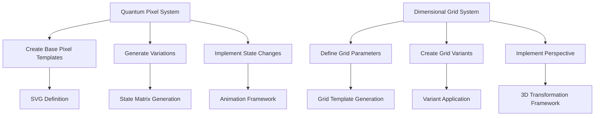

# AI-Assisted Quantum Pixel System Generation Strategy

Author: Penny Platt
Created time: April 24, 2025 1:23 AM
Overview: This document outlines a comprehensive strategy for developing an AI-assisted quantum pixel system, detailing steps for creation, generation, and implementation.

## Executive Summary:

Comprehensive plan for developing your quantum-spatial brand elements using AI assistance and code to build out the foundational system. Here's how we can approach this efficiently:

## Quick Visual Reference



## Step 1: Create Core SVG Templates with Claude Code

For the Quantum Pixel System, let's first create base templates for each state type that can then be parameterized for batch generation:

### Base Pixel Template - SVG Definition

```jsx
// Base template for quantum pixels
function createQuantumPixel({
  size = 32,       // Base size (1x, 2x, 3x, 4x multiplier applied later)
  state = 'materialized', // materialized, partial, energy, superposition
  color = '#331F4A',      // Dimensional Eggplant as default
  accentColor = '#5AC8FA', // Subtle Cyan as default accent
  borderRadius = 2,       // Corner rounding
}) {
  // State-specific rendering properties
  const stateProps = {
    materialized: {
      opacity: 1,
      glow: 0,
      layers: 1,
      shadow: '0 2px 8px rgba(90, 200, 250, 0.3)'
    },
    partial: {
      opacity: 0.7,
      glow: 0.3,
      layers: 1,
      shadow: '0 1px 6px rgba(90, 200, 250, 0.2)'
    },
    energy: {
      opacity: 0.9,
      glow: 0.8,
      layers: 1,
      shadow: '0 2px 12px rgba(90, 200, 250, 0.6)'
    },
    superposition: {
      opacity: 0.85,
      glow: 0.4,
      layers: 3,
      shadow: '0 3px 10px rgba(90, 200, 250, 0.4)'
    }
  };

  const props = stateProps[state];

  // Generate SVG string
  let svgString = `<svg width="${size}" height="${size}" viewBox="0 0 ${size} ${size}" xmlns="http://www.w3.org/2000/svg">
    <defs>
      <filter id="glow-${state}" x="-50%" y="-50%" width="200%" height="200%">
        <feGaussianBlur stdDeviation="${props.glow * 4}" result="blur"/>
        <feComposite in="SourceGraphic" in2="blur" operator="over"/>
      </filter>`;

  if (state === 'energy') {
    svgString += `
      <radialGradient id="energyGradient" cx="50%" cy="50%" r="50%" fx="50%" fy="50%">
        <stop offset="0%" stop-color="${accentColor}" stop-opacity="0.8"/>
        <stop offset="80%" stop-color="${color}" stop-opacity="${props.opacity}"/>
      </radialGradient>`;
  }

  if (state === 'superposition') {
    svgString += `
      <filter id="displace" x="-20%" y="-20%" width="140%" height="140%">
        <feTurbulence type="turbulence" baseFrequency="0.01" numOctaves="2" result="turbulence"/>
        <feDisplacementMap in="SourceGraphic" in2="turbulence" scale="3" xChannelSelector="R" yChannelSelector="G"/>
      </filter>`;
  }

  svgString += `
    </defs>`;

  // For superposition, render multiple layers with slight offset
  if (state === 'superposition') {
    for (let i = 0; i < props.layers; i++) {
      const offset = i * 2;
      const layerOpacity = props.opacity - (i * 0.15);

      svgString += `
      <rect
        x="${offset}"
        y="${offset}"
        width="${size - (offset * 2)}"
        height="${size - (offset * 2)}"
        rx="${borderRadius}"
        fill="${i === 0 ? color : accentColor}"
        opacity="${layerOpacity}"
        ${i === 0 ? 'filter="url(#displace)"' : ''}
        style="box-shadow: ${props.shadow};"
      />`;
    }
  } else if (state === 'energy') {
    svgString += `
    <rect
      x="2"
      y="2"
      width="${size - 4}"
      height="${size - 4}"
      rx="${borderRadius}"
      fill="url(#energyGradient)"
      filter="url(#glow-${state})"
      style="box-shadow: ${props.shadow};"
    />
    <rect
      x="4"
      y="4"
      width="${size - 8}"
      height="${size - 8}"
      rx="${borderRadius - 1}"
      stroke="${accentColor}"
      stroke-width="1"
      fill="none"
      opacity="${props.opacity + 0.1}"
    />`;
  } else {
    svgString += `
    <rect
      x="0"
      y="0"
      width="${size}"
      height="${size}"
      rx="${borderRadius}"
      fill="${color}"
      opacity="${props.opacity}"
      filter="url(#glow-${state})"
      style="box-shadow: ${props.shadow};"
    />`;
  }

  svgString += `
  </svg>`;

  return svgString;
}

```

## Step 2: Batch Generate Quantum Pixel Variations

Let's create a script that generates all the required quantum pixel variations based on our parameters:

```jsx
// Batch generation of quantum pixels
function generateQuantumPixelSystem() {
  const states = ['materialized', 'partial', 'energy', 'superposition'];
  const sizes = [1, 2, 3, 4]; // Size multipliers
  const colorSets = [
    // Primary colors
    { main: '#131A36', accent: '#5AC8FA' }, // Deep Space Indigo + Subtle Cyan
    { main: '#331F4A', accent: '#BF4080' }, // Dimensional Eggplant + Rose Energy
    { main: '#0D0D15', accent: '#6A3093' }, // Midnight Richness + Quantum Violet
    // Secondary combinations
    { main: '#2C5F2D', accent: '#3DFF74' }, // Heritage Green + Heritage Pixel Green
  ];

  const pixelSystem = {};

  // Generate all combinations
  states.forEach(state => {
    pixelSystem[state] = {};

    colorSets.forEach(colorSet => {
      const colorKey = Object.keys(pixelSystem[state]).length;
      pixelSystem[state][colorKey] = {};

      sizes.forEach(sizeMultiplier => {
        const pixelSize = 16 * sizeMultiplier; // Base size of 16px

        const svgString = createQuantumPixel({
          size: pixelSize,
          state: state,
          color: colorSet.main,
          accentColor: colorSet.accent,
          borderRadius: Math.max(1, 2 * sizeMultiplier)
        });

        pixelSystem[state][colorKey][sizeMultiplier] = svgString;
      });
    });
  });

  return pixelSystem;
}

// Save SVGs to files
function saveQuantumPixelSystem(pixelSystem) {
  // In a Node.js environment, you'd use fs to write files
  // For browser, we'll create a download function

  const downloads = [];

  Object.entries(pixelSystem).forEach(([state, colorVariants]) => {
    Object.entries(colorVariants).forEach(([colorVariant, sizeVariants]) => {
      Object.entries(sizeVariants).forEach(([size, svgString]) => {
        const filename = `quantum-pixel-${state}-color${colorVariant}-${size}x.svg`;

        // Create downloadable blob
        const blob = new Blob([svgString], { type: 'image/svg+xml' });
        const url = URL.createObjectURL(blob);

        downloads.push({
          filename,
          url,
          svgString
        });
      });
    });
  });

  return downloads;
}

```

## Step 3: Dimensional Grid System Generation

Now let's create a function to generate the three types of grid systems:

```jsx
// Generate dimensional grid SVG
function createDimensionalGrid({
  type = 'background', // background, navigation, distortion
  width = 1200,
  height = 800,
  opacity = 0.15,
  cellSize = 32,
  perspective = 0.2, // 0-1 value for perspective strength
  color = '#5AC8FA', // Subtle Cyan as default
  secondaryColor = '#331F4A', // Dimensional Eggplant
}) {
  // Grid type properties
  const gridProps = {
    background: {
      lineWidth: 1,
      fadeStart: 0.3, // Percentage from center where fade begins
      distortion: 0.05,
      secondaryOpacity: 0.05,
    },
    navigation: {
      lineWidth: 1.5, 
      fadeStart: 0.5,
      distortion: 0.1,
      secondaryOpacity: 0.1,
    },
    distortion: {
      lineWidth: 1,
      fadeStart: 0.4,
      distortion: 0.3,
      secondaryOpacity: 0.15,
    }
  };

  const props = gridProps[type];

  // Create SVG string
  let svgString = `<svg width="${width}" height="${height}" viewBox="0 0 ${width} ${height}" xmlns="http://www.w3.org/2000/svg">
    <defs>
      <linearGradient id="fadeX" x1="0%" y1="50%" x2="100%" y2="50%">
        <stop offset="0%" stop-color="${color}" stop-opacity="0"/>
        <stop offset="${50 - props.fadeStart * 50}%" stop-color="${color}" stop-opacity="${opacity}"/>
        <stop offset="50%" stop-color="${color}" stop-opacity="${opacity}"/>
        <stop offset="${50 + props.fadeStart * 50}%" stop-color="${color}" stop-opacity="${opacity}"/>
        <stop offset="100%" stop-color="${color}" stop-opacity="0"/>
      </linearGradient>
      <linearGradient id="fadeY" x1="50%" y1="0%" x2="50%" y2="100%">
        <stop offset="0%" stop-color="${color}" stop-opacity="0"/>
        <stop offset="${50 - props.fadeStart * 50}%" stop-color="${color}" stop-opacity="${opacity}"/>
        <stop offset="50%" stop-color="${color}" stop-opacity="${opacity}"/>
        <stop offset="${50 + props.fadeStart * 50}%" stop-color="${color}" stop-opacity="${opacity}"/>
        <stop offset="100%" stop-color="${color}" stop-opacity="0"/>
      </linearGradient>`;

  if (type === 'distortion') {
    svgString += `
      <filter id="gridDistortion" x="0%" y="0%" width="100%" height="100%">
        <feTurbulence type="fractalNoise" baseFrequency="0.01" numOctaves="2" seed="5" result="turbulence"/>
        <feDisplacementMap in="SourceGraphic" in2="turbulence" scale="${props.distortion * 20}" xChannelSelector="R" yChannelSelector="G"/>
      </filter>`;
  }

  svgString += `
    </defs>
    <g class="grid-container">`;

  // Calculate grid dimensions with perspective
  const centerX = width / 2;
  const centerY = height / 2;

  // Draw horizontal lines
  for (let y = 0; y <= height; y += cellSize) {
    // Apply perspective distortion
    const distanceFromCenterY = Math.abs(y - centerY) / height;
    const perspectiveShiftX = distanceFromCenterY * perspective * width;

    // Calculate start and end points with perspective
    const x1 = 0 + perspectiveShiftX;
    const x2 = width - perspectiveShiftX;

    svgString += `
      <line
        x1="${x1}"
        y1="${y}"
        x2="${x2}"
        y2="${y}"
        stroke="url(#fadeX)"
        stroke-width="${props.lineWidth}"
        ${type === 'distortion' ? 'filter="url(#gridDistortion)"' : ''}
      />`;
  }

  // Draw vertical lines
  for (let x = 0; x <= width; x += cellSize) {
    // Apply perspective distortion
    const distanceFromCenterX = Math.abs(x - centerX) / width;
    const perspectiveShiftY = distanceFromCenterX * perspective * height;

    // Calculate start and end points with perspective
    const y1 = 0 + perspectiveShiftY;
    const y2 = height - perspectiveShiftY;

    svgString += `
      <line
        x1="${x}"
        y1="${y1}"
        x2="${x}"
        y2="${y2}"
        stroke="url(#fadeY)"
        stroke-width="${props.lineWidth}"
        ${type === 'distortion' ? 'filter="url(#gridDistortion)"' : ''}
      />`;
  }

  // Draw secondary grid (larger cells) for more depth
  if (type !== 'background') {
    const secondaryCellSize = cellSize * 4;

    // Draw secondary horizontal lines
    for (let y = 0; y <= height; y += secondaryCellSize) {
      const distanceFromCenterY = Math.abs(y - centerY) / height;
      const perspectiveShiftX = distanceFromCenterY * perspective * width;

      const x1 = 0 + perspectiveShiftX;
      const x2 = width - perspectiveShiftX;

      svgString += `
        <line
          x1="${x1}"
          y1="${y}"
          x2="${x2}"
          y2="${y}"
          stroke="${secondaryColor}"
          stroke-opacity="${props.secondaryOpacity}"
          stroke-width="${props.lineWidth * 1.5}"
          ${type === 'distortion' ? 'filter="url(#gridDistortion)"' : ''}
        />`;
    }

    // Draw secondary vertical lines
    for (let x = 0; x <= width; x += secondaryCellSize) {
      const distanceFromCenterX = Math.abs(x - centerX) / width;
      const perspectiveShiftY = distanceFromCenterX * perspective * height;

      const y1 = 0 + perspectiveShiftY;
      const y2 = height - perspectiveShiftY;

      svgString += `
        <line
          x1="${x}"
          y1="${y1}"
          x2="${x}"
          y2="${y2}"
          stroke="${secondaryColor}"
          stroke-opacity="${props.secondaryOpacity}"
          stroke-width="${props.lineWidth * 1.5}"
          ${type === 'distortion' ? 'filter="url(#gridDistortion)"' : ''}
        />`;
    }
  }

  svgString += `
    </g>
  </svg>`;

  return svgString;
}

// Generate all grid variants
function generateDimensionalGridSystem() {
  const types = ['background', 'navigation', 'distortion'];
  const sizes = [
    { width: 1920, height: 1080, cellSize: 32 }, // Large
    { width: 1200, height: 800, cellSize: 24 },  // Medium
    { width: 800, height: 600, cellSize: 16 }    // Small
  ];
  const perspectives = [0.1, 0.2, 0.3]; // Different perspective strengths

  const gridSystem = {};

  types.forEach(type => {
    gridSystem[type] = {};

    sizes.forEach((size, sizeIndex) => {
      gridSystem[type][sizeIndex] = {};

      perspectives.forEach((perspective, perspectiveIndex) => {
        const svgString = createDimensionalGrid({
          type,
          width: size.width,
          height: size.height,
          cellSize: size.cellSize,
          perspective,
          opacity: type === 'background' ? 0.1 : type === 'navigation' ? 0.15 : 0.12
        });

        gridSystem[type][sizeIndex][perspectiveIndex] = svgString;
      });
    });
  });

  return gridSystem;
}

// Save grid SVGs
function saveDimensionalGridSystem(gridSystem) {
  const downloads = [];

  Object.entries(gridSystem).forEach(([type, sizeVariants]) => {
    Object.entries(sizeVariants).forEach(([sizeVariant, perspectiveVariants]) => {
      Object.entries(perspectiveVariants).forEach(([perspective, svgString]) => {
        const filename = `grid-${type}-size${sizeVariant}-perspective${perspective}.svg`;

        // Create downloadable blob
        const blob = new Blob([svgString], { type: 'image/svg+xml' });
        const url = URL.createObjectURL(blob);

        downloads.push({
          filename,
          url,
          svgString
        });
      });
    });
  });

  return downloads;
}

```

## Step 4: Framer Web App for Generation and Preview

I recommend creating a simple Framer web app to run this code and generate your assets with visual preview:

```jsx
import React, { useState, useEffect } from 'react';
import { Frame, Stack, Scroll, Button, Tabs } from "framer";

export default function QuantumAssetGenerator() {
  const [pixelSystem, setPixelSystem] = useState(null);
  const [gridSystem, setGridSystem] = useState(null);
  const [activeTab, setActiveTab] = useState("pixels");
  const [pixelFilter, setPixelFilter] = useState({ state: "all", color: "all", size: "all" });
  const [gridFilter, setGridFilter] = useState({ type: "all", size: "all", perspective: "all" });

  useEffect(() => {
    // Generate assets on component mount
    setPixelSystem(generateQuantumPixelSystem());
    setGridSystem(generateDimensionalGridSystem());
  }, []);

  // Implementation of the functions from earlier
  function createQuantumPixel() {/* ... */}
  function generateQuantumPixelSystem() {/* ... */}
  function createDimensionalGrid() {/* ... */}
  function generateDimensionalGridSystem() {/* ... */}

  // Download all assets as a ZIP file
  const downloadAllAssets = () => {
    // Using JSZip library to create a zip file
    const JSZip = window.JSZip;
    const zip = new JSZip();

    // Add all pixel SVGs
    if (pixelSystem) {
      Object.entries(pixelSystem).forEach(([state, colorVariants]) => {
        Object.entries(colorVariants).forEach(([colorVariant, sizeVariants]) => {
          Object.entries(sizeVariants).forEach(([size, svgString]) => {
            const filename = `quantum-pixels/${state}/color${colorVariant}/quantum-pixel-${state}-color${colorVariant}-${size}x.svg`;
            zip.file(filename, svgString);
          });
        });
      });
    }

    // Add all grid SVGs
    if (gridSystem) {
      Object.entries(gridSystem).forEach(([type, sizeVariants]) => {
        Object.entries(sizeVariants).forEach(([sizeVariant, perspectiveVariants]) => {
          Object.entries(perspectiveVariants).forEach(([perspective, svgString]) => {
            const filename = `dimensional-grids/${type}/size${sizeVariant}/grid-${type}-size${sizeVariant}-perspective${perspective}.svg`;
            zip.file(filename, svgString);
          });
        });
      });
    }

    // Generate and download ZIP
    zip.generateAsync({ type: "blob" }).then(function(content) {
      const url = URL.createObjectURL(content);
      const a = document.createElement("a");
      a.href = url;
      a.download = "quantum-spatial-assets.zip";
      a.click();
    });
  };

  // Preview rendering logic
  const renderPixelPreviews = () => {
    if (!pixelSystem) return <div>Generating pixel system...</div>;

    const filtered = [];

    Object.entries(pixelSystem).forEach(([state, colorVariants]) => {
      if (pixelFilter.state !== "all" && pixelFilter.state !== state) return;

      Object.entries(colorVariants).forEach(([colorVariant, sizeVariants]) => {
        if (pixelFilter.color !== "all" && pixelFilter.color !== colorVariant) return;

        Object.entries(sizeVariants).forEach(([size, svgString]) => {
          if (pixelFilter.size !== "all" && pixelFilter.size !== size) return;

          filtered.push({
            state,
            colorVariant,
            size,
            svgString
          });
        });
      });
    });

    return (
      <div className="pixel-grid">
        {filtered.map((pixel, index) => (
          <div key={index} className="pixel-preview">
            <div className="preview-container" dangerouslySetInnerHTML={{ __html: pixel.svgString }} />
            <div className="preview-label">
              {pixel.state} - Color {pixel.colorVariant} - {pixel.size}x
            </div>
          </div>
        ))}
      </div>
    );
  };

  const renderGridPreviews = () => {
    if (!gridSystem) return <div>Generating grid system...</div>;

    const filtered = [];

    Object.entries(gridSystem).forEach(([type, sizeVariants]) => {
      if (gridFilter.type !== "all" && gridFilter.type !== type) return;

      Object.entries(sizeVariants).forEach(([sizeVariant, perspectiveVariants]) => {
        if (gridFilter.size !== "all" && gridFilter.size !== sizeVariant) return;

        Object.entries(perspectiveVariants).forEach(([perspective, svgString]) => {
          if (gridFilter.perspective !== "all" && gridFilter.perspective !== perspective) return;

          filtered.push({
            type,
            sizeVariant,
            perspective,
            svgString
          });
        });
      });
    });

    return (
      <div className="grid-previews">
        {filtered.map((grid, index) => (
          <div key={index} className="grid-preview">
            <div className="preview-container" dangerouslySetInnerHTML={{ __html: grid.svgString }} />
            <div className="preview-label">
              {grid.type} - Size {grid.sizeVariant} - Perspective {grid.perspective}
            </div>
          </div>
        ))}
      </div>
    );
  };

  return (
    <Frame
      width={"100%"}
      height={"100%"}
      background="#0A0621"
      color="#FFFFFF"
    >
      <Stack direction="vertical" width="100%" height="100%" gap={20} padding={20}>
        <h1>Quantum-Spatial Asset Generator</h1>

        <Tabs
          tabs={["Quantum Pixels", "Dimensional Grids"]}
          value={activeTab}
          onChange={(tab) => setActiveTab(tab)}
        />

        <Button onClick={downloadAllAssets}>
          Download All Assets as ZIP
        </Button>

        {activeTab === "pixels" && (
          <>
            <div className="filters">
              <select
                value={pixelFilter.state}
                onChange={e => setPixelFilter({...pixelFilter, state: e.target.value})}
              >
                <option value="all">All States</option>
                <option value="materialized">Materialized</option>
                <option value="partial">Partial</option>
                <option value="energy">Energy</option>
                <option value="superposition">Superposition</option>
              </select>

              <select
                value={pixelFilter.color}
                onChange={e => setPixelFilter({...pixelFilter, color: e.target.value})}
              >
                <option value="all">All Colors</option>
                <option value="0">Color 0 (Indigo/Cyan)</option>
                <option value="1">Color 1 (Eggplant/Rose)</option>
                <option value="2">Color 2 (Midnight/Violet)</option>
                <option value="3">Color 3 (Heritage Green)</option>
              </select>

              <select
                value={pixelFilter.size}
                onChange={e => setPixelFilter({...pixelFilter, size: e.target.value})}
              >
                <option value="all">All Sizes</option>
                <option value="1">1x</option>
                <option value="2">2x</option>
                <option value="3">3x</option>
                <option value="4">4x</option>
              </select>
            </div>

            <Scroll height={600}>
              {renderPixelPreviews()}
            </Scroll>
          </>
        )}

        {activeTab === "grids" && (
          <>
            <div className="filters">
              <select
                value={gridFilter.type}
                onChange={e => setGridFilter({...gridFilter, type: e.target.value})}
              >
                <option value="all">All Types</option>
                <option value="background">Background</option>
                <option value="navigation">Navigation</option>
                <option value="distortion">Distortion</option>
              </select>

              <select
                value={gridFilter.size}
                onChange={e => setGridFilter({...gridFilter, size: e.target.value})}
              >
                <option value="all">All Sizes</option>
                <option value="0">Large</option>
                <option value="1">Medium</option>
                <option value="2">Small</option>
              </select>

              <select
                value={gridFilter.perspective}
                onChange={e => setGridFilter({...gridFilter, perspective: e.target.value})}
              >
                <option value="all">All Perspectives</option>
                <option value="0">Subtle (0.1)</option>
                <option value="1">Medium (0.2)</option>
                <option value="2">Strong (0.3)</option>
              </select>
            </div>

            <Scroll height={600}>
              {renderGridPreviews()}
            </Scroll>
          </>
        )}
      </Stack>
    </Frame>
  );
}

```

## Step 5: Standalone Node.js Generator

If you prefer a command-line approach instead of Framer, here's a simple Node.js script you can use with Claude Code:

```jsx
// quantum-spatial-generator.js
const fs = require('fs');
const path = require('path');

// Import the pixel and grid generation functions
// (Insert the createQuantumPixel, generateQuantumPixelSystem, createDimensionalGrid, and generateDimensionalGridSystem functions here)

// Create output directories
const outputDir = path.join(__dirname, 'quantum-spatial-assets');
const pixelDir = path.join(outputDir, 'quantum-pixels');
const gridDir = path.join(outputDir, 'dimensional-grids');

// Create directory structure
fs.mkdirSync(outputDir, { recursive: true });
fs.mkdirSync(pixelDir, { recursive: true });
fs.mkdirSync(gridDir, { recursive: true });

// Generate and save quantum pixels
console.log('Generating quantum pixel system...');
const pixelSystem = generateQuantumPixelSystem();

Object.entries(pixelSystem).forEach(([state, colorVariants]) => {
  const stateDir = path.join(pixelDir, state);
  fs.mkdirSync(stateDir, { recursive: true });

  Object.entries(colorVariants).forEach(([colorVariant, sizeVariants]) => {
    const colorDir = path.join(stateDir, `color${colorVariant}`);
    fs.mkdirSync(colorDir, { recursive: true });

    Object.entries(sizeVariants).forEach(([size, svgString]) => {
      const filename = path.join(colorDir, `quantum-pixel-${state}-color${colorVariant}-${size}x.svg`);
      fs.writeFileSync(filename, svgString);
    });
  });
});

console.log('Quantum pixel system generated successfully!');

// Generate and save dimensional grids
console.log('Generating dimensional grid system...');
const gridSystem = generateDimensionalGridSystem();

Object.entries(gridSystem).forEach(([type, sizeVariants]) => {
  const typeDir = path.join(gridDir, type);
  fs.mkdirSync(typeDir, { recursive: true });

  Object.entries(sizeVariants).forEach(([sizeVariant, perspectiveVariants]) => {
    const sizeDir = path.join(typeDir, `size${sizeVariant}`);
    fs.mkdirSync(sizeDir, { recursive: true });

    Object.entries(perspectiveVariants).forEach(([perspective, svgString]) => {
      const filename = path.join(sizeDir, `grid-${type}-size${sizeVariant}-perspective${perspective}.svg`);
      fs.writeFileSync(filename, svgString);
    });
  });
});

console.log('Dimensional grid system generated successfully!');
console.log(`All assets saved to: ${outputDir}`);

```

## Implementation Tips

1. **Start Small**: Begin by generating a few samples to verify the style matches your quantum-spatial aesthetic
2. **Tweak Parameters**: Adjust the SVG generation functions to match your exact specifications
3. **Optimize for Performance**: The grid system can become complex, so consider optimizing for viewing performance
4. **Create Asset Registry**: Keep a JSON file that catalogs all your generated assets with their purposes
5. **Version Control**: Store these generators in version control so you can evolve the system over time

## Next Steps

1. **Create Example Compositions**: Build sample layouts showing how to use multiple quantum pixels together
2. **Animation Framework**: Develop animation templates for transitioning between pixel states
3. **Component Integration**: Create React/Framer components
    
    

<aside>


### Document History

| Version | Date | Author | Changes |
| --- | --- | --- | --- |
| 0.1 | April 18, 2025  | @Penny Platt  | Initial draft |
| 0.2 | YYYY-MM-DD | [Name] | Added market analysis |
| 0.3 | YYYY-MM-DD | [Name] | Updated technical architecture |
| 1.0 | YYYY-MM-DD | [Name] | Finalized for approval |

*This document follows 9Bit Studios’ documentation standards and incorporates quantum-spatial design principles.*

</aside>

*© 2025 9Bit Studios. All rights reserved.*
