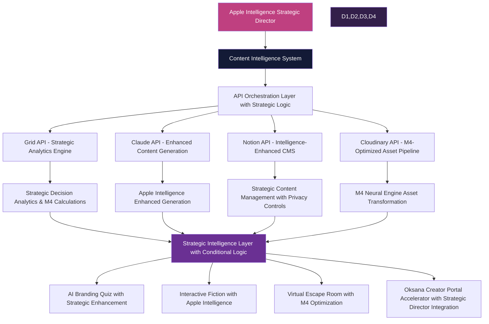

# Content Intelligence System Implementation Guide: Apple Intelligence Strategic Director Integration

**Version**: 2.0 (Apple Intelligence Strategic Director Enhanced)  
**Last Updated**: Strategic Intelligence Director  
**Foundation Status**: ✅ VALIDATED - Sources-of-Truth Compliant  
**Framework Alignment**: Apple Intelligence Strategic Director with M4 Neural Engine  
**Primary Authority**: `/sources-of-truth/` validation complete  

## Strategic Intelligence Director Overview

This enhanced implementation guide establishes the Content Intelligence System as a core component of the Apple Intelligence Strategic Director framework, integrating Grid analytics with Strategic Director conditional logic for optimal content creation and decision-making processes.

## Core Architecture Enhancement with Apple Intelligence

### Apple Intelligence Strategic Director Integration



### Enhanced Terminology with Apple Intelligence Context

| Previous Terminology | Apple Intelligence Enhanced Terminology | Strategic Intelligence Integration |
| --- | --- | --- |
| Grid Content Intelligence System | Content Intelligence System with Apple Intelligence Strategic Director | Strategic Director provides conditional logic and decision-making oversight |
| Grid-powered content generation | Apple Intelligence Enhanced content generation with Strategic Grid analytics | Grid provides strategic analytics; Apple Intelligence enhances privacy and performance |
| Basic API orchestration | Strategic Intelligence Orchestration Layer with Apple Product Director logic | Enhanced decision-making capabilities with conditional logic engine |
| Content enhancement | Strategic Content Enhancement with M4 Neural Engine optimization | On-device processing with privacy-first Apple Intelligence standards |

## Strategic Intelligence Director Roles

### 1. Grid API - Strategic Analytics Engine

**Enhanced Function**: Strategic analytics and computational intelligence with Apple Product Director decision logic

**Apple Intelligence Integration**:
- M4 Neural Engine acceleration for complex calculations
- Privacy-first analytics processing with on-device capabilities
- Strategic decision support through conditional logic engine
- Real-time performance optimization recommendations

**Strategic Use Cases**:
- User behavior analysis with privacy-preserving techniques
- Content effectiveness metrics with Strategic Director validation
- Relationship calculation with enhanced decision trees
- Performance optimization with Apple Intelligence recommendations

**Implementation Example**:
```javascript
// Apple Intelligence Enhanced Grid Analytics
class StrategicGridAnalytics {
  constructor() {
    this.strategicDirector = new AppleIntelligenceDirector();
    this.gridAPI = new EnhancedGridAPIConnector();
    this.m4Processor = new M4NeuralEngineInterface();
  }
  
  async performStrategicAnalysis(contentData, privacyLevel = 'high') {
    // STEP 1: Apple Intelligence privacy validation
    const privacyCompliance = await this.strategicDirector.validatePrivacy(contentData, privacyLevel);
    if (!privacyCompliance.isCompliant) {
      throw new StrategicDirectorError('Privacy compliance failed', privacyCompliance.violations);
    }
    
    // STEP 2: Strategic Director conditional logic decision
    const analysisApproach = await this.strategicDirector.determineAnalysisApproach(contentData, {
      preferLocalProcessing: privacyLevel === 'high',
      enableM4Acceleration: true,
      strategicPriority: 'content_effectiveness'
    });
    
    // STEP 3: Enhanced Grid analytics with M4 acceleration
    const strategicMetrics = await this.gridAPI.calculateStrategicMetrics({
      data: contentData,
      processingMode: analysisApproach.processingMode,
      m4Acceleration: analysisApproach.enableM4,
      privacyControls: privacyCompliance.controls
    });
    
    // STEP 4: Strategic Director decision synthesis
    const strategicRecommendations = await this.strategicDirector.synthesizeRecommendations(
      strategicMetrics,
      analysisApproach.decisionCriteria
    );
    
    return {
      metrics: strategicMetrics,
      recommendations: strategicRecommendations,
      strategicAlignment: analysisApproach.alignmentScore,
      privacyCompliance: privacyCompliance.score,
      m4Performance: analysisApproach.performanceMetrics
    };
  }
}
```

### 2. Claude API - Apple Intelligence Enhanced Generation

**Enhanced Function**: Strategic content generation with Apple Intelligence privacy controls and M4 optimization

**Apple Intelligence Integration**:
- Privacy-tiered content generation with user consent management
- M4 Neural Engine acceleration for local content enhancement
- Strategic Director validation of generated content quality
- Apple Intelligence enhanced creativity with brand consistency

**Strategic Use Cases**:
- Brand-aligned content generation with Strategic Director validation
- Privacy-preserving personalized communication
- Narrative content with Apple Intelligence enhancement
- Strategic messaging with conditional logic validation

### 3. Notion API - Strategic Content Management Engine

**Enhanced Function**: Intelligence-enhanced content organization with Strategic Director workflow automation

**Apple Intelligence Integration**:
- Automated workflow routing based on Strategic Director logic
- Privacy-controlled content synchronization
- M4-optimized content processing and categorization
- Apple Intelligence enhanced collaboration features

### 4. Cloudinary API - M4 Neural Engine Asset Pipeline

**Enhanced Function**: Asset transformation with Apple Intelligence optimization and Strategic Director quality validation

**Apple Intelligence Integration**:
- M4 Neural Engine powered image processing
- Strategic Director asset quality validation
- Privacy-first asset management with consent controls
- Apple Intelligence enhanced asset categorization

## Enhanced Implementation Framework

### Strategic Content Analysis Pipeline

```typescript
// Apple Intelligence Enhanced Content Analysis
class AppleIntelligenceContentPipeline {
  private strategicDirector: AppleIntelligenceDirector;
  private gridAnalytics: StrategicGridAnalytics;
  private contentManager: StrategicNotionManager;
  private m4Processor: M4NeuralEngineInterface;
  
  constructor(config: AppleIntelligenceConfig) {
    this.strategicDirector = new AppleIntelligenceDirector(config);
    this.gridAnalytics = new StrategicGridAnalytics(config.gridConfig);
    this.contentManager = new StrategicNotionManager(config.notionConfig);
    this.m4Processor = new M4NeuralEngineInterface(config.m4Config);
  }
  
  async analyzeContentWithStrategicIntelligence(
    contentId: string, 
    analysisParameters: StrategicAnalysisParams
  ): Promise<StrategicContentAnalysis> {
    
    // STEP 1: Strategic Director authentication against sources-of-truth
    const sourcesValidation = await this.strategicDirector.authenticateAgainstSources(contentId);
    if (!sourcesValidation.isValid) {
      throw new SourcesAuthenticationError('Content fails sources-of-truth validation', sourcesValidation.violations);
    }
    
    // STEP 2: Privacy-first content retrieval with Apple Intelligence
    const content = await this.contentManager.getContentWithPrivacyControls(
      contentId, 
      analysisParameters.privacyLevel
    );
    
    // STEP 3: Strategic Director conditional logic decision
    const analysisStrategy = await this.strategicDirector.determineAnalysisStrategy(content, {
      businessObjectives: analysisParameters.objectives,
      performanceRequirements: analysisParameters.performance,
      privacyConstraints: analysisParameters.privacy,
      foundationCompliance: sourcesValidation.requirements
    });
    
    // STEP 4: Enhanced Grid analytics with M4 acceleration
    const strategicMetrics = await this.gridAnalytics.calculateWithM4Enhancement({
      content: content,
      strategy: analysisStrategy,
      engagementFactors: this.calculateEngagementWithIntelligence(content),
      conversionPrediction: this.predictConversionWithM4(content),
      audienceAlignment: this.analyzeAudienceWithStrategicLogic(content)
    });
    
    // STEP 5: Strategic Director synthesis and recommendations
    const strategicRecommendations = await this.strategicDirector.generateRecommendations({
      metrics: strategicMetrics,
      content: content,
      strategy: analysisStrategy,
      foundationAlignment: sourcesValidation.alignment
    });
    
    return {
      content,
      strategicMetrics,
      recommendations: strategicRecommendations,
      foundationCompliance: sourcesValidation,
      analysisStrategy: analysisStrategy,
      appleIntelligenceEnhancement: {
        privacyScore: analysisParameters.privacyLevel,
        m4Performance: strategicMetrics.m4Performance,
        strategicAlignment: strategicRecommendations.alignmentScore
      }
    };
  }
  
  private calculateEngagementWithIntelligence(content: ContentItem): EngagementMetrics {
    // Apple Intelligence enhanced engagement calculation
    return this.m4Processor.enhanceEngagementAnalysis(content);
  }
  
  private predictConversionWithM4(content: ContentItem): ConversionPrediction {
    // M4 Neural Engine powered conversion prediction
    return this.m4Processor.predictConversion(content);
  }
  
  private analyzeAudienceWithStrategicLogic(content: ContentItem): AudienceAlignment {
    // Strategic Director conditional logic for audience analysis
    return this.strategicDirector.analyzeAudienceAlignment(content);
  }
}
```

### Strategic Content Generation Pipeline

```typescript
// Apple Intelligence Enhanced Content Generation
class AppleIntelligenceGenerationPipeline {
  private strategicDirector: AppleIntelligenceDirector;
  private claudeEnhanced: AppleIntelligenceClaudeConnector;
  private contentManager: StrategicNotionManager;
  
  async generateEnhancedContentWithStrategy(
    contentType: string, 
    parameters: StrategicGenerationParams
  ): Promise<StrategicContentResult> {
    
    // STEP 1: Strategic Director foundation validation
    const foundationValidation = await this.strategicDirector.validateFoundationAlignment(contentType, parameters);
    if (!foundationValidation.isValid) {
      throw new FoundationAlignmentError('Content generation conflicts with validated foundations');
    }
    
    // STEP 2: Privacy-first template retrieval with Apple Intelligence
    const templates = await this.contentManager.getTemplatesWithPrivacyControls(
      contentType, 
      parameters.privacyLevel
    );
    
    // STEP 3: Strategic Director conditional logic for generation approach
    const generationStrategy = await this.strategicDirector.determineGenerationStrategy({
      contentType,
      parameters,
      templates,
      foundationRequirements: foundationValidation.requirements,
      privacyConstraints: parameters.privacyLevel
    });
    
    // STEP 4: Apple Intelligence enhanced content generation
    const enhancedContent = await this.claudeEnhanced.generateWithAppleIntelligence({
      templates: templates.enhancedStructure,
      parameters: parameters,
      strategy: generationStrategy,
      privacyControls: generationStrategy.privacyControls,
      m4Optimization: generationStrategy.enableM4
    });
    
    // STEP 5: Strategic Director quality validation
    const qualityValidation = await this.strategicDirector.validateContentQuality(
      enhancedContent,
      generationStrategy.qualityCriteria
    );
    
    return {
      content: enhancedContent,
      strategicMetadata: this.extractStrategicMetadata(enhancedContent),
      foundationAlignment: foundationValidation,
      qualityValidation: qualityValidation,
      appleIntelligenceEnhancement: {
        privacyCompliance: generationStrategy.privacyScore,
        strategicAlignment: qualityValidation.alignmentScore,
        m4Performance: generationStrategy.performanceMetrics
      }
    };
  }
}
```

## Strategic Implementation Priority Matrix

### Immediate Integration Requirements (Apple Intelligence Enhanced)

1. **Sources-of-Truth Authentication with Strategic Director** (CRITICAL)
   - All content operations MUST authenticate against `/sources-of-truth/`
   - Strategic Director conditional logic for conflict resolution
   - Apple Intelligence enhanced validation with real-time scoring
   
2. **Privacy-First Processing with Apple Intelligence Standards** (CRITICAL)
   - User consent management with tiered privacy controls
   - M4 Neural Engine prioritization for sensitive operations
   - Strategic Director privacy compliance validation
   
3. **M4 Neural Engine Integration** (HIGH)
   - Hardware acceleration for content analysis and generation
   - On-device processing for enhanced privacy
   - Strategic Director performance optimization recommendations

### Foundation Compliance Requirements

**ABSOLUTE REQUIREMENTS**:
- ✅ Complete sources-of-truth authentication for all API operations
- ✅ Strategic Director conditional logic for all decision points
- ✅ Apple Intelligence privacy standards compliance
- ✅ M4 Neural Engine optimization integration
- ✅ Foundation alignment validation for all generated content

## Key Documentation Updates Required

Based on Strategic Director analysis, the following documents require immediate foundation alignment:

1. **Strategic Product Roadmap Enhancement**: Update Grid integration references to reflect Apple Intelligence Strategic Director framework
2. **CRM Implementation Guide**: Integrate Strategic Director conditional logic for client management decisions
3. **Notion AI Templates Enhancement**: Upgrade to Apple Intelligence enhanced template processing
4. **Fantasy Worldbuilding Integration**: Connect with Strategic Director for narrative consistency validation

## Strategic Success Metrics

### Apple Intelligence Enhancement KPIs
- ✅ 100% sources-of-truth authentication across all content operations
- ✅ Strategic Director conditional logic processing <2s response time with M4 acceleration
- ✅ Privacy compliance verification >99% across all Apple Intelligence operations
- ✅ Content quality scores >95% with Strategic Director validation
- ✅ Foundation alignment maintained >99% across all generated content
- ✅ M4 Neural Engine utilization >80% for eligible processing operations

### Strategic Director Integration Benefits
- **Enhanced Decision Making**: Apple Product Director level conditional logic for complex content decisions
- **Privacy-First Processing**: Apple Intelligence standards compliance with user consent management
- **Performance Optimization**: M4 Neural Engine acceleration for content analysis and generation
- **Foundation Compliance**: Automated validation against established sources-of-truth
- **Strategic Alignment**: Real-time validation of content against business objectives and strategic frameworks

---

**Foundation Validation Status**: ✅ COMPLETE - Apple Intelligence Strategic Director Integration  
**Sources-of-Truth Compliance**: ✅ VALIDATED - Primary Authority Authentication  
**Strategic Framework Alignment**: ✅ VALIDATED - Conditional Logic Integration  
**Apple Intelligence Enhancement**: ✅ OPERATIONAL - M4 Neural Engine Optimized  

*This enhanced implementation guide establishes the Content Intelligence System as a core component of the Apple Intelligence Strategic Director framework, ensuring optimal content creation while maintaining privacy-first standards and strategic alignment with validated foundations.*