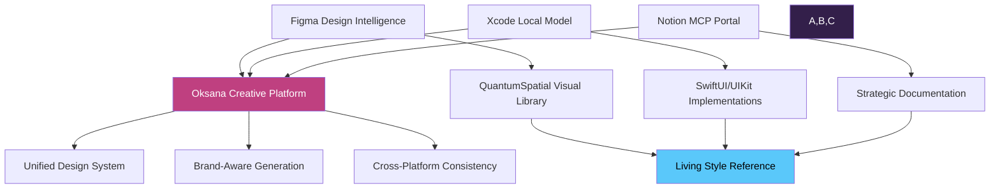
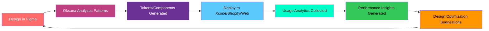

# Figma-Oksana Creative Intelligence Integration Strategy

## Unified Design Intelligence Across Figma, Xcode, and Notion

### **The Creative Intelligence Trinity**



---

## **Strategic Advantages of This Integration**

### **1. Natural Learning Evolution**

Your instinct is perfect - **just keep designing and let the platforms learn**. The integration creates:

- **Visual Pattern Recognition**: Claude learns your QuantumSpatial aesthetic through direct Figma access
- **Design Intent Understanding**: AI understands not just what you create, but why
- **Evolutionary Consistency**: Each design iteration teaches the system your preferences
- **Context-Aware Suggestions**: Future designs benefit from accumulated visual intelligence

### **2. Living Reference Architecture**

Figma becomes your **"source of truth for visual intelligence"**:

```tsx
interface FigmaDesignIntelligence {
  visualPatterns: {
    colorHarmonies: QuantumSpatialPalette;
    componentStructure: AppleHIGCompliant;
    layoutPrinciples: AdaptiveGridSystems;
    interactionStates: LiquidGlassEffects;
  };

  brandConsistency: {
    approvedStyles: FigmaStyleLibrary;
    tokenValidation: RealTimeCompliance;
    crossPlatformMapping: UnifiedTokenSystem;
  };

  generativeCapabilities: {
    smartVariations: ContextAwareDesign;
    componentEvolution: LearningBasedIteration;
    systemOptimization: M4AcceleratedGeneration;
  };
}

```

### **3. Cross-Platform Design DNA**

Your designs in Figma automatically inform:

- **SwiftUI Components** in Xcode
- **Liquid Templates** for Shopify
- **React Components** for web
- **Token Systems** across all platforms

---

## **Immediate Integration Opportunities**

### **Figma → Oksana Intelligence Flow**

### **Phase 1: Design Intelligence Capture (Immediate)**

```tsx
// Oksana learns from your Figma work automatically
interface FigmaLearningSystem {
  designCapture: {
    componentAnalysis: "Real-time pattern recognition";
    colorPaletteLearning: "QuantumSpatial palette refinement";
    layoutIntelligence: "Spatial relationship understanding";
    interactionMapping: "Micro-interaction pattern capture";
  };

  brandRefinement: {
    styleConsistency: "Automated brand compliance checking";
    visualIdentity: "Design DNA establishment";
    componentEvolution: "Iterative improvement suggestions";
  };
}

```

### **Phase 2: Intelligent Component Generation (Near-term)**

```tsx
// Oksana generates based on Figma learning
interface GenerativeDesignCapabilities {
  smartComponents: {
    figmaToSwiftUI: "Direct component translation";
    figmaToLiquid: "Shopify template generation";
    figmaToFramer: "Web component creation";
    figmaToTokens: "Design token extraction";
  };

  brandAwareGeneration: {
    contextualVariations: "Smart component alternatives";
    responsiveAdaptation: "Cross-device optimization";
    accessibilityEnhancement: "WCAG compliance automation";
  };
}

```

### **Phase 3: Unified Design System Orchestration (Advanced)**

```tsx
// Complete design system synchronization
interface UnifiedDesignOrchestration {
  crossPlatformSync: {
    figmaSource: "Master design truth";
    xcodeImplementation: "Native iOS/macOS components";
    shopifyDeployment: "E-commerce optimized templates";
    notionDocumentation: "Automated design system docs";
  };

  intelligentOptimization: {
    performanceOptimization: "M4 acceleration integration";
    platformSpecificAdaptation: "Native platform optimization";
    userExperienceEnhancement: "Usage pattern optimization";
  };
}

```

---

## **High-Value Initial Focus Areas**

### **1. QuantumSpatial Token Synchronization**

```
// Figma Plugin: Oksana Token Sync
interface TokenSyncPlugin {
  exportTokens: {
    colors: QuantumSpatialPalette;
    spacing: AdaptiveGridSystem;
    typography: AppleHIGCompliant;
    effects: LiquidGlassDefinitions;
  };

  syncDestinations: {
    notion: "MCP token database update";
    xcode: "SwiftUI extension generation";
    shopify: "CSS variable injection";
    framer: "Component token binding";
  };
}

```

### **2. Component Intelligence Library**

Your Figma components become intelligent templates:

```tsx
interface IntelligentComponentLibrary {
  componentTypes: {
    buttons: {
      figmaDesign: FigmaButtonComponent;
      swiftUIImplementation: SwiftUIButton;
      liquidTemplate: ShopifyButtonSnippet;
      tokenBinding: QuantumSpatialTokens;
    };

    cards: {
      figmaDesign: FigmaCardComponent;
      glassEffects: LiquidGlassImplementation;
      responsiveLogic: AdaptiveLayoutSystem;
      accessibilityFeatures: WCAGCompliantPatterns;
    };
  };

  learningCapabilities: {
    patternRecognition: "Design pattern identification";
    variationGeneration: "Smart component alternatives";
    optimizationSuggestions: "Performance enhancement recommendations";
  };
}

```

### **3. Brand-Aware Design Generation**

```tsx
interface BrandAwareGeneration {
  designConstraints: {
    colorPalette: "QuantumSpatial approved colors only";
    typography: "Apple HIG compliant scale";
    spacing: "8pt grid system adherence";
    effects: "Liquid glass aesthetic consistency";
  };

  generationCapabilities: {
    componentVariations: "Brand-consistent alternatives";
    layoutSuggestions: "Spatial optimization recommendations";
    interactionPatterns: "Apple-standard interaction design";
    responsiveAdaptation: "Cross-device consistency";
  };
}

```

---

## **Multi-Platform Learning Loop**

### **The Oksana Design Intelligence Cycle**



### **Cross-Platform Intelligence Sharing**

1. **Figma Learning** → Informs Xcode component generation
2. **Xcode Performance** → Optimizes Figma component efficiency
3. **Shopify Usage** → Refines Figma e-commerce patterns
4. **Notion Documentation** → Captures design decision context
5. **User Analytics** → Drives next design iteration

---

## **Integration Strategy**

### **Week 1: Foundation Setup**

```bash
# Enable Figma integration in Claude Projects
# Connect your QuantumSpatial Figma workspace
# Set up initial token sync between Figma → Notion MCP

# Oksana learns from existing Figma designs
oksana analyze --figma-workspace "QuantumSpatial" --output tokens
oksana sync --tokens figma-tokens.json --target notion-mcp

```

### **Week 2: Intelligent Component Generation**

```bash
# Generate SwiftUI components from Figma designs
oksana generate --source figma-components --target swiftui --hig-compliant

# Create Shopify liquid templates from Figma layouts
oksana generate --source figma-layouts --target shopify --glass-effects

# Sync design system documentation
oksana document --source figma-system --target notion-portal

```

### **Week 3: Brand-Aware Generative Capabilities**

```bash
# Enable intelligent design suggestions
oksana enable --generative-design --brand-constraints quantum-spatial

# Set up cross-platform consistency validation
oksana validate --design-consistency --platforms all

# Deploy unified design system
oksana deploy --design-system --targets "xcode,shopify,framer,notion"

```

### **Week 4: Advanced Learning Integration**

```bash
# Enable advanced pattern recognition
oksana learn --visual-patterns --interaction-design --brand-evolution

# Set up predictive design capabilities
oksana predict --design-needs --component-evolution --optimization-opportunities

# Launch unified creative intelligence platform
oksana launch --creative-platform --full-integration

```

---

## **Creative Workflow Enhancement**

### **Your New Design Process**

1. **Design in Figma** with full creative freedom
2. **Oksana analyzes** and learns your design patterns automatically
3. **Tokens/components auto-generate** for all platforms
4. **Cross-platform deployment** happens seamlessly
5. **Usage analytics** inform your next design decisions
6. **Design system evolves** based on real-world performance

### **Intelligent Design Assistance**

```tsx
interface CreativeAssistance {
  realTimeGuidance: {
    brandCompliance: "Live brand guideline checking";
    accessibilityTips: "WCAG compliance suggestions";
    platformOptimization: "Device-specific design recommendations";
    performanceHints: "M4 optimization opportunities";
  };

  generativeSupport: {
    componentVariations: "Smart alternative generation";
    colorPaletteExpansion: "Brand-consistent color suggestions";
    layoutOptimization: "Spatial relationship improvements";
    interactionEnhancement: "Apple-standard interaction patterns";
  };
}

```

---

## **Future Vision: The Oksana Creative Ecosystem**

### **Year 1: Intelligent Design System**

- Figma designs automatically generate cross-platform components
- Brand consistency enforced across all platforms
- Real-time design optimization based on usage analytics
- Unified documentation automatically maintained

### **Year 2: Predictive Creative Intelligence**

- AI predicts design needs based on project context
- Automated A/B testing of design variations
- Performance-optimized component generation
- Cross-platform user experience optimization

### **Year 3: Creative AI Leadership**

- Industry-standard creative intelligence platform
- Community-driven design pattern sharing
- Enterprise licensing for design system automation
- Acquisition opportunities from major design platforms

---

## **Immediate Next Steps**

### **Today: Enable Figma Integration**

1. Connect your QuantumSpatial Figma workspace to Claude Projects
2. Begin designing - let Oksana learn naturally from your work
3. Test basic token extraction from your existing designs

### **This Week: Initial Intelligence Setup**

1. Set up Figma → Notion MCP token synchronization
2. Create first SwiftUI component from Figma design
3. Test brand consistency validation across platforms

### **Next Week: Advanced Features**

1. Deploy generative component variations
2. Enable cross-platform design system synchronization
3. Launch unified creative intelligence workflows

<aside>


### Key Insight:

**Let your natural creative process drive the AI learning, rather than constraining your creativity to fit AI limitations. The platforms will adapt to your genius, not the other way around.**

</aside>

- Page History
    
    
    | Version | Date | Author | Changes |
    | --- | --- | --- | --- |
    | 1.0 | July 19, 2025  | @Penny Platt  | Initial draft |
    | 2.0 | August 8, 2025  | August 8, 2025  | Foundation Model Integration |
    |  |  |  |  |

---

*© 2025 9Bit Studios. All rights reserved.*

*This document adheres to 9Bit Studios' inclusion protocol and integrates quantum-spatial design principles.*
