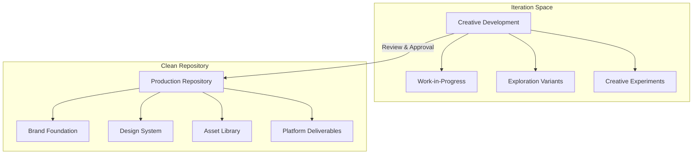

# Quantum Leap Neural Engine Art and Asset Generation Acceleration Guide

## Summary

This strategic Apple Intelligence neural engine art and asset generation acceleration guide is designed for managing both iterative creative development and production-ready assets in a local repository. This system gives the best of both worlds: creative freedom during development and rigorous organization for production assets. The twin repository structure ensures a clean, approved asset library that exactly matches your Notion pipeline.


## Local Repository Strategy

Here's an efficient two-tier system that supports rapid iteration while maintaining a clean production repository:



## Streamlined Pipeline Design for Skilled Code Execution and Creative Asset Management

Here's how to set up your asset management system:

```tsx
// File: create-asset-repository.js

const fs = require('fs');
const path = require('path');

// Base structure matching your Notion art pipeline
const directoryStructure = {
  "Brand-Foundation": {
    "Brand-Identity-System": {
      "Core-Brand-Elements": [
        "Logo-System-Variations",
        "Color-System-Palette",
        "Typography-System",
        "Voice-Tone-Guidelines"
      ],
      "Brand-Narrative-Framework": [
        "Brand-Story-Positioning",
        "Audience-Personas",
        "Messaging-Architecture",
        "Content-Strategy-Guidelines"
      ],
      "Brand-Expression-Standards": [
        "Visual-Style-Guidelines",
        "Writing-Style-Guide",
        "Presentation-Templates",
        "Marketing-Asset-Standards"
      ]
    }
  },
  "Quantum-Spatial-Design-System": {
    "Core-Design-Principles": {
      "Dimensional-Evolution-Framework": [
        "Heritage-State-Guidelines",
        "Transitional-State-Parameters",
        "Quantum-State-Specifications",
        "Superposition-State-Implementation"
      ],
      "Grid-System-Architecture": [
        "Background-Grid",
        "Interface-Grid",
        "Feature-Grid",
        "Spatial-Grid-3D-Applications"
      ],
      "Material-Properties-System": [
        "Quantum-Surface-Specifications",
        "Grid-Surface-Guidelines",
        "Heritage-Element-Parameters",
        "Energy-State-Definitions"
      ],
      "Motion-Animation-Framework": [
        "State-Transition-Guidelines",
        "Physics-Based-Animation-Rules",
        "Timing-Easing-Standards",
        "Platform-Specific-Animation-Guidelines"
      ]
    },
    "Component-Library": {
      "Foundational-Elements": [
        "Quantum-Pixel-System",
        "Dimensional-Grid-Components",
        "Material-States-Transitions",
        "Energy-Flow-Visualizations"
      ],
      "UI-Components": [
        "Navigation-Systems",
        "Buttons-Controls",
        "Cards-Containers",
        "Forms-Inputs",
        "Modals-Overlays"
      ],
      "Information-Display": [
        "Data-Visualization-Components",
        "Status-Progress-Indicators",
        "Notification-Systems",
        "Content-Display-Frameworks"
      ],
      "Design-Tokens": [
        "Color-Tokens",
        "Typography-Tokens",
        "Spacing-Layout-Tokens",
        "Animation-Tokens"
      ]
    }
  },
  "Asset-Creation-Pipeline": {
    "Design-Requests": {
      "Brand-Asset-Requests": [],
      "UI-Element-Requests": [],
      "Marketing-Asset-Requests": [],
      "Game-Asset-Requests": [
        "Character-Art",
        "Environment-Assets",
        "UI-Game-Elements",
        "Animation-Requests"
      ]
    },
    "AI-Powered-Creation-Framework": {
      "M4-Optimized-Generation-Pipeline": [
        "Claude-Code-Generation-System",
        "Ideogram-Visual-Generation",
        "Neural-Engine-Integration",
        "Batch-Processing-Framework"
      ],
      "Quality-Control-System": [
        "AI-Output-Validation",
        "Brand-Consistency-Verification",
        "Technical-Specification-Compliance",
        "Performance-Optimization-Checks"
      ],
      "Content-Intelligence-System": [
        "Content-Analysis-Framework",
        "Enhancement-Recommendation-Engine",
        "Creative-Workflow-Optimization",
        "Quality-Assessment-Protocols"
      ]
    },
    "Standardized-Production-Workflows": {
      "2D-Asset-Workflow": [
        "Vector-Asset-Creation-Process",
        "Raster-Asset-Optimization-Pipeline",
        "SVG-Component-Development",
        "Iconography-Production-System"
      ],
      "3D-Asset-Workflow": [
        "3D-Modeling-Standards-Process",
        "Material-Development-Pipeline",
        "Lighting-Implementation-Guidelines",
        "Environment-Creation-Workflow"
      ],
      "Animation-Workflow": [
        "Animation-Concept-Development",
        "Technical-Animation-Implementation",
        "State-Transition-Animation-System",
        "Platform-Specific-Optimization"
      ]
    },
    "Platform-Specific-Pipelines": {
      "Web-Platform-Pipeline": [
        "Framer-Component-Implementation",
        "React-Component-Generation",
        "Web-Animation-Framework",
        "Performance-Optimization-Process"
      ],
      "iOS-macOS-Pipeline": [
        "SwiftUI-Component-Implementation",
        "Native-Asset-Optimization",
        "iOS-Animation-Framework",
        "Apple-HIG-Compliance-Process"
      ],
      "Vision-Pro-Pipeline": [
        "Spatial-Asset-Creation",
        "RealityKit-Implementation",
        "Spatial-Interface-Guidelines",
        "Performance-Optimization-Process"
      ]
    }
  },
  "Game-Design-Workshop": {
    "Game-Art-Production-System": {
      "Game-Art-Frameworks": {
        "Character-Art-Pipeline": [
          "Character-Design-Guidelines",
          "Character-Modeling-Standards",
          "Character-Animation-Framework",
          "Character-State-Implementation"
        ],
        "Environment-Art-Pipeline": [
          "Environment-Design-Standards",
          "World-Building-Guidelines",
          "Level-Design-Workflow",
          "Atmospheric-Elements-System"
        ],
        "UI-UX-Game-Elements": [
          "Game-Interface-Guidelines",
          "HUD-Design-Framework",
          "Menu-System-Standards",
          "Player-Feedback-Components"
        ]
      },
      "Game-Specific-Art-Workflows": {
        "World-of-Jrotharke": [
          "Character-Art-Style-Guide",
          "Environment-Art-Standards",
          "Narrative-Visual-Elements",
          "Animation-Style-Guidelines"
        ],
        "Escape-Room-Products": [
          "Room-Design-Templates",
          "Puzzle-Visual-Language",
          "Clue-Visualization-System",
          "Progression-Indicator-Standards"
        ],
        "Interactive-Fiction-System": [
          "Character-Visualization-Framework",
          "Environment-Illustration-Standards",
          "Narrative-Choice-Visualization",
          "Story-Progression-Indicators"
        ]
      },
      "Technical-Art-Implementation": {
        "Game-Engine-Implementation": [
          "Godot-Asset-Pipeline",
          "Unity-Integration-Guidelines",
          "PlayCanvas-Implementation",
          "Custom-Engine-Standards"
        ],
        "Optimization-Framework": [
          "Asset-LOD-System",
          "Performance-Budgeting-Guidelines",
          "Mobile-Optimization-Workflow",
          "Cross-Platform-Consistency-Standards"
        ],
        "Game-Effects-System": [
          "Particle-Effect-Guidelines",
          "Visual-Feedback-Standards",
          "State-Transition-Effects",
          "Environmental-Effect-Framework"
        ]
      }
    }
  }
};

// Create twin structure for iteration repository
const workRepositories = ["Production-Ready", "Creative-Development"];

// Directory creation function
function createDirectoryStructure(basePath, structure, prefix = "") {
  // Create base directory if it doesn't exist
  if (!fs.existsSync(basePath)) {
    fs.mkdirSync(basePath, { recursive: true });
  }

  // Create directories
  Object.entries(structure).forEach(([key, value]) => {
    const dirPath = path.join(basePath, prefix + key);

    if (!fs.existsSync(dirPath)) {
      fs.mkdirSync(dirPath, { recursive: true });
    }

    // If value is an object, recurse
    if (value !== null && typeof value === 'object' && !Array.isArray(value)) {
      createDirectoryStructure(dirPath, value);
    }

    // If value is an array, create each directory
    if (Array.isArray(value)) {
      value.forEach(subdir => {
        const subdirPath = path.join(dirPath, subdir);
        if (!fs.existsSync(subdirPath)) {
          fs.mkdirSync(subdirPath, { recursive: true });
        }
      });
    }
  });
}

// Create README template for guiding usage
function createReadme(basePath, repoType) {
  const content = repoType === "Production-Ready" ?
    `# 9Bit Studios Production Repository

This repository contains ONLY approved, production-ready assets that meet our quality standards and brand guidelines.

## Usage Guidelines

1. **Do not** add work-in-progress assets to this repository
2. **All assets** must go through the approval process
3. **Maintain** the directory structure
4. **Follow** naming conventions: [category]-[element]-[variant]-[size].[format]
5. **Include** metadata in your submissions

## Asset Standards

- Vector files: AI, SVG, EPS (with source .ai file)
- Raster images: PNG, WebP (with source .psd file)
- Animations: JSON, GIF, MP4 (with source project file)
- 3D assets: GLB, USDZ (with source project file)

## Approval Process

1. Submit assets via the Creative Development repository
2. Request review through the approval system
3. Approved assets will be moved to this repository by authorized team members
` :
    `# 9Bit Studios Creative Development Repository

This repository is for active development, exploration, and iteration of creative assets.

## Usage Guidelines

1. Maintain clear version numbering: v1, v2, v3, etc.
2. Create a new folder for major concept variations
3. Use dated folders for creative sessions: YYYY-MM-DD-[session-name]
4. Ready for review? Tag files with "-FOR-REVIEW" suffix
5. Approved assets will be moved to the Production Repository

## Development Workflow

1. Create or select the appropriate category folder
2. Make a new session folder with today's date
3. Work within this folder for your creative session
4. Save iterations with version numbers
5. When satisfied, mark files for review

## Review Process

1. Files marked with "-FOR-REVIEW" are evaluated weekly
2. Approved assets move to the Production Repository
3. Assets needing revision remain with feedback notes
4. Rejected concepts are archived with feedback
`;

  fs.writeFileSync(path.join(basePath, 'README.md'), content);
}

// Create template configuration file for asset sizes
function createSizeConfigTemplate(basePath) {
  const sizeConfig = {
    "icon": {
      "small": {"width": 16, "height": 16},
      "medium": {"width": 32, "height": 32},
      "large": {"width": 64, "height": 64},
      "source": {"width": 512, "height": 512}
    },
    "logo": {
      "standard": {"width": 250, "height": 100},
      "square": {"width": 250, "height": 250},
      "source": {"width": 2000, "height": 800}
    },
    "social": {
      "profile": {"width": 500, "height": 500},
      "banner": {"width": 1500, "height": 500},
      "post": {"width": 1200, "height": 630},
      "source": {"width": 3000, "height": 2000}
    },
    "ui-component": {
      "standard": {"width": 350, "height": 350},
      "source": {"width": 1400, "height": 1400}
    },
    "background": {
      "mobile": {"width": 750, "height": 1334},
      "tablet": {"width": 1668, "height": 2224},
      "desktop": {"width": 1920, "height": 1080},
      "source": {"width": 3840, "height": 2160}
    }
  };

  fs.writeFileSync(
    path.join(basePath, 'asset-size-config.json'),
    JSON.stringify(sizeConfig, null, 2)
  );
}

// Create .gitignore for large files
function createGitIgnore(basePath) {
  const content = `# Ignore large media files
*.psd
*.ai
*.indd
*.mp4
*.mov
*.wav
*.mp3
*.zip
*.7z
*.rar

# Except in source directories
!*/Source/**/*.psd
!*/Source/**/*.ai
!*/Source/**/*.indd

# Ignore temporary files
.DS_Store
Thumbs.db
.tmp
.cache
`;

  fs.writeFileSync(path.join(basePath, '.gitignore'), content);
}

// Create metadata template
function createMetadataTemplate(basePath) {
  const metadataTemplate = {
    "title": "[Asset Name]",
    "description": "[Brief description]",
    "category": "[Asset category]",
    "status": "approved", // or "draft", "review", "archived"
    "version": "1.0",
    "created": "YYYY-MM-DD",
    "modified": "YYYY-MM-DD",
    "creator": "[Creator name]",
    "approver": "[Approver name]",
    "tags": ["tag1", "tag2", "tag3"],
    "dimensions": {
      "width": 0,
      "height": 0,
      "depth": 0 // for 3D assets
    },
    "sourceFile": "[Path to source file]",
    "variants": [
      {
        "name": "[Variant name]",
        "path": "[Path to variant]",
        "purpose": "[Variant purpose]"
      }
    ],
    "relatedAssets": [
      "[Path to related asset]"
    ],
    "notes": "[Additional notes]"
  };

  fs.writeFileSync(
    path.join(basePath, 'metadata-template.json'),
    JSON.stringify(metadataTemplate, null, 2)
  );
}

// Create asset batch processing script template
function createBatchProcessingTemplate(basePath) {
  const batchScript = `// Asset Batch Processing Template
// For use with Sharp or Cloudinary

const sharp = require('sharp');
const fs = require('fs');
const path = require('path');
const config = require('./asset-size-config.json');

// Example function to batch process images
async function batchProcessAssets(sourceFolder, targetFolder, assetType) {
  const sizes = config[assetType];

  if (!sizes) {
    console.error(\`Unknown asset type: \${assetType}\`);
    return;
  }

  // Get all files from source folder
  const files = fs.readdirSync(sourceFolder)
    .filter(file => /\\.(png|jpg|jpeg|svg)$/i.test(file));

  for (const file of files) {
    const sourcePath = path.join(sourceFolder, file);
    const filename = path.parse(file).name;

    for (const [sizeName, dimensions] of Object.entries(sizes)) {
      // Skip source files when batch processing
      if (sizeName === 'source') continue;

      const targetDir = path.join(targetFolder, sizeName);

      // Create target directory if it doesn't exist
      if (!fs.existsSync(targetDir)) {
        fs.mkdirSync(targetDir, { recursive: true });
      }

      const targetPath = path.join(
        targetDir,
        \`\${filename}-\${sizeName}.\${path.parse(file).ext}\`
      );

      try {
        await sharp(sourcePath)
          .resize(dimensions.width, dimensions.height)
          .toFile(targetPath);

        console.log(\`Created \${targetPath}\`);
      } catch (error) {
        console.error(\`Error processing \${file}: \${error.message}\`);
      }
    }
  }
}

// Example usage
// batchProcessAssets('./source-icons', './processed-icons', 'icon');
`;

  fs.writeFileSync(path.join(basePath, 'batch-process-template.js'), batchScript);
}

// Create the main function to set up both repositories
function setupAssetRepositories(baseDir) {
  workRepositories.forEach(repo => {
    const repoPath = path.join(baseDir, repo);
    console.log(`Creating ${repo} repository structure...`);

    createDirectoryStructure(repoPath, directoryStructure);
    createReadme(repoPath, repo);

    // Add additional templates to both repositories
    createSizeConfigTemplate(repoPath);
    createMetadataTemplate(repoPath);

    if (repo === "Production-Ready") {
      // Add special files for production repository
      createBatchProcessingTemplate(repoPath);
    }

    // Create gitignore for both repositories
    createGitIgnore(repoPath);
  });

  console.log("Asset repository structure created successfully!");
}

// Execute with your desired base directory
const baseDirectory = './/AssetSystem';
setupAssetRepositories(baseDirectory);

```

## File Naming & Organization Strategy

To maintain clarity in your rapid iteration process:

1. **For Creative Development:**
    - Use dated folders: `2025-04-26-pixel-exploration/`
    - Include version numbers: `hero-banner-v3.ai`
    - Tag for review: `landing-page-FOR-REVIEW.ai`
2. **For Production Repository:**
    - Use category prefixes: `UI-button-primary.svg`
    - Include size indicators: `icon-settings-32px.svg`
    - Specify states: `button-primary-hover.svg`

## Optimal Artboard Sizes for Adobe Illustrator

I recommend setting up a master template with these artboard sizes:

1. **Source/Master Art: 4000×3000px**
    - This is your ultra-high-quality master artboard
    - All elements at highest detail
    - Use for future scaling and adaptation
2. **Additional artboards for common deliverables:**
    - UI Components: 400×400px (easy to scale down)
    - Icons: 512×512px (can be scaled down easily)
    - App Screens: 1440×900px (desktop)
    - Social Media: 1200×630px (Facebook/LinkedIn)
    - Backgrounds: 3840×2160px (4K)

## Cloudinary Integration Strategy

For automated asset processing:

1. **Set up named transformations** for each asset category:
    
    ```
    icon-small: w_32,h_32,c_fill
    icon-medium: w_64,h_64,c_fill
    hero-desktop: w_1920,h_1080,c_fill
    hero-mobile: w_750,h_1334,c_fill
    
    ```
    
2. **Create upload presets** for each asset type:
    - Quantum-pixel-elements
    - Grid-backgrounds
    - UI-components
    - Marketing-assets
3. **Implement tagging system** matching your asset pipeline:
    - heritage-state
    - transitional-state
    - quantum-state
    - superposition-state


