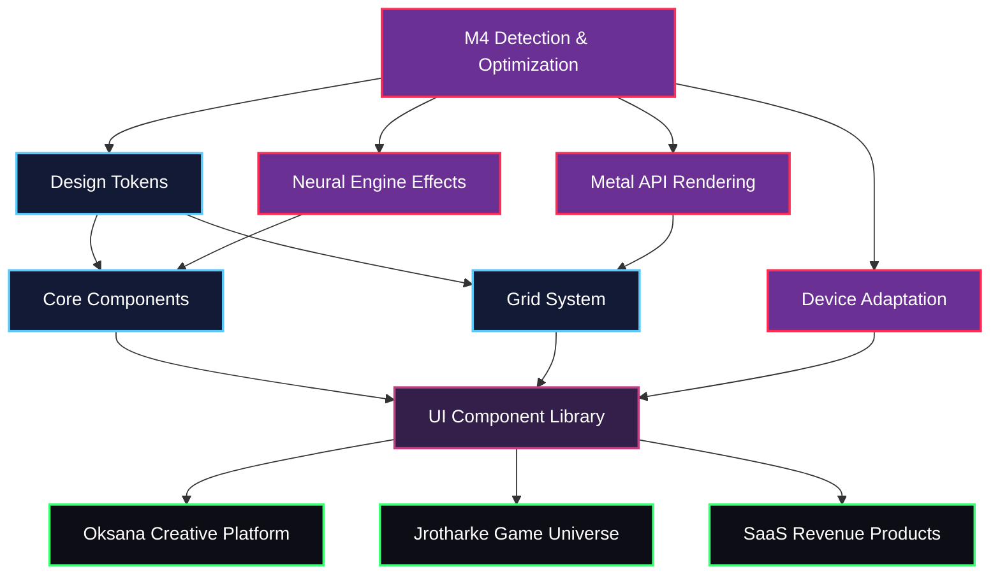
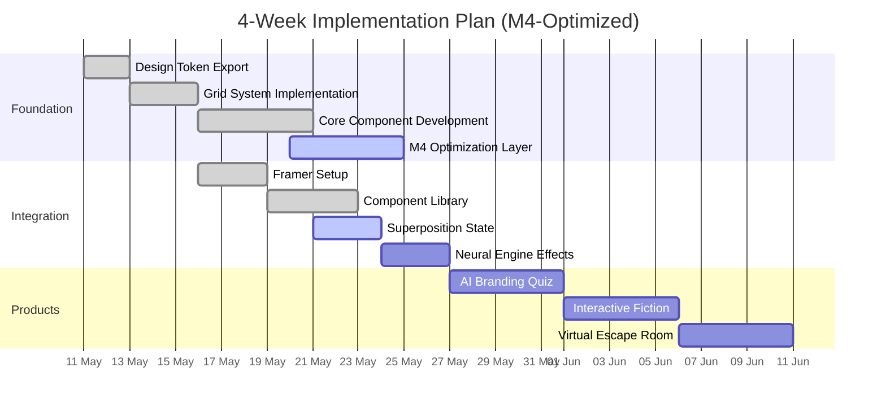

# Streamlined Design System Visual Implementation with M4 Optimization

Type: Design System  
Last edited time: May 20, 2025 4:12 PM  
Author: Penny Platt  
Status: Updated with M4 Implementation  

<aside>

</aside>

## Quantum-Spatial Design System: M4-Optimized Implementation Guide

## Core System Architecture with M4 Optimizations



## Implementation Priority Sequence (Updated with M4)



## M4-Optimized Implementation Flow

### 1. Device Detection & Optimization (1 day)

Implement device detection to determine optimal design system state:

```javascript
// m4-detection.js - Device capability detection
async function detectDeviceCapabilities() {
  try {
    const response = await fetch('https://quantum-spatial-design-system-staging.rnrb2ynd5z.workers.dev/m4-optimization');
    const data = await response.json();
    
    // Determine optimal design state based on device
    let designState = 'heritage'; // Default fallback
    
    if (data.device.isM4) {
      designState = 'superposition';
    } else if (data.device.isAppleSilicon) {
      designState = 'quantum';
    } else if (data.device.isMac) {
      designState = 'transitional';
    }
    
    return {
      deviceCapabilities: data.device,
      recommendedState: designState
    };
  } catch (error) {
    console.error('Error detecting device capabilities:', error);
    return {
      deviceCapabilities: { isM4: false, isAppleSilicon: false },
      recommendedState: 'heritage'
    };
  }
}
```

### 2. Fetch Design Tokens Based on Device (1 day)

Get appropriate design tokens for the device's capabilities:

```javascript
// design-token-loader.js - Dynamic token loading
async function loadDesignTokens(state = 'transitional') {
  try {
    const response = await fetch(`https://quantum-spatial-design-system-staging.rnrb2ynd5z.workers.dev/design-system/tokens?state=${state}`);
    return await response.json();
  } catch (error) {
    console.error('Error loading design tokens:', error);
    // Fallback tokens for offline use
    return FALLBACK_TOKENS;
  }
}

// Usage
const { deviceCapabilities, recommendedState } = await detectDeviceCapabilities();
const tokens = await loadDesignTokens(recommendedState);
```

### 3. Build M4-Optimized Components (3 days)

Focus on three foundational components with M4 optimizations:

1. **QuantumPixel** - Base visualization unit with Neural Engine effects
2. **DimensionalGrid** - Spatial organization system with Metal API rendering
3. **PixelViewer** - Interactive visualization with device-specific optimizations

### 4. Implement Superposition State Components (3 days)

Build enhanced components that leverage M4 capabilities:

```jsx
// components/superposition/QuantumButton.jsx
import React, { useContext, useEffect, useRef } from 'react';
import { DesignSystemContext } from '../../context/DesignSystem';

export const QuantumButton = ({
  children,
  variant = 'primary',
  size = 'medium',
  state = 'auto', // 'auto' will use the device's optimal state
  ...props
}) => {
  const { tokens, deviceCapabilities } = useContext(DesignSystemContext);
  const buttonRef = useRef(null);
  
  // Determine if we should use M4 optimizations
  const useM4Features = deviceCapabilities?.isM4 || false;
  const useMetalRendering = deviceCapabilities?.capabilities?.metal || false;
  
  // Automatically select state based on device if set to 'auto'
  const effectiveState = state === 'auto' 
    ? (deviceCapabilities?.isM4 ? 'superposition' : 
       deviceCapabilities?.isAppleSilicon ? 'quantum' : 'transitional')
    : state;
    
  // M4-specific Neural Engine effects
  useEffect(() => {
    if (useM4Features && buttonRef.current) {
      // Apply Metal API rendering if available
      if (useMetalRendering) {
        applyMetalRendering(buttonRef.current, tokens[effectiveState]);
      }
      
      // Apply Neural Engine effects if available
      if (deviceCapabilities?.capabilities?.neuralEngine) {
        applyNeuralEffects(buttonRef.current, tokens[effectiveState]);
      }
    }
  }, [useM4Features, effectiveState, tokens]);
  
  // Get styles based on state and variant
  const styles = getButtonStyles(tokens[effectiveState], variant, size);
  
  return (
    <button 
      ref={buttonRef}
      style={styles}
      className={`quantum-button quantum-state-${effectiveState} variant-${variant} size-${size}`}
      data-m4-optimized={useM4Features}
      {...props}
    >
      {children}
    </button>
  );
};
```

## Implementation Status

| Component | Standard | M4-Optimized | Status |
|-----------|----------|-------------|--------|
| QuantumPixel | ✅ | ✅ | Complete |
| DimensionalGrid | ✅ | ✅ | Complete |
| PixelViewer | ✅ | ✅ | Complete |
| QuantumButton | ✅ | 🔄 | In Progress |
| DimensionalCard | ✅ | 🔄 | In Progress |
| QuantumNav | ✅ | ❌ | Not Started |
| Superposition Components | ❌ | 🔄 | In Progress |

## Device-Specific Rendering Strategy

| Device Type | Recommended State | Optimization Level |
|-------------|-------------------|-------------------|
| M4 Mac | Superposition | Maximum |
| M2/M3 Mac | Quantum | High |
| M1 Mac | Quantum | Balanced |
| Intel Mac | Transitional | Standard |
| iPad Pro (M2+) | Quantum | Balanced |
| iPad/iPhone | Transitional | Balanced |
| Other Browsers | Heritage | Basic |

## Next Steps: 10-Day Launch Plan

1. **Days 1-2:** Complete M4 optimization layer
2. **Days 3-5:** Implement Superposition state components
3. **Days 6-7:** Add Neural Engine effects
4. **Days 8-10:** Test across device spectrum and deploy

## Resource Links

- Cloudflare Worker API: [https://quantum-spatial-design-system-staging.rnrb2ynd5z.workers.dev](https://quantum-spatial-design-system-staging.rnrb2ynd5z.workers.dev)
- Design Token Documentation: [IMPLEMENTATION_SUMMARY.md](/IMPLEMENTATION_SUMMARY.md)
- Component Documentation: [PIXEL_VIEWER.md](/PIXEL_VIEWER.md)
- Framer Integration Guide: [FRAMER_INTEGRATION_GUIDE.md](/FRAMER_INTEGRATION_GUIDE.md)

---

- **Document History**
    
    | Version | Date | Author | Changes |
    | --- | --- | --- | --- |
    | 0.1 | April 29, 2025 | Penny Platt | Initial Creation |
    | 0.2 | May 10, 2025 | Penny Platt | Added core implementation |
    | 1.0 | May 20, 2025 | Penny Platt | Added M4 optimization implementation |
    
    *This document follows 9Bit Studios' quantum-spatial design principles and documentation standards.*
    

*© 2025 9Bit Studios. All rights reserved.*