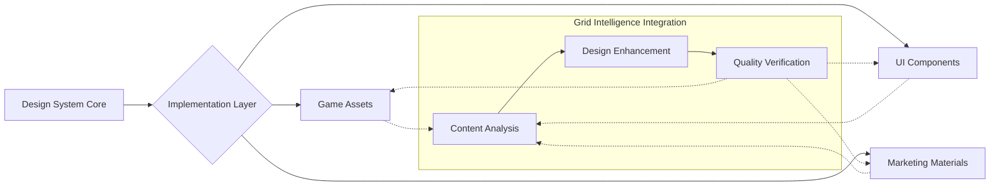
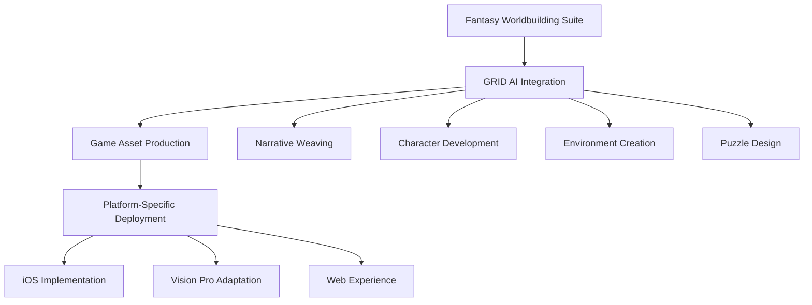

# Optimized Workspace Architecture for AI-Assisted Game Development

Verification: Verified
Author: Penny Platt
Created time: April 23, 2025 7:33 PM
Overview: This document outlines an optimized workspace architecture for AI-assisted game development, detailing operational frameworks, repository structures, and strategies to enhance productivity and creativity.

Framework / Optimized Workspace Architecture for AI-Assisted Game Development

---

## Overview

This document outlines an optimized workspace architecture and operational framework for 9Bit Studios, detailing activities, repository structure and implementation strategies for enhancing productivity and creativity.

### Docs Information Architecture

- **Central Command Hub**
    - **Operations Hub**
        - Operational Frameworks
            - Workflow Documentation
                - Procedure Guides
            - Information Architecture
            - Documentation Standards
                - Document Templates
                    - Standardized Formats
                - Versioning Protocols
                    - Change Management
        - Strategic Planning
            - Objectives & Key Results
                - OKR Documentation
                    - Performance Tracking
                - Executive Summaries
                    - High-level Business Overviews
                - Cross-functional Initiatives
                    - Projects Spanning Multiple Hubs
            - Strategic Planning Documents
                - Master Planning Documents
        - Legal & Compliance
            - Legal Document Types
                - Contracts
                    - Agreement Templates
                    - Client Contracts
                    - Vendor Agreements
                - Intellectual Property
                    - Asset Protection
            - Compliance Categories
                - Compliance Documentation
                    - Regulatory Guides
                - Privacy Frameworks
                    - Data Protection
        - Team Operations
            - Team Structure
                - Organizational Charts
                    - Team Composition
            - Skill Development
                - Skill Matrix
                    - Capability Tracking
                - Training Plans
                    - Development Pathways
            - Hiring Plan
                - Recruitment Strategies
                    - Talent Acquisition
            - Onboarding Processes
                - New Team Integration
        - Financial Management
            - Revenue Planning
                - Revenue Forecasts
                    - Financial Projections
                - Revenue Tracking
                    - Income Monitoring
            - Financial Planning
                - Budget Planning
                    - Resource Allocation
                - Financial Reporting
                    - Performance Summaries
            - Pricing Models
                - Pricing Guides
                    - Product Pricing Strategies
                - Expense Management
                    - Cost Control
            - Client Financial Documentation
                - Invoicing
                - Payment Tracking
                - Financial Records
        - Investment Strategy
            - Fundraising & Pitch Planning
                - Investor Pitches
                    - Investor Pitch Deck
                    - Funding Roadmap
                    - Investor Relations Process
                - Funding Strategies
                    - Capital Acquisition Plans
                    - Funding Roadmap
            - Partner Management
                - Partnership Frameworks
                    - Collaboration Structures
                - Joint Marketing Plans
                    - Promotional Coordination
            - Resource Allocation
                - Launch Plans
                    - Go-to-Market Strategies
                - Resource Prioritization
                    - Strategic Investment
        - Business Fundamentals
            - Company Overview
                - Mission
                - Vision
                - Values
            - Organizational Structure
                - Responsibility Matrices
                    - Role Definitions
                - Team Structure Documentation
                    - Organizational Charts
    - **Marketing & CRM Hub**
        - Lead Generation
            - Lead Source Tracking
            - Lead Qualification
            - Lead Magnets
        - Client Management
            - Contact Management
            - Relationship Stages
            - Communication Tracking
            - Client Profiles
                - Client Demographics
                - Project History
                - Communication Preferences
            - Client Onboarding
                - Onboarding Process Documentation
                - Welcome Packages
                - Initial Needs Assessment
        - Proposal Management
            - Client Briefs
            - Proposal Templates
            - Scope Documentation
            - Service Agreements
        - Client Portal Admin
            - Portal Configuration
            - Access Management
            - Content Delivery
        - CRM Analytics
            - Client Retention Metrics
            - Engagement Analytics
            - Relationship Health Tracking
        - Marketing Strategy
            - Positioning & Messaging
            - Audience Definition
                - Avatar Planning
                - User Segmentation
            - Channel Strategies
            - Launch Planning
        - Campaign Execution
            - Product Launch
            - Feature Releases
            - Community Building
            - Partnerships & PR
        - Analytics & Performance
            - KPI Tracking
            - Conversion Analysis
            - SEO Performance
            - ROI Measurement
    - **Content Hub**
        - Content Planning
            - Editorial Calendar
            - Blog & Article Creation
            - Social Media Content
            - Email Campaigns
            - Narrative Content Planning
                - Game Story Elements
                - Character Development
                - World Building Assets
        - Product Marketing Content
            - Product Descriptions
            - Feature Highlights
            - User Guides
            - Marketing Collateral
        - Content Production
            - Writing Guidelines
            - Media Production
            - Content Review Process
            - Publication Workflow
        - Content Distribution
            - Channel Management
            - Publication Schedule
            - Cross-Promotion Planning
    - **Product Strategy**
        - Idea Pipeline
            - Concept Development
            - Idea Validation
            - Opportunity Assessment
        - Strategic Planning
            - Vision Documents
            - Market Analysis
            - Competitive Positioning
            - Long-term Roadmaps
        - Feature Planning
            - Feature Prioritization
            - Requirements Documentation
            - User Story Development
        - UX Research & Planning
            - User Research
            - Usability Testing
            - Experience Mapping
            - Information Architecture
    - **Design Hub**
        - Brand Foundation
            - Brand Identity System
                - Core Brand Elements
                    - Logo System & Variations
                    - Color System & Palette
                    - Typography System
                    - Voice & Tone Guidelines
                - Brand Narrative Framework
                    - Brand Story & Positioning
                    - Audience Personas
                    - Messaging Architecture
                    - Content Strategy Guidelines
                - Brand Expression Standards
                    - Visual Style Guidelines
                    - Writing Style Guide
                    - Presentation Templates
                    - Marketing Asset Standards
        - Quantum-Spatial Design System
            - Core Design Principles
                - Dimensional Evolution Framework
                    - Heritage State Guidelines
                    - Transitional State Parameters
                    - Quantum State Specifications
                    - Superposition State Implementation
                - Grid System Architecture
                    - Background Grid (8-12% opacity)
                    - Interface Grid (15-20% opacity)
                    - Feature Grid (20-25% opacity)
                    - Spatial Grid for 3D Applications
                - Material Properties System
                    - Quantum Surface Specifications
                    - Grid Surface Guidelines
                    - Heritage Element Parameters
                    - Energy State Definitions
                - Motion & Animation Framework
                    - State Transition Guidelines
                    - Physics-Based Animation Rules
                    - Timing & Easing Standards
                    - Platform-Specific Animation Guidelines
            - Component Library
                - Foundational Elements
                    - Quantum Pixel System
                    - Dimensional Grid Components
                    - Material States & Transitions
                    - Energy Flow Visualizations
                - UI Components
                    - Navigation Systems
                    - Buttons & Controls
                    - Cards & Containers
                    - Forms & Inputs
                    - Modals & Overlays
                - Information Display
                    - Data Visualization Components
                    - Status & Progress Indicators
                    - Notification Systems
                    - Content Display Frameworks
                - Design Tokens
                    - Color Tokens
                    - Typography Tokens
                    - Spacing & Layout Tokens
                    - Animation Tokens
        - Asset Creation Pipeline
            - Design Requests
                - Brand Asset Requests
                - UI Element Requests
                - Marketing Asset Requests
                - Game Asset Requests
                    - Character Art
                    - Environment Assets
                    - UI Game Elements
                    - Animation Requests
            - AI-Powered Creation Framework
                - M4-Optimized Generation Pipeline
                    - Claude Code Generation System
                    - Ideogram Visual Generation
                    - Neural Engine Integration
                    - Batch Processing Framework
                - Quality Control System
                    - AI Output Validation
                    - Brand Consistency Verification
                    - Technical Specification Compliance
                    - Performance Optimization Checks
                - Content Intelligence System
                    - Content Analysis Framework
                    - Enhancement Recommendation Engine
                    - Creative Workflow Optimization
                    - Quality Assessment Protocols
            - Standardized Production Workflows
                - 2D Asset Workflow
                    - Vector Asset Creation Process
                    - Raster Asset Optimization Pipeline
                    - SVG Component Development
                    - Iconography Production System
                - 3D Asset Workflow
                    - 3D Modeling Standards & Process
                    - Material Development Pipeline
                    - Lighting Implementation Guidelines
                    - Environment Creation Workflow
                - Animation Workflow
                    - Animation Concept Development
                    - Technical Animation Implementation
                    - State Transition Animation System
                    - Platform-Specific Optimization
            - Platform-Specific Pipelines
                - Web Platform Pipeline
                    - Framer Component Implementation
                    - React Component Generation
                    - Web Animation Framework
                    - Performance Optimization Process
                - iOS/macOS Pipeline
                    - SwiftUI Component Implementation
                    - Native Asset Optimization
                    - iOS Animation Framework
                    - Apple HIG Compliance Process
                - Vision Pro Pipeline
                    - Spatial Asset Creation
                    - RealityKit Implementation
                    - Spatial Interface Guidelines
                    - Performance Optimization Process
        - UX/UI Design Pipeline
            - UX Research
                - User Testing
                - Usability Studies
                - Experience Mapping
            - UI Design
                - Interface Components
                - Design Specifications
                - Prototype Development
            - Design-Development Handoff
                - Implementation Guidelines
                - Component Specifications
                - Developer Resources
            - Design System Integration
                - Component Mapping
                - Style Guide Application
                - Pattern Library Updates
    - **Game Design Workshop**
        - Mechanics Design
            - Game Design Documents
            - Technical Game Architecture
            - Player Experience
            - Release Strategy
            - Cross-Platform Implementation
        - Narrative Development
            - Narrative Design Framework
            - Character Profiles
            - Ink Script Implementation
            - Story Progression System
            - Dialogue Systems
        - Worldbuilding
            - Locations
            - Factions & Group Dynamics
            - Magic Systems
            - Historical Events
            - Cultural Development
        - Game Art Production System
            - Game Art Frameworks
                - Character Art Pipeline
                    - Character Design Guidelines
                    - Character Modeling Standards
                    - Character Animation Framework
                    - Character State Implementation
                - Environment Art Pipeline
                    - Environment Design Standards
                    - World-Building Guidelines
                    - Level Design Workflow
                    - Atmospheric Elements System
                - UI/UX Game Elements
                    - Game Interface Guidelines
                    - HUD Design Framework
                    - Menu System Standards
                    - Player Feedback Components
            - Game-Specific Art Workflows
                - World of Jrotharke
                    - Character Art Style Guide
                    - Environment Art Standards
                    - Narrative Visual Elements
                    - Animation Style Guidelines
                - Escape Room Products
                    - Room Design Templates
                    - Puzzle Visual Language
                    - Clue Visualization System
                    - Progression Indicator Standards
                - Interactive Fiction System
                    - Character Visualization Framework
                    - Environment Illustration Standards
                    - Narrative Choice Visualization
                    - Story Progression Indicators
            - Technical Art Implementation
                - Game Engine Implementation
                    - Godot Asset Pipeline
                    - Unity Integration Guidelines
                    - PlayCanvas Implementation
                    - Custom Engine Standards
                - Optimization Framework
                    - Asset LOD System
                    - Performance Budgeting Guidelines
                    - Mobile Optimization Workflow
                    - Cross-Platform Consistency Standards
                - Game Effects System
                    - Particle Effect Guidelines
                    - Visual Feedback Standards
                    - State Transition Effects
                    - Environmental Effect Framework
        - Game Design Projects
            - Prototyping
                - Concept Prototypes
                - Interaction Testing
                - Mechanic Validation
            - Playtesting
                - User Testing Sessions
                - Feedback Analysis
                - Iterative Improvements
            - Game Balance
                - Difficulty Tuning
                - Progression Pacing
                - Economy Management
    - **Product Roadmap**
        - OKR Tracking
            - Company-Level OKRs
            - Department OKRs
            - Individual OKRs
            - Progress Metrics
            - Achievement Tracking
        - Project & Epic Management
            - Active Epics
            - Sprint Planning
            - Task Assignment
            - Blockers & Dependencies
            - Cross-Functional Initiatives
        - Release Tracking
            - Release Calendar
            - Version Control
            - Feature Inclusion
            - Testing Status
            - Deployment Preparation
        - Product Performance Metrics
            - User Engagement Analytics
            - Conversion Metrics
            - Retention Data
            - Feature Adoption Rates
            - Revenue Performance
        - Technical Development
            - Architecture
                - Infrastructure Architecture
                    - Technical Structure
                    - System Diagrams
                - API Documentation
                - Security Frameworks
                    - Protection Measures
            - Implementation
                - Coding Standards
                    - Style Guidelines
                - Development Workflows
                    - Process Documentation
                - Dependency Management
                    - External Resources
                - Deployment Pipelines
                    - Release Systems
            - Quality Assurance
                - Test Plans
                    - Verification Strategies
                - Performance Benchmarks
                    - Optimization Targets
                - Acceptance Criteria
                    - Quality Standards
        - Engineering Management
            - Sprint Board
            - Bug Tracker
            - Release Manager
    - **Client Portals**
        - Client Journey Mapping
            - Engagement Touchpoints
            - Experience Optimization
            - Journey Analytics
        - Client Collaboration
            - Project Workflows
                - Delivery Frameworks
            - Feedback Systems
                - Input Integration
            - Client Meetings
                - Discussion Documentation
        - Support Systems
            - Help Structures
            - Issue Resolution
            - Knowledge Base
        - Client Deliverables
            - Deliverable Templates
            - Approval Workflows
            - Quality Assurance
        - Client Feedback
            - Collection Methods
                - Input Gathering
            - Analysis Frameworks
                - Insight Generation
            - Improvement Implementation
                - Response Actions
            - Satisfaction Tracking
                - Experience Metrics
    - **Personal Teamspaces**
        - Individual Workspaces
            - Personal Organization
        - Skill Development
            - Learning Resources
        - Project Contributions
            - Role Documentation
        - Performance Tracking
    - **Templates**
        - Strategic Planning
            - Vision Templates
                - Concept Frameworks
            - Roadmap Templates
                - Timeline Structures
            - Requirement Templates
                - Specification Formats
            - Analysis Frameworks
                - Assessment Structures
        - Game Design
            - Mechanic Templates
                - System Frameworks
            - Character Templates
                - Persona Structures
            - Level Design Templates
                - Environment Formats
            - Narrative Frameworks
                - Story Structures
        - Blueprints
            - Product Vision Document
            - Technical Architecture Specification
            - Implementation Roadmap
            - User Experience Framework
            - Integration Strategy
            - Go-to-Market Plan
            - Asset System Specification
            - AI Integration Framework
            - Multi-Platform Deployment Strategy
            - Creative Workflow Design
            - Game Design Document
            - Technical Game Architecture
            - Narrative Design Framework
            - Player Experience Roadmap
            - Art Production Pipeline
            - Game Analytics Framework
            - Release Strategy
            - Cross-Platform Implementation Plan
            - Infrastructure Architecture
            - Knowledge Management System
            - Collaboration Framework
            - Brand System Specification
            - Analytics & Business Intelligence
            - Integration Framework
            - Product Connection Strategy
        - Document Types
            - Strategic Brief
            - Product Requirements Document
            - Technical Architecture Document
            - Implementation Guide
            - Style Guide
            - Asset Specification
            - Game Design Document
            - Narrative Design Document
            - API Documentation
            - Marketing Strategy
            - Content Plan
            - Client Profile
            - Business Process Document
            - User Flow Diagram
            - Visual Design Guide
            - Character Profile
            - Environment Specification
            - Sprint Plan
            - Test Plan
            - Brand Expression Guide
            - Template
</aside>

## 1. Creative Command Center

### Key Components

1. **AI-Enhanced Dashboard**
    - Visualization of current project status
    - Creative power activation system
    - Resource allocation analytics
    - Team collaboration metrics
2. **Project Mission Control**
    - Current sprint visualization
    - Character & environment progress tracking
    - Narrative branch development status
    - Asset completion metrics
3. **Revenue Product Acceleration**
    - Branding Quiz implementation status
    - Interactive Fiction framework progress
    - Virtual Escape Room development pipeline
    - Vision Pro adaptation roadmap

## 2. Quantum-Spatial Design System

### System Integration

### Key Components

1. **Quantum Pixel Foundry**
    - Core pixel asset library
    - State transition management
    - Material property system
    - Animation framework
2. **Grid Dimension System**
    - Background grid templates
    - Interface grid components
    - Feature grid elements
    - Spatial grid implementation
3. **Color & Material Intelligence**
    - Foundation color system
    - Accent deployment guidelines
    - Material property definitions
    - Lighting implementation standards

## 3. M4-Optimized Development Environment

### Neural Engine Integration

1. **AI-Assisted Asset Generation**
    - Prompt engineering framework
    - Ideogram integration for visuals
    - Claude-powered narrative generation
    - Batch processing optimization
2. **Content Intelligence System**
    - Content analysis pipeline
    - Creative enhancement engine
    - Quality assessment protocols
    - Cross-product consistency verification
3. **Accelerated Workflow Tools**
    - SwiftUI component generation
    - Shader optimization pipeline
    - Animation sequence automation
    - Asset variant production system

## 4. Game Production Pipeline

### Integrated Workflows

### Key Components

1. **Fantasy Worldbuilding Suite**
    - Character template system
    - Location generation framework
    - Narrative flow designer
    - Lore management system
2. **Narrative Engine**
    - Ink script integration
    - Branching story framework
    - Character relationship mapping
    - Decision consequence system
3. **Interactive Systems**
    - Puzzle design templates
    - Difficulty scaling framework
    - Hint system implementation
    - Reward mechanics design

## 5. Platform Integration

### Cross-Platform Implementation

1. **iOS Native Development**
    - SwiftUI component library
    - Metal shader optimization
    - Performance profiling system
    - Touch interaction framework
2. **Vision Pro Spatial Computing**
    - Spatial interface guidelines
    - Hand tracking interaction system
    - Environmental response framework
    - Performance optimization protocols
3. **Web & Framer Implementation**
    - React component library
    - WebGL optimization pipeline
    - Progressive enhancement system
    - Responsive design framework

## 6. Revenue Product Framework

### Immediate Implementation Focus

1. **Branding Quiz System**
    - Interactive flow management
    - AI analysis integration
    - Visual report generation
    - Subscription management
2. **Interactive Fiction Framework**
    - Character system implementation
    - Narrative engine integration
    - Visual styling framework
    - Episodic content management
3. **Virtual Escape Room**
    - Room template system
    - Puzzle generation framework
    - Narrative integration pipeline
    - iOS implementation guidelines

## Implementation Checklist

1. **Create Command Center** (1-2 days)
    - Design visual dashboard with quantum-spatial aesthetics
    - Configure "quick-start" functionality
    - Implement project tracking visualization
    - Set up team collaboration tools
2. **Configure Neural Engine Pipeline** (2-3 days)
    - Set up M4-optimized AI tools
    - Configure prompt engineering system
    - Establish asset generation pipeline
    - Create content intelligence framework
3. **Build Template Ecosystem** (3-4 days)
    - Develop character creation templates
    - Build world-building frameworks
    - Create narrative design system
    - Implement interactive element templates
4. **Launch Revenue Products** (parallel track)
    - Accelerate Branding Quiz implementation
    - Develop Interactive Fiction framework
    - Build Virtual Escape Room prototype
    - Prepare Vision Pro adaptation strategy

The architecture integrates our quantum-spatial design language with AI-assisted production tools, creating a cohesive ecosystem that accelerates game development while maintaining consistent brand expression across all products.

<aside>

### See Also

---

[Notion Pipeline Blueprint](Notion%20Pipeline%20Blueprint%201dac7f76af88805db7e7e578eaaa92a5.md)

[Quantum-Spatial Portal **Portal Plan: Hub Design for 9Bit Studios**](Quantum-Spatial%20Portal%20Portal%20Plan%20Hub%20Design%20for%20%201d9c7f76af88808b81f4d229ca26ec51.md)

</aside>

<aside>

- **Document History**
    
    
    | Version | Date | Author | Changes |
    | --- | --- | --- | --- |
    | 0.1 | April 18, 2025  | @Penny Platt  | Published |
    | 0.2 | April 19, 2025  | @Penny Platt  | Validation |
    | 0.3 | April 20, 2025  | @Penny Platt  | Place workflow guides in context of Asset Pipeline |
    | 1.0 | April 24, 2025  | @Penny Platt  | Updated alongside new detailed information architecture and integrated workspace hub activity mapping |
    
    *This document follows 9Bit Studios’ documentation standards and incorporates quantum-spatial design principles.*
    
</aside>

*© 2025 9Bit Studios. All rights reserved.*
