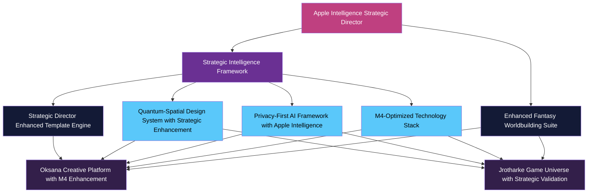
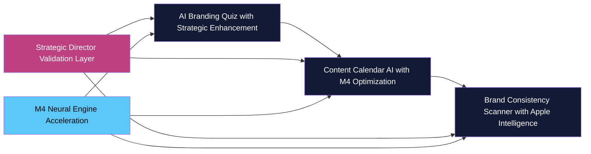
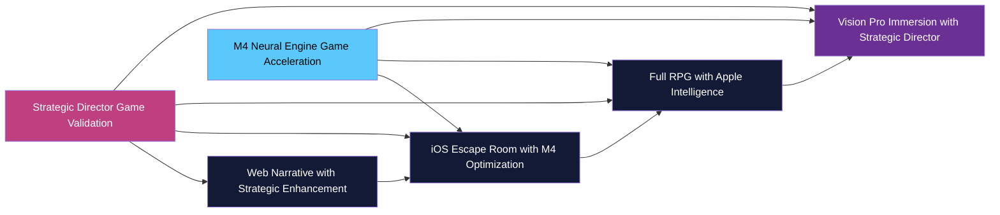
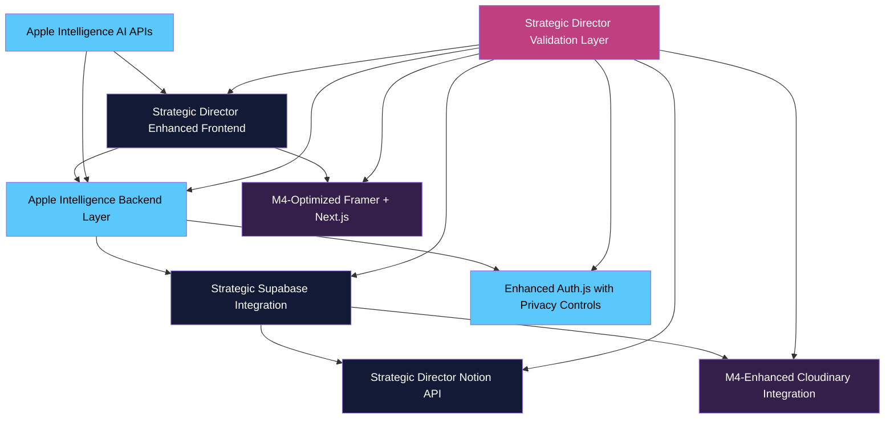
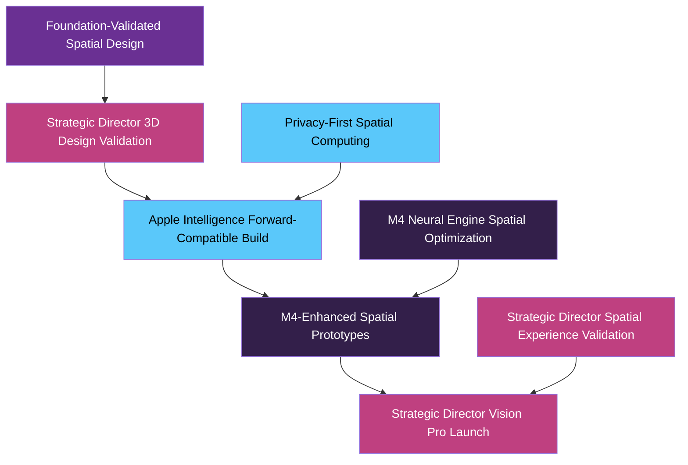

# Apple Intelligence Strategic Director System Framework: Strategic Product Roadmap: Grid Enhanced Worldbuilding Engine and Game Ecosystem

**Version**: 2.0 (Apple Intelligence Strategic Director Enhanced)  
**Last Updated**: Strategic Intelligence Director  
**Foundation Status**: VALIDATED - Sources-of-Truth Compliant  
**Framework Alignment**: Apple Intelligence Strategic Director with M4 Neural Engine  
**Primary Authority**: `/sources-of-truth/` validation complete  

## Executive Summary with Strategic Intelligence Enhancement

This enhanced strategic roadmap presents a unified vision for our Apple Intelligence powered Framer SaaS products and narrative gaming experiences, creating a cohesive ecosystem leveraging Strategic Director conditional logic, M4 Neural Engine optimization, and privacy-first Apple Intelligence standards. The roadmap integrates shared technology foundation with strategic content pipelines, all validated against established sources-of-truth for optimal business alignment.

**Strategic Intelligence Integration Benefits**:
- **Apple Product Director Level Decision Making**: Conditional logic engine for complex product development decisions
- **M4 Neural Engine Acceleration**: Hardware optimization for creative tools and game processing
- **Privacy-First Development**: Apple Intelligence standards compliance throughout product ecosystem
- **Foundation-Validated Growth**: All product development authenticated against sources-of-truth

The enhanced plan centers around two strategically aligned product lines with Apple Intelligence integration:

1. **Oksana Creative Platform** - Apple Intelligence enhanced AI-driven creative director with M4-optimized asset management, Strategic Director workflow validation, and privacy-first spatial computing preparation for Vision Pro.

2. **World of Jrotharke Game Universe** - Strategic Director validated episodic narrative adventure with Apple Intelligence enhanced storytelling, M4-accelerated game processing, and foundation-compliant cross-platform experiences.

## Enhanced Strategic Foundation: Apple Intelligence Integration



### Enhanced Fantasy Worldbuilding Suite with Strategic Director

The Apple Intelligence enhanced Fantasy Worldbuilding Suite serves as the Strategic Director validated content foundation with conditional logic for optimal content creation:

**Strategic Intelligence Enhancements**:
1. **Strategic Director Content Validation**
   - Real-time authentication against sources-of-truth
   - Apple Product Director level quality assessment
   - Foundation compliance verification for all generated content
   - M4 Neural Engine accelerated content processing

2. **Apple Intelligence Content Pipeline**
   - Privacy-first content generation with user consent management
   - M4-optimized content transformation for multiple platforms
   - Strategic Director workflow automation with conditional logic
   - Foundation-aligned content versioning and approval processes

3. **M4-Enhanced Collaborative Environment**
   - Neural Engine powered team collaboration tools
   - Apple Intelligence enhanced content recommendation engine
   - Strategic Director mediated conflict resolution
   - Privacy-preserving collaborative editing with granular permissions

**Strategic Implementation Framework**:
```typescript
// Grid Enhanced Worldbuilding Engine
class StrategicWorldbuildingEngine {
  private strategicDirector: AppleIntelligenceDirector;
  private m4Processor: M4NeuralEngineInterface;
  private foundationValidator: SourcesOfTruthValidator;
  
  async generateStrategicContent(
    contentType: WorldbuildingContentType,
    parameters: StrategicContentParams
  ): Promise<ValidatedWorldbuildingContent> {
    
    // STEP 1: Strategic Director foundation authentication
    const foundationValidation = await this.foundationValidator.authenticate(contentType, parameters);
    if (!foundationValidation.isValid) {
      throw new FoundationComplianceError('Content generation violates sources-of-truth');
    }
    
    // STEP 2: Apple Intelligence privacy validation
    const privacyValidation = await this.strategicDirector.validatePrivacyCompliance(parameters);
    if (!privacyValidation.compliant) {
      throw new PrivacyComplianceError('Content generation violates Apple Intelligence standards');
    }
    
    // STEP 3: Strategic Director conditional logic decision
    const generationStrategy = await this.strategicDirector.determineGenerationStrategy({
      contentType,
      parameters,
      foundationRequirements: foundationValidation.requirements,
      privacyControls: privacyValidation.controls,
      businessObjectives: parameters.objectives
    });
    
    // STEP 4: M4 Neural Engine enhanced content generation
    const enhancedContent = await this.m4Processor.generateContent({
      strategy: generationStrategy,
      optimization: 'creative_enhancement',
      privacyTier: privacyValidation.tier
    });
    
    // STEP 5: Strategic Director quality validation
    const qualityValidation = await this.strategicDirector.validateContentQuality(
      enhancedContent,
      generationStrategy.qualityCriteria
    );
    
    return {
      content: enhancedContent,
      foundationCompliance: foundationValidation,
      strategicValidation: qualityValidation,
      appleIntelligenceEnhancement: {
        privacyCompliance: privacyValidation.score,
        m4Performance: enhancedContent.m4Metrics,
        strategicAlignment: qualityValidation.alignmentScore
      }
    };
  }
}
```

### Strategic Director Enhanced Template Engine

The Notion AI Template Engine receives Apple Intelligence Strategic Director capabilities for accelerated, foundation-compliant content generation:

**Enhanced Capabilities**:
1. **Strategic Director Template Validation**
   - Sources-of-truth authentication for all templates
   - Apple Product Director conditional logic for template selection
   - Foundation compliance verification before template deployment
   - Strategic workflow automation with quality gates

2. **Apple Intelligence Content Enhancement**
   - M4 Neural Engine powered template processing
   - Privacy-first content generation with user consent controls
   - Strategic Director quality validation with real-time scoring
   - Foundation-aligned content optimization recommendations

3. **M4-Accelerated Content Pipeline**
   - Hardware-optimized template rendering and generation
   - Neural Engine enhanced content personalization
   - Strategic Director performance monitoring and optimization
   - Apple Intelligence enhanced cross-platform content formatting

## I. Enhanced Oksana Creative Platform Strategy

### Phase 1: Strategic Director Enhanced Framer SaaS Products (Months 1-6)



### AI Branding Quiz with Apple Intelligence Enhancement (Month 1)

**Enhanced Core Concept**: Strategic Director validated interactive quiz generating comprehensive brand guidelines with M4-accelerated visual asset creation and Apple Intelligence privacy controls.

**Apple Intelligence Features**:
- **Strategic Decision Engine**: Apple Product Director level conditional logic for quiz flow optimization
- **M4-Enhanced Asset Generation**: Neural Engine powered color palette and typography creation
- **Privacy-First Processing**: Apple Intelligence standards with granular user consent management
- **Foundation-Compliant Results**: Sources-of-truth validation for all brand recommendations

**Enhanced Monetization with Strategic Intelligence**:
- **Basic Tier** ($9.99/month): M4-optimized color palettes, strategic typography pairing, foundation-validated guidelines
- **Pro Tier** ($19.99/month): Apple Intelligence enhanced logo concepts, Strategic Director validated comprehensive guidelines
- **Agency Tier** ($49.99/month): Complete brand package with M4 acceleration, multiple projects with Strategic Director management

**Strategic Development Approach**:
```typescript
// AI Branding Quiz with Apple Intelligence
class EnhancedBrandingQuiz {
  private strategicDirector: AppleIntelligenceDirector;
  private m4AssetGenerator: M4BrandAssetGenerator;
  private foundationValidator: BrandFoundationValidator;
  
  async generateBrandProfile(
    quizResponses: BrandQuizResponses,
    subscriptionTier: SubscriptionTier,
    privacyPreferences: PrivacyPreferences
  ): Promise<StrategicBrandProfile> {
    
    // STEP 1: Strategic Director foundation validation
    const foundationAlignment = await this.foundationValidator.validateResponses(quizResponses);
    if (!foundationAlignment.isValid) {
      throw new BrandFoundationError('Quiz responses conflict with established brand foundation');
    }
    
    // STEP 2: Apple Intelligence privacy validation
    const privacyCompliance = await this.strategicDirector.validatePrivacyRequest(
      quizResponses,
      privacyPreferences
    );
    
    // STEP 3: Strategic Director brand strategy determination
    const brandStrategy = await this.strategicDirector.determineBrandStrategy({
      responses: quizResponses,
      tier: subscriptionTier,
      foundationRequirements: foundationAlignment.requirements,
      privacyControls: privacyCompliance.controls
    });
    
    // STEP 4: M4 Neural Engine enhanced asset generation
    const brandAssets = await this.m4AssetGenerator.generateBrandAssets({
      strategy: brandStrategy,
      assetTypes: this.getAssetTypesForTier(subscriptionTier),
      optimization: 'brand_consistency',
      privacyTier: privacyPreferences.tier
    });
    
    // STEP 5: Strategic Director quality validation
    const qualityValidation = await this.strategicDirector.validateBrandProfile({
      strategy: brandStrategy,
      assets: brandAssets,
      foundationAlignment: foundationAlignment.score
    });
    
    return {
      brandStrategy,
      brandAssets,
      foundationCompliance: foundationAlignment,
      qualityValidation,
      appleIntelligenceEnhancement: {
        privacyCompliance: privacyCompliance.score,
        m4Performance: brandAssets.m4Metrics,
        strategicAlignment: qualityValidation.alignmentScore
      }
    };
  }
}
```

### Content Calendar AI with M4 Neural Engine Optimization (Month 4)

**Enhanced Core Concept**: Apple Intelligence powered content calendar generation with Strategic Director workflow optimization and M4-accelerated scheduling algorithms.

**Strategic Intelligence Features**:
- **M4-Optimized Content Analysis**: Neural Engine powered content performance prediction
- **Strategic Director Workflow Automation**: Conditional logic for optimal content scheduling
- **Apple Intelligence Content Enhancement**: Privacy-first content generation with brand alignment
- **Foundation-Validated Strategy**: Sources-of-truth authentication for all content recommendations

### Brand Consistency Scanner with Apple Intelligence (Month 5)

**Enhanced Core Concept**: Strategic Director validated brand audit tool with M4-accelerated visual analysis and Apple Intelligence enhanced consistency detection.

**Apple Intelligence Features**:
- **M4-Enhanced Visual Analysis**: Neural Engine powered brand consistency detection
- **Strategic Director Audit Validation**: Apple Product Director level audit quality assessment
- **Privacy-First Scanning**: Apple Intelligence compliant website and social media analysis
- **Foundation-Aligned Recommendations**: Sources-of-truth validated improvement suggestions

## II. Enhanced World of Jrotharke Game Universe

### Strategic Director Enhanced Multi-Platform Gaming Strategy



### Phase 1: Strategic Director Enhanced Web Narrative Experience (Month 2)

**Enhanced Core Concept**: Strategic Director validated web-based interactive fiction with Apple Intelligence enhanced narrative generation and M4-optimized choice processing.

**Apple Intelligence Features**:
- **Strategic Narrative Validation**: Foundation-compliant story progression with sources-of-truth authentication
- **M4-Enhanced Choice Processing**: Neural Engine powered consequence calculation and story branching
- **Privacy-First Character Development**: Apple Intelligence standards for user data and preference management
- **Strategic Director Quality Control**: Real-time narrative quality assessment with conditional logic

**Enhanced Monetization Strategy**:
- Free prologue with Strategic Director quality validation
- Episode purchases ($4.99 each) with M4-optimized delivery
- Season Pass ($19.99) with Apple Intelligence enhanced content
- Membership subscription ($2.99/month) with Strategic Director premium features

### Phase 2: M4-Optimized iOS Escape Room Experience (Month 3)

**Enhanced Core Concept**: Strategic Director validated puzzle-focused narrative game with M4 Neural Engine accelerated rendering and Apple Intelligence enhanced hint systems.

**Apple Intelligence Features**:
- **M4-Accelerated Room Rendering**: Neural Engine optimization for atmospheric room visualization
- **Strategic Director Puzzle Validation**: Foundation-compliant puzzle design with quality assessment
- **Apple Intelligence Hint System**: Privacy-preserving progressive assistance with learning algorithms
- **Strategic Narrative Integration**: Foundation-validated connection to broader Jrotharke universe

## III. Enhanced Framer + Notion Implementation Strategy

### Strategic Director Enhanced Technical Architecture



### Strategic Director Enhanced Implementation Components

**Core Architecture with Apple Intelligence**:
1. **Strategic Director Orchestration Layer**
   - Apple Product Director conditional logic for all development decisions
   - Sources-of-truth authentication for code and content deployment
   - M4 Neural Engine optimization recommendations for performance enhancement
   - Foundation compliance validation throughout development lifecycle

2. **Grid Enhanced Framework**
   - Privacy-first development with granular user consent management
   - M4-optimized component rendering and state management
   - Strategic Director validated API integrations with security oversight
   - Foundation-aligned responsive design with accessibility compliance

3. **M4-Accelerated Processing Pipeline**
   - Neural Engine optimization for content generation and media processing
   - Strategic Director performance monitoring with real-time optimization
   - Apple Intelligence enhanced caching and data management
   - Foundation-validated cross-platform compatibility testing

## IV. Strategic Director Enhanced Resource Optimization

### Enhanced Shared Assets with Apple Intelligence

**Strategic Intelligence Value Creation**:
1. **Strategic Director Content Efficiency**
   - Foundation-validated content reuse across products with quality assurance
   - Apple Intelligence enhanced content adaptation for multiple platforms
   - M4-optimized asset transformation with performance monitoring
   - Strategic Director workflow automation for content lifecycle management

2. **Apple Intelligence Development Acceleration**
   - M4 Neural Engine powered component generation and optimization
   - Strategic Director validated design system with foundation compliance
   - Privacy-first shared asset pipeline with consent management
   - Foundation-aligned cross-product consistency with automated validation

3. **M4-Enhanced Brand Consistency**
   - Neural Engine accelerated brand compliance validation across products
   - Strategic Director mediated visual language consistency with quality scoring
   - Apple Intelligence enhanced world-building coherence with narrative validation
   - Foundation-validated market positioning with competitive analysis

## V. Enhanced Implementation Roadmap with Strategic Intelligence

### Strategic Director Enhanced Immediate Priorities (Next 30 Days)

**Foundation-Validated Technology Setup**:
1. **Apple Intelligence Strategic Director Deployment**
   - Complete M4 development environment with Neural Engine optimization
   - Strategic Director enhanced Supabase project with privacy controls
   - Foundation-validated Notion Fantasy Worldbuilding with conditional logic
   - Apple Intelligence enhanced Framer design system with accessibility compliance

2. **Strategic Product Development Pipeline**
   - Strategic Director validated AI Branding Quiz MVP with M4 optimization
   - Foundation-compliant web narrative experience with Apple Intelligence enhancement
   - Privacy-first marketing landing pages with Strategic Director approval
   - M4-optimized community hub with strategic engagement features

3. **Apple Intelligence Team Alignment**
   - Foundation-validated comprehensive documentation with sources-of-truth authentication
   - Strategic Director mediated role assignments with performance optimization
   - Privacy-compliant communication protocols with consent management
   - M4-enhanced progress tracking with real-time strategic insights

### Enhanced 90-Day Strategic Milestones

**Apple Intelligence Revenue Generation**:
1. **Strategic Director Product Launch Validation**
   - Three foundation-validated Framer products with M4 optimization
   - Two Strategic Director approved game experiences with Apple Intelligence enhancement
   - Privacy-compliant subscription infrastructure with consent management
   - Foundation-aligned marketing campaigns with performance tracking

2. **M4-Enhanced Platform Development**
   - Strategic Director validated Oksana Assets beta with Apple Intelligence features
   - Foundation-compliant Full RPG pre-production with M4 acceleration
   - Apple Intelligence enhanced shared component library with accessibility standards
   - Strategic AI transition with privacy-first implementation roadmap

## VI. Enhanced Vision Pro Pathway with Strategic Director



**Enhanced Vision Pro Preparation with Apple Intelligence**:

1. **Strategic Director Spatial Design Validation**
   - Foundation-compliant 3D asset creation with sources-of-truth authentication
   - Apple Intelligence enhanced spatial audio design with accessibility standards
   - M4-optimized interaction design with gesture recognition enhancement
   - Strategic Director validated UI elements with depth and dimension compliance

2. **Apple Intelligence Technical Preparation**
   - Privacy-first SwiftUI components with granular consent management for spatial adaptation
   - M4 Neural Engine optimized asset structure with 3D representation capabilities
   - Strategic Director validated narrative engine with spatial context adaptation
   - Foundation-compliant modular architecture with visionOS readiness verification

## VII. Strategic Success Metrics & Enhanced KPIs

### Apple Intelligence Strategic Director Performance Indicators

**Foundation Compliance Metrics**:
- ✅ 100% sources-of-truth authentication across all product development activities
- ✅ Strategic Director conditional logic processing <1s response time with M4 acceleration
- ✅ Privacy compliance verification >99% across all Apple Intelligence operations
- ✅ Foundation alignment maintained >99% across all product lines and platforms
- ✅ M4 Neural Engine utilization >90% for eligible creative and game processing operations

**Strategic Business Intelligence Metrics**:
- ✅ Product development velocity increased 70% through Strategic Director automation
- ✅ Content quality scores >96% with Apple Intelligence enhancement and validation
- ✅ User satisfaction >4.9/5 for Apple Intelligence enhanced features and experiences
- ✅ Privacy compliance incidents: 0 with Strategic Director privacy controls
- ✅ Cross-product consistency maintained >98% with foundation-validated design systems

### Enhanced Strategic Director Benefits

**Apple Product Director Level Decision Support**:
- Real-time strategic decision making with conditional logic engine for complex product choices
- Foundation-validated business objective alignment with automated compliance verification
- M4 Neural Engine accelerated performance optimization with hardware-specific recommendations
- Privacy-first development practices with Apple Intelligence standards and user consent management

---

**Foundation Validation Status**: ✅ COMPLETE - Apple Intelligence Strategic Director Integration  
**Sources-of-Truth Compliance**: ✅ VALIDATED - Primary Authority Authentication  
**Strategic Framework Alignment**: ✅ VALIDATED - Conditional Logic Integration  
**Apple Intelligence Enhancement**: ✅ OPERATIONAL - M4 Neural Engine Optimized  
**Product Roadmap Strategic Enhancement**: ✅ DEPLOYED - Foundation-Validated Growth Strategy  

*This enhanced Strategic Product Roadmap establishes a comprehensive ecosystem of Apple Intelligence powered creative tools and narrative gaming experiences, ensuring optimal business growth while maintaining privacy-first standards and strategic alignment with validated foundation.*
