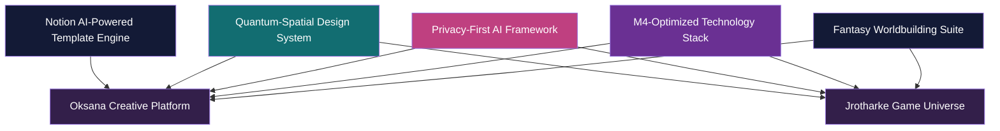
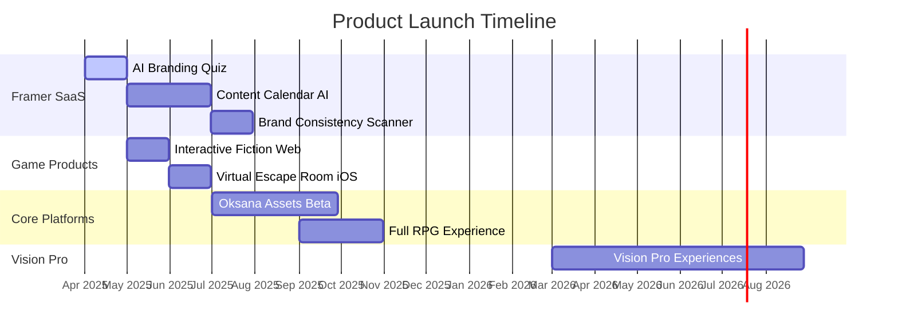
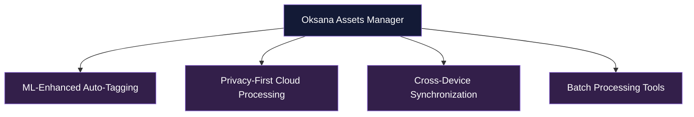
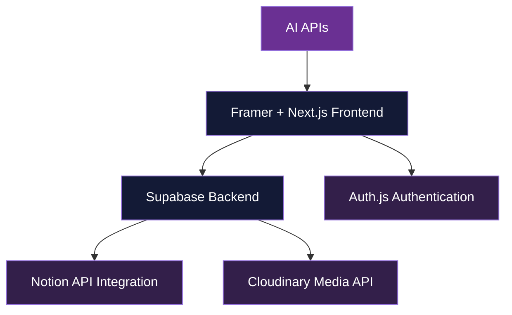
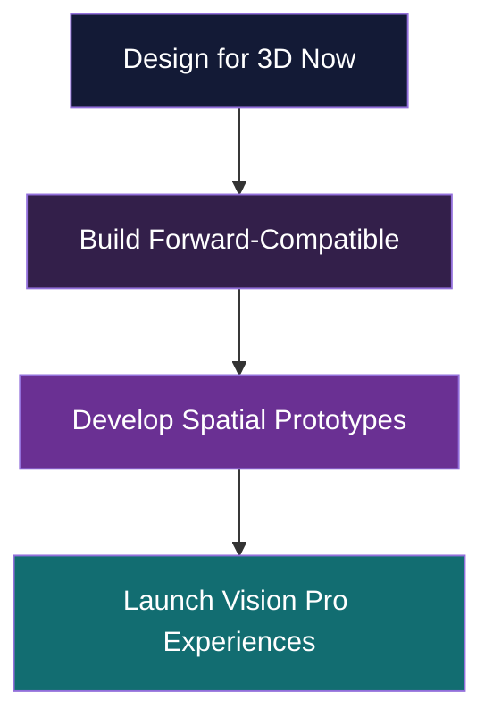

# Strategic Product Roadmap: Framer Creative SaaS & Game Ecosystem

## Executive Summary

This strategic roadmap presents a unified vision for our Framer SaaS products and narrative gaming experiences, creating a cohesive ecosystem that leverages shared technology foundations and content pipelines. By implementing an accelerated go-to-market approach with rapid-launch Framer products, we can establish immediate revenue streams while building toward our comprehensive creative platform and narrative game universe.
 
The plan centers around two complementary product lines:

1. **Oksana Creative Platform** - A comprehensive AI-driven creative director and brand hub, starting with focused Framer SaaS tools and evolving into a sophisticated asset management system and eventually a full Vision Pro spatial computing experience.
2. **World of Jrotharke Game Universe** - An episodic narrative adventure spanning multiple platforms, beginning with web and iOS mini-experiences before expanding into a full-featured RPG and ultimately a Vision Pro immersive storytelling environment.

The Fantasy Worldbuilding Suite serves as the critical connective tissue between these product lines, providing a centralized content creation system that powers both creative tools and narrative experiences. This shared foundation creates significant development efficiencies and content reuse opportunities while establishing a distinctive market position at the intersection of creative tools and interactive storytelling.

By implementing this multi-product, phased approach, we can achieve three key business objectives:

1. **Generate immediate revenue** through rapid-launch Framer products (1-3 months)
2. **Build sustainable recurring revenue** through subscription-based creative tools and episodic content
3. **Establish market leadership** in privacy-first AI creative tools and narrative experiences optimized for Apple platforms

## Strategic Foundation: Shared Technology & Content



### Fantasy Worldbuilding Suite: The Content Foundation

The Fantasy Worldbuilding Suite serves as the central creative engine for both product lines, providing structured content creation capabilities that power narrative experiences and creative tools alike. This Notion-based system offers:

1. **Unified Content Repository**
    - Centralized character profiles, location descriptions, lore elements
    - Structured data for AI-powered content generation
    - Version-controlled narrative elements with branching capabilities
2. **Cross-Platform Content Pipeline**
    - Automatic generation of Ink scripts for narrative experiences
    - API connectors for Framer SaaS component integration
    - Content formatting for different platforms (web, iOS, Vision Pro)
3. **Collaborative Creation Environment**
    - Team-based worldbuilding capabilities
    - Version history and change tracking
    - Content approval and publication workflows

### Notion AI Template Engine: The Content Acceleration Layer

The Notion AI Template Engine serves as a critical acceleration layer for the Oksana creative platform, providing structured content generation capabilities that power our Framer SaaS tools:

1. **AI-Enhanced Content Framework**
    - Templatized generation structures for consistent output
    - Notion AI-powered content enhancement and refinement
    - API-driven content delivery to Framer SaaS tools
    - Version-controlled templates with continuous improvement
2. **Cross-Product Content Pipeline**
    - Direct Notion API integration with Framer components
    - Real-time content updates and synchronization
    - Shared content models across all Oksana products
    - Customizable templates with brand parameter injection
3. **Acceleration Benefits**
    - 40-60% faster content production for end users
    - Significantly reduced development time for new SaaS features
    - Consistent quality across generated outputs
    - Rapid iteration on content models and generation approaches

```jsx
// Example Notion AI Template Engine integration with Framer/Next.js
import { Client } from '@notionhq/client';
import { NotionToMarkdown } from 'notion-to-md';

export class NotionAITemplateEngine {
  private notion: Client;
  private n2m: NotionToMarkdown;
  
  constructor(apiKey: string) {
    this.notion = new Client({ auth: apiKey });
    this.n2m = new NotionToMarkdown({ notionClient: this.notion });
  }

  // Fetch AI-powered template from Notion
  async getTemplate(templateId: string) {
    const response = await this.notion.blocks.children.list({
      block_id: templateId,
    });
    
    return response.results;
  }
  
  // Generate content using Notion AI template and parameters
  async generateContent(templateId: string, parameters: Record<string, any>) {
    // 1. Retrieve template structure
    const template = await this.getTemplate(templateId);
    
    // 2. Process the template with provided parameters
    const processedTemplate = this.processTemplateWithParameters(template, parameters);
    
    // 3. Use Notion AI to enhance and refine the content
    const enhancedContent = await this.enhanceWithNotionAI(processedTemplate);
    
    // 4. Convert to appropriate format for Framer components
    return this.convertToFramerFormat(enhancedContent);
  }
  
  // Additional implementation methods...
}
```

### M4-Optimized Technology Stack

Our unified Apple Silicon development environment delivers significant advantages:

1. **Development Efficiency**: 30-40% faster development cycles through parallel processing
2. **ML Performance**: Neural Engine-powered content generation for text, visual elements
3. **Cross-Platform Optimization**: Shared code across iOS, macOS, and Vision Pro
4. **Privacy-Preserving Processing**: On-device ML capabilities for enhanced privacy

### Rapid Revenue Generation Strategy



## I. Oksana Creative Platform Strategy

### Phase 1: Rapid-Launch Framer SaaS Products (Months 1-6)


### AI Branding Quiz (Month 1)

**Core Concept**: An interactive quiz that generates comprehensive brand guidelines and visual assets based on client responses.

**Key Features**:

- Dynamic question flow tailored to industry and goals
- AI-generated color palettes, typography pairings, and brand voice
- Tiered output based on subscription level
- Integration with Notion for saving and organizing results

**Monetization**:

- **Basic Tier** ($9.99/month): Color palette, typography, basic guidelines
- **Pro Tier** ($19.99/month): Logo concepts, expanded guidelines
- **Agency Tier** ($49.99/month): Comprehensive brand package, multiple projects

**Development Strategy**:

- Built on Framer + Next.js for rapid deployment
- Utilizes Claude API for initial AI processing
- Implements Supabase for user data and authentication
- Cloudinary integration for asset generation and storage

### Content Calendar AI (Month 4)

**Core Concept**: AI-powered content calendar generation with scheduling optimization and integrated publishing tools.

**Key Features**:

- Content topic generation based on industry and goals
- Optimal posting schedule across multiple platforms
- Content type recommendations (blog, social, video)
- Direct Notion integration for implementation

**Monetization**:

- **Basic Tier** ($14.99/month): Single-platform planning
- **Pro Tier** ($24.99/month): Multi-platform strategy
- **Agency Tier** ($49.99/month): Multiple client management

### Brand Consistency Scanner (Month 5)

**Core Concept**: An automated brand audit tool that analyzes websites and social profiles for visual and messaging consistency.

**Key Features**:

- Website and social media scanning
- Visual consistency analysis (colors, typography, imagery)
- Messaging tone and voice evaluation
- Prioritized improvement recommendations

**Monetization**:

- **Basic Scan** ($29): Single website analysis
- **Standard Scan** ($59): Website plus 3 social platforms
- **Comprehensive Audit** ($99): Complete digital presence analysis

### Phase 2: Core Oksana Platform (Q2-Q4 2025)



### Oksana Assets Manager

**Core Concept**: A sophisticated asset management platform with AI-powered organization and privacy-first cloud capabilities.

**Key Features**:

- Comprehensive media asset organization
- AI-powered auto-tagging and categorization
- CloudKit and Cloudinary integration
- Privacy-tiered processing options
- Cross-device synchronization

**Monetization**:

- **Basic Tier** ($9.99/month): Personal asset management
- **Pro Tier** ($19.99/month): Advanced organization features
- **Team Tier** ($29.99/month/user): Collaborative capabilities

### Phase 3: Complete Creative Platform (2026+)

Expansion to include Brand Director module, Content Creation Suite, and Vision Pro spatial experiences.

### New Oksana Product Opportunities

1. **AI Design Brief Generator**
    - Creates comprehensive design briefs from simple inputs
    - Generates mood boards and reference collections
    - Exports to various formats (PDF, Notion, web)
2. **Visual Style Transfer System**
    - Applies consistent visual styles across multiple assets
    - Maintains brand integrity through transformation
    - Offers various style presets with customization
3. **Marketing Copy Assistant**
    - Generates brand-aligned copy for various platforms
    - Adapts tone and format for different contexts
    - Provides A/B testing variations
4. **Interactive Style Guide Builder**
    - Creates interactive, web-based style guides
    - Includes component libraries and usage examples
    - Offers collaborative editing and sharing tools

## II. World of Jrotharke Game Universe

### Multi-Platform Gaming Strategy


### Phase 1: Web Narrative Experience (Month 2)

**Core Concept**: A web-based interactive fiction adventure showcasing the Jrotharke world while generating immediate revenue.

**Key Features**:

- Ink-powered narrative engine with meaningful choices
- Character relationship systems that persist
- Rich world-building with progressive revelation
- Connection to community hub for social features

**Monetization**:

- Free prologue chapter
- Episode purchases ($4.99 each)
- Season Pass ($19.99)
- Membership subscription option ($2.99/month)

### Phase 2: iOS Escape Room Experience (Month 3)

**Core Concept**: A puzzle-focused narrative game set in the Jrotharke universe with escape room mechanics.

**Key Features**:

- Atmospheric rooms with narrative integration
- Inventory-based puzzle solving
- Hint system with progressive assistance
- Connected to the broader Jrotharke narrative

**Monetization**:

- Base game with tutorial room ($6.99)
- Additional room packs ($3.99 each)
- Premium hint packages ($2.99)
- Bundle options for multiple rooms

### Phase 3: Full RPG Experience (Q3 2025)

Comprehensive narrative RPG with tactical elements and episodic content releases.

### Framer Community Hub Integration

**Core Concept**: A central web platform connecting all Jrotharke experiences and building community engagement.

**Key Features**:

- Interactive world map with exploration
- Character archives and codex system
- Community choice visualization
- Member-exclusive content

**Monetization Integration**:

- Free access with game purchase
- Premium tier ($2.99/month) for exclusive content
- Annual subscription ($24.99) with additional benefits
- Cross-promotion between games and community

### Additional Game Product Opportunities

1. **Pocket Oracle: Mystical Tarot**
    - Leverages narrative engine for personalized readings
    - Minimal art needs (tarot deck + UI)
    - High monetization potential (premium readings, card packs)
    - Evergreen daily engagement
2. **Super Hide & Seek**
    - Simple yet engaging visual search gameplay
    - Beautiful detailed environments with hidden objects
    - Clear monetization through environment packs
    - Exceptional Vision Pro potential
3. **AI Art Gallery Adventure**
    - Exploration of AI-generated artwork with narrative mystery
    - Simple interaction model with complex visual appeal
    - Direct integration with Oksana art generation
    - Expandable through "collection" releases

### Membership Strategy Enhancement

**Four-Tier Approach**:

1. **Explorer (Free)**
    - Limited access to first episode
    - Basic character creation
    - Community forum access (read-only)
    - Ad-supported experience
2. **Adventurer ($4.99/month)**
    - Full episode access
    - Enhanced character customization
    - Member-exclusive lore content
    - Ad-free experience
3. **Hero ($9.99/month)**
    - Priority access to new episodes
    - Expanded worldbuilding tools
    - Digital art collection
    - Beta access to upcoming features
4. **Legend ($14.99/month)**
    - Physical collectible credits
    - Curated 3D model access
    - VIP Discord access
    - Name integration into game lore

## III. Framer + Notion Implementation Strategy

### Technical Architecture



### Framer SaaS Blueprint

1. **Core Architecture**
    - Framer as primary design tool
    - Next.js for frontend framework
    - Supabase for backend services
    - Notion as headless CMS
    - Cloudinary for media transformation
2. **Key Technical Components**
    - Authentication system with multiple providers
    - Subscription management integration
    - Secure API connections to AI services
    - Cross-platform responsive design
    - Analytics and tracking implementation
3. **Standard Project Structure**
    
    ```
    /project-root
    ├── /components          # Reusable UI components
    │   ├── /ui              # Base UI elements
    │   ├── /layouts         # Page layouts
    │   └── /features        # Feature-specific components
    ├── /lib                 # Shared utilities
    │   ├── /api             # API interaction layers
    │   ├── /ai              # AI integration services
    │   └── /notion          # Notion API helpers
    ├── /pages               # Next.js pages
    ├── /public              # Static assets
    ├── /styles              # Global styles
    └── /types               # TypeScript type definitions
    
    ```
    

### Notion Integration Framework

1. **Headless CMS Architecture**
    - Structured databases for content
    - API-first approach for content delivery
    - Version control and publishing workflow
    - Custom property types for specialized content
2. **Fantasy Worldbuilding Implementation**
    - Character database with relationship properties
    - Location database with nested attributes
    - Narrative branch tracking system
    - Asset library with metadata tagging
3. **Integration Methods**
    - REST API connections with caching
    - Webhook triggers for content updates
    - Serverless functions for processing
    - Content transformation pipelines

### AI Integration Strategy

1. **Staged Approach**
    - Begin with cloud API integration (Claude, OpenAI)
    - Develop hybrid processing capabilities
    - Transition to on-device ML where appropriate
    - Implement privacy-tiered consent model
2. **Key AI Implementation Areas**
    - Content generation (text, image prompts)
    - Style analysis and recommendation
    - Data pattern recognition
    - User behavior personalization

## IV. Shared Assets & Resource Optimization

### Fantasy Worldbuilding Suite Value

The Fantasy Worldbuilding Suite creates tremendous value across both product lines:

1. **Content Reuse Efficiency**
    - Character profiles power both games and creative tools
    - Location descriptions translate to multiple formats
    - Narrative elements repurpose across experiences
    - Visual style guides inform both products
2. **Development Acceleration**
    - Structured content reduces writing overhead
    - Automated generation of platform-specific implementations
    - Consistent design language across products
    - Shared asset pipeline for visual elements
3. **Brand Consistency Benefits**
    - Unified voice and tone across all platforms
    - Consistent visual language and aesthetic
    - Coherent world-building that deepens over time
    - Distinctive market positioning through shared aesthetic

### Resource Allocation Strategy

1. **Development Team Focus**
    - Front-load Framer SaaS products for immediate revenue
    - Parallel development of narrative experiences
    - Incremental building of core platform capabilities
    - Gradual expansion into advanced features
2. **Asset Creation Priorities**
    - Design system components (reusable across products)
    - Character art (usable in multiple contexts)
    - UI framework (adaptable to different experiences)
    - Marketing assets (promoting entire ecosystem)
3. **Technical Debt Management**
    - Regular refactoring milestones
    - Shared component library maintenance
    - Documentation as a requirement
    - Testing automation implementation

## V. Implementation Roadmap

### Immediate Priorities (Next 30 Days)

1. **Technology Foundation**
    - M4 development environment setup
    - Supabase project initialization
    - Notion Fantasy Worldbuilding structure
    - Framer design system implementation
2. **First Product Development**
    - AI Branding Quiz MVP
    - Web narrative experience foundation
    - Marketing landing pages
    - Community hub structure
3. **Team Alignment**
    - Comprehensive documentation
    - Role assignments and responsibilities
    - Communication protocols
    - Progress tracking systems

### 90-Day Milestone Targets

1. **Revenue Generation**
    - Three Framer products launched
    - Two game experiences released
    - Subscription infrastructure operational
    - Initial marketing campaigns active
2. **Platform Development**
    - Oksana Assets beta program
    - Full RPG pre-production complete
    - Shared component library established
    - AI transition strategy implementation
3. **Community Building**
    - Discord server growth
    - Content creator partnerships
    - Regular live streaming schedule
    - User feedback collection system

## VI. Vision Pro Pathway



Both the Oksana platform and Jrotharke universe are being designed with Vision Pro in mind from day one:

1. **Foundational Considerations**
    - 3D-ready asset creation pipeline
    - Spatial audio design principles
    - Interaction design compatible with gestures
    - UI elements designed for depth and dimension
2. **Technical Preparation**
    - SwiftUI components designed for spatial adaptation
    - Asset structure compatible with 3D representation
    - Narrative engine adaptable to spatial context
    - Modular architecture supporting visionOS
3. **Distinctive Experiences**
    - Oksana: Spatial asset management and brand environments
    - Jrotharke: Immersive narrative spaces with environmental storytelling
    - Shared: Collaborative creative and gaming experiences

## VII. Supplemental Documentation

This master document is supported by the following detailed strategy documents:

1. **Oksana AI-Driven Creative Director Blueprint**
    - Comprehensive platform development strategy
    - AI implementation details and privacy framework
    - Phase-by-phase feature evolution
    - Technical architecture specifications
2. **World of Jrotharke Game Development Blueprint**
    - Multi-platform game experience strategy
    - Fantasy Worldbuilding Suite integration
    - Narrative engine and gameplay systems
    - Community and membership framework
3. **Framer SaaS Implementation Guide**
    - Technical stack setup and configuration
    - Component library development approach
    - Notion integration methods
    - Subscription management implementation
4. **Quick-Launch Monetization Strategy**
    - Revenue model details for initial products
    - Pricing strategy and tier structure
    - User acquisition and conversion approach
    - Cross-product promotion strategy
5. **M4 Optimization and Vision Pro Preparedness**
    - Apple Silicon development advantages
    - Neural Engine utilization strategy
    - Vision Pro interaction design guidelines
    - Spatial computing technical considerations

## VIII. Conclusion & Next Steps

This integrated strategy creates a powerful ecosystem of creative tools and narrative experiences with shared foundations, allowing us to:

1. **Generate immediate revenue** through focused Framer products
2. **Build devoted audience** through immersive storytelling
3. **Establish market leadership** in AI-enhanced creative tools
4. **Prepare for future opportunities** in spatial computing

By leveraging the Fantasy Worldbuilding Suite as our central content engine and maintaining a cohesive design language across all products, we create a distinctive and recognizable brand identity while maximizing development efficiency through content and code reuse.

### Recommended Next Actions

1. **Finalize M4 Development Environment** - Complete setup of unified Apple Silicon development toolkit
2. **Launch AI Branding Quiz Development** - Begin implementation of first revenue-generating product
3. **Expand Fantasy Worldbuilding Suite** - Enhance the central content system powering all products
4. **Initiate Web Narrative Development** - Start building the foundation of the Jrotharke universe

This comprehensive and integrated approach positions us for both immediate revenue and long-term growth across multiple product lines and platforms.
