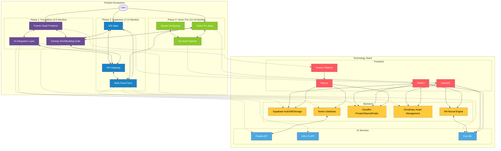

# Technology Integration Architecture for 9Bit Studios

The framework architecture diagram shows how your various technologies connect across the three phases:

- How user interactions flow through the system
- Connections between front-end products and back-end services
- Technology dependencies and integration points
- How each product ties to specific technologies in your stack

This is especially valuable for your developer to understand the technical architecture that will support your product vision.

These visualizations can be placed alongside your written strategic roadmap in your Development Hub. They provide different perspectives on the same strategy, making it more accessible to team members with different thinking styles. You could even print the timeline as a physical poster to keep the big picture visible during daily work.

